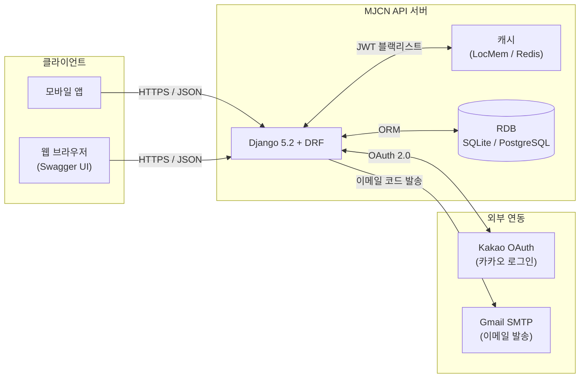
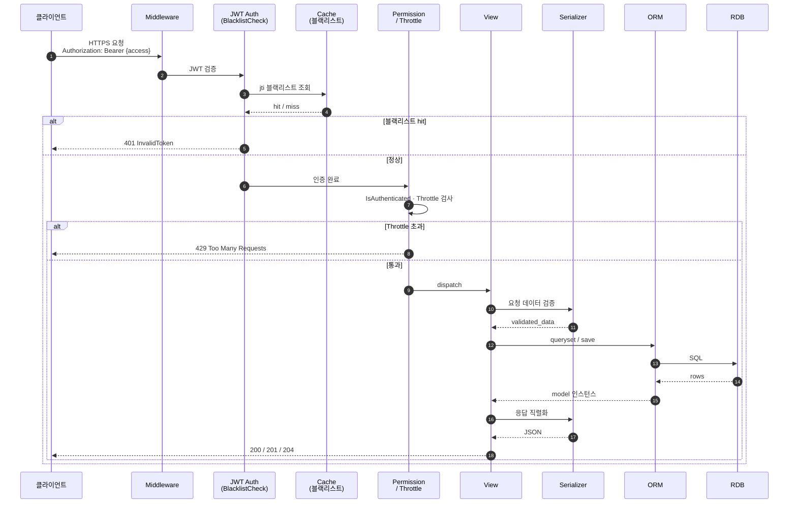
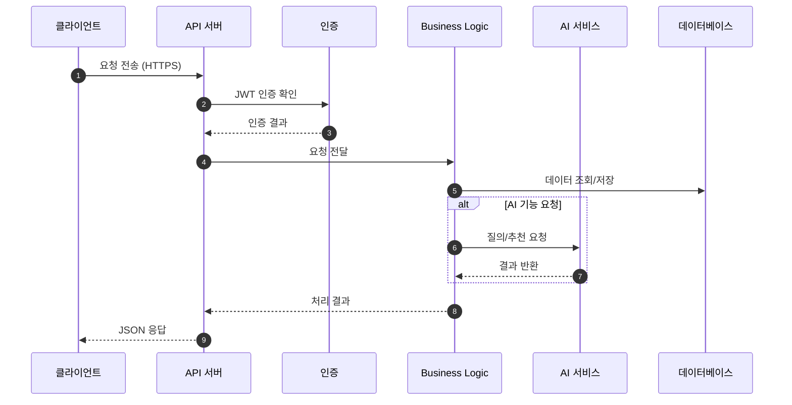
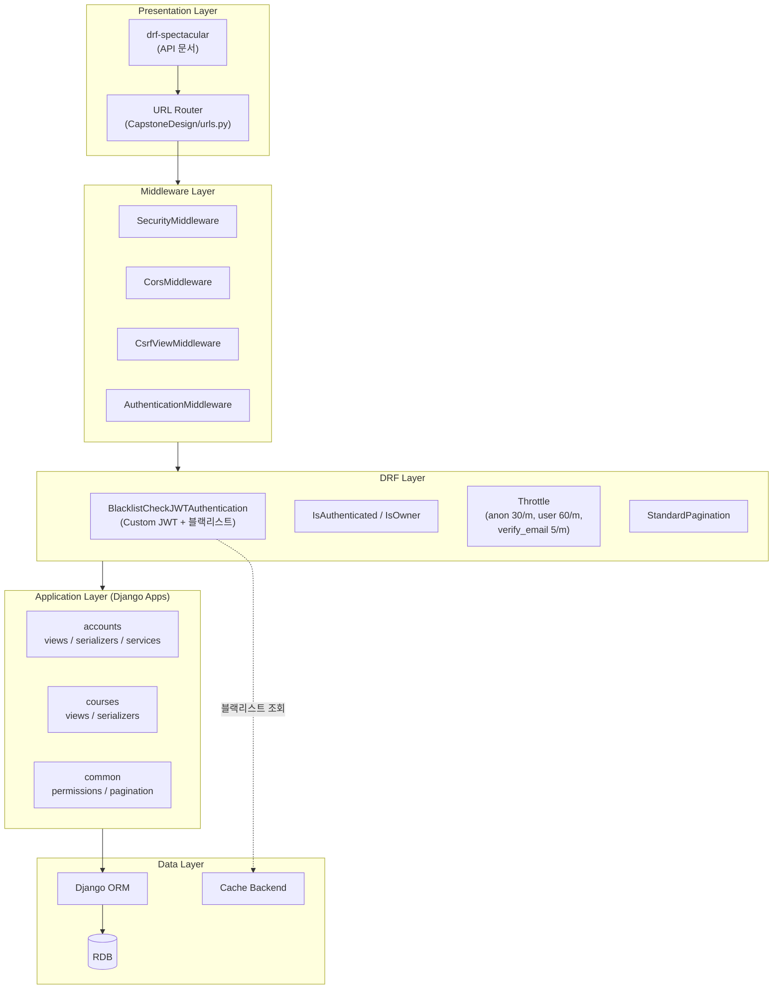
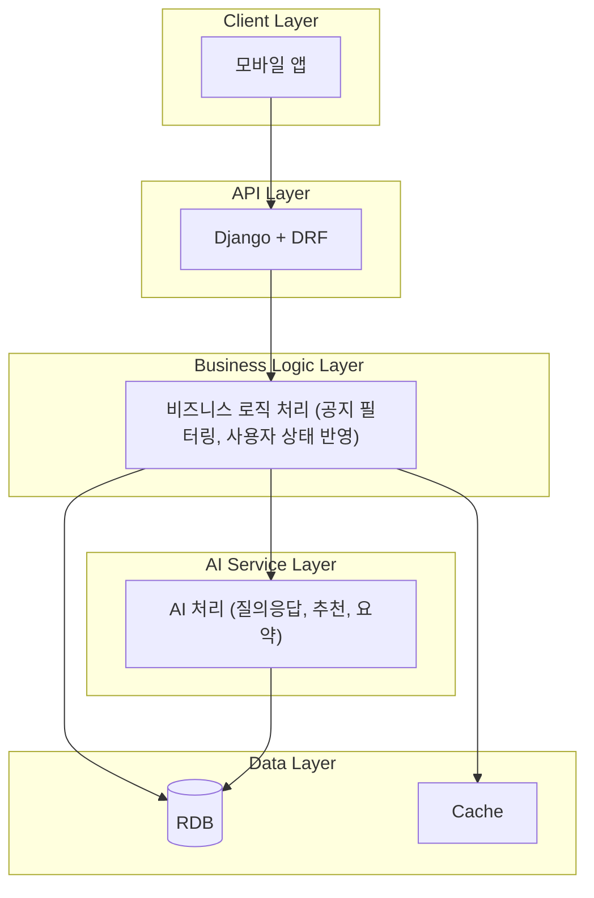

# MJCN 서버 구조 다이어그램 (상세설계보고서용)

> 명지대학교 학생 AI 비서 서비스 API 서버 아키텍처

---

## 피드백 개요
- 다 포함하는 것 보다는 주요한 것 3가지를 추가하는 게 좋아보입니다.

### 포함 제안 목록 & 흐름 설명
아래 3단 구조 설명으로 흐름을 구성하면 어떨까 합니다.
1. 전체 시스템 구성도 → 시스템 간 연결 구조
    - 프론트엔드의 내용이 포함됨
    - 아래 흐름을 설명
        - Android / iOS → 요청 보냄
        - 서버 → 처리
        - AI 서버 → 응답 생성
    - 기존 다이어그램 : "1. 전체 시스템 구성도 (System Context)" 해당

2. 요청 처리 흐름 → 실제 동작 과정
    - 서버 중심 설명
    - 포함 내용: 인증, 로직 처리, DB, AI 호출
    - 기존 다이어그램 : "4. 요청 처리 흐름 (Request Flow)" 해당

3. 계층형 아키텍처 → 서버 내부 설계
    - 포함 내용: API, Business, AI, Data
    - 기존 다이어그램 : "2. 계층형 아키텍처 (Layered Architecture)" 해당

이후 발표 가이드 및 구조도 피드백에 대한 상세한 내용은
아래 각 파트별로 진행합니다.

---

## 전체 시스템 구성도
- 기존 다이어그램 : "1. 전체 시스템 구성도 (System Context)" 해당

### 발표 가이드
- 모바일 앱에서 요청이 들어오면 Django 서버에서 처리
- DB와 캐시를 통해 데이터 관리
- 카카오 로그인, 이메일 같은 외부 서비스와 연동됨

### 구조도 피드백
- 특별히 없음

---

## 2. 요청 처리 흐름
- 기존 다이어그램 : "4. 요청 처리 흐름 (Request Flow)" 해당

### 발표 가이드
- 클라이언트 요청이 들어오면 인증을 먼저 확인하고
- Business Logic에서 데이터를 처리
- 필요 시 AI 서비스를 호출하여 결과를 생성
- 최종적으로 JSON 형태로 응답 반환

### 구조도 피드백
#### 수정 전

---

### 수정 후

---

## 3. 계층형 아키텍처
- 기존 다이어그램 : "2. 계층형 아키텍처 (Layered Architecture)" 해당

### 발표 가이드
- 클라이언트 요청은 API Layer에서 처리
- Business Logic Layer에서 핵심 로직 수행
- AI Service Layer에서 추천 및 질의응답 처리
- Data Layer에서 데이터 저장 및 조회

### 구조도 피드백
- 기존 구조: Django 내부 구조를 설명하는 방향(Framework 중심)
- 제안 구조: 서비스 기준 아키텍처(기능 중심)

#### 수정 전

#### 수정 후

---
