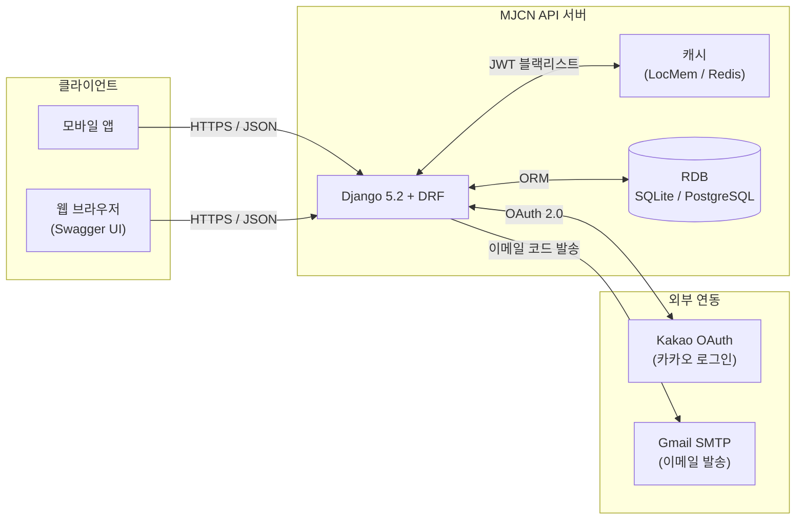
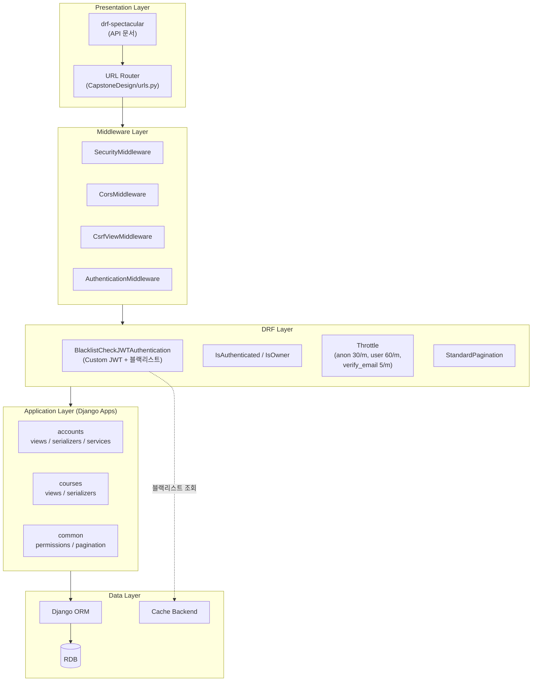
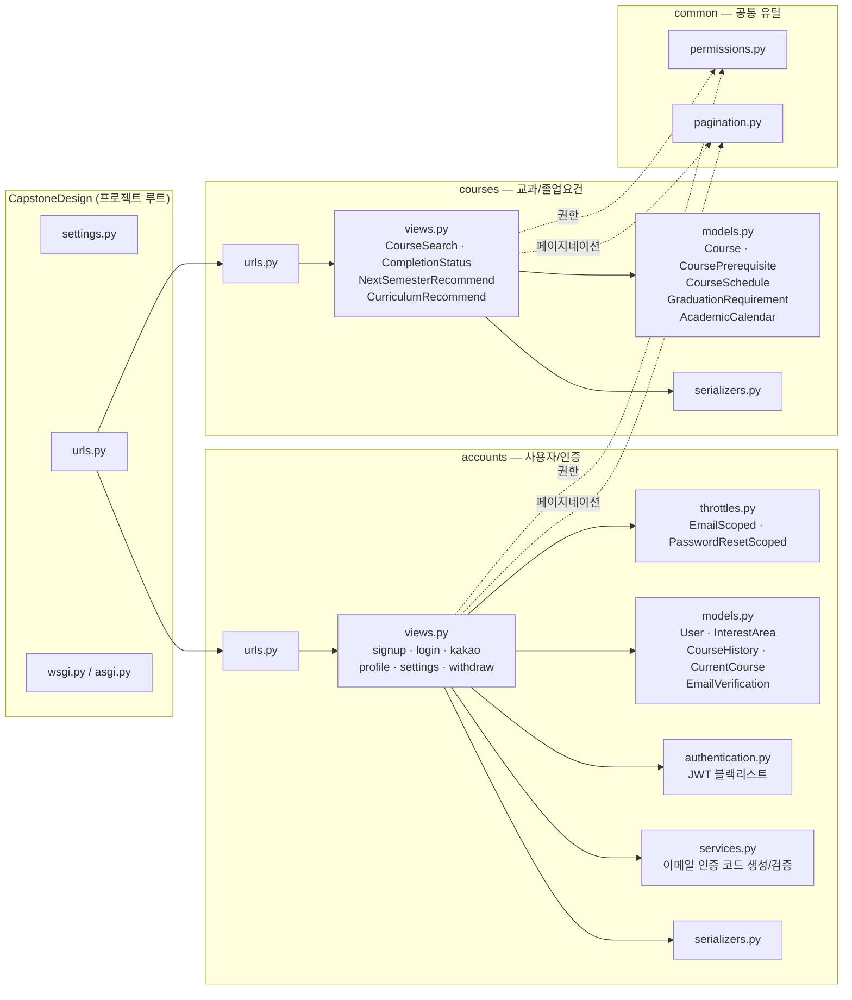
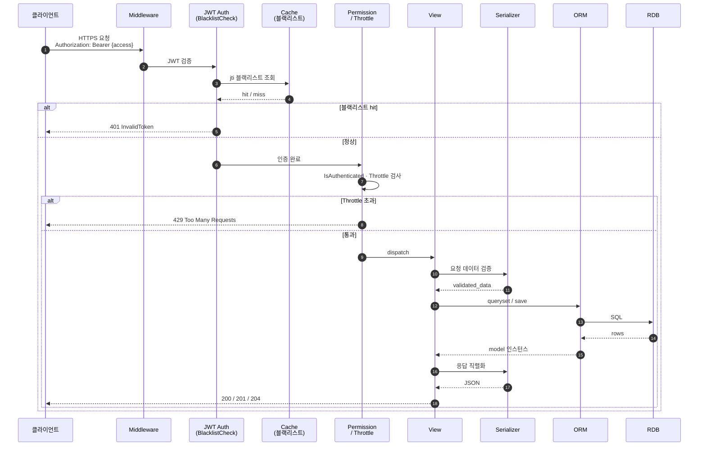
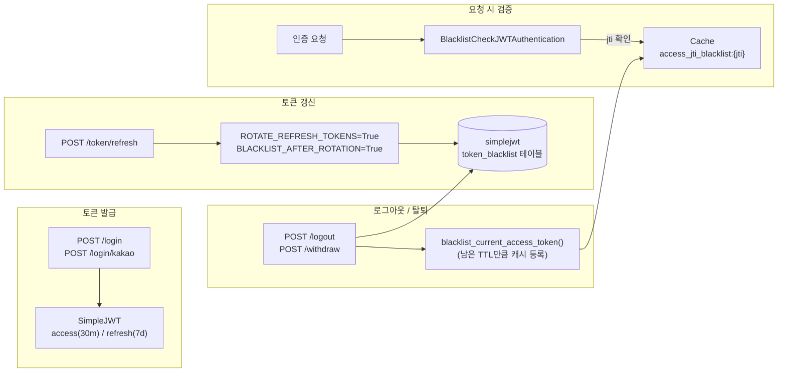
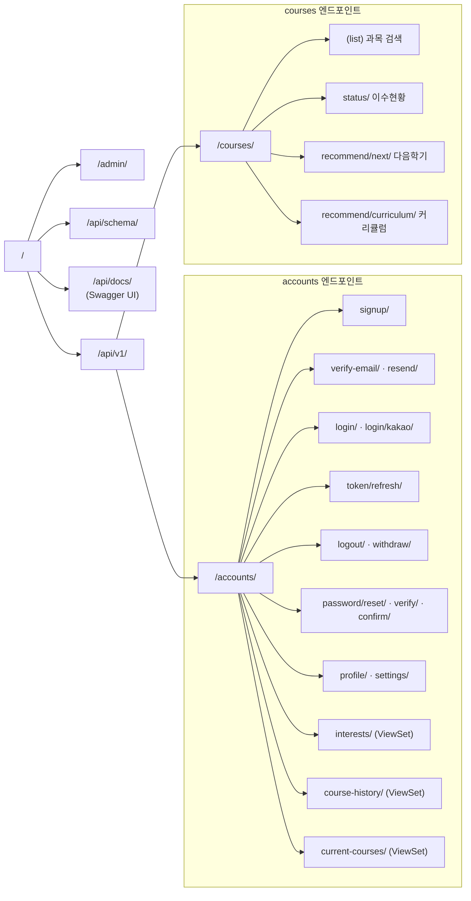
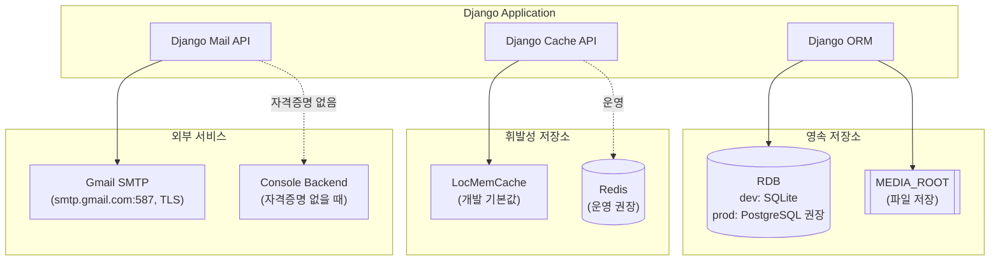
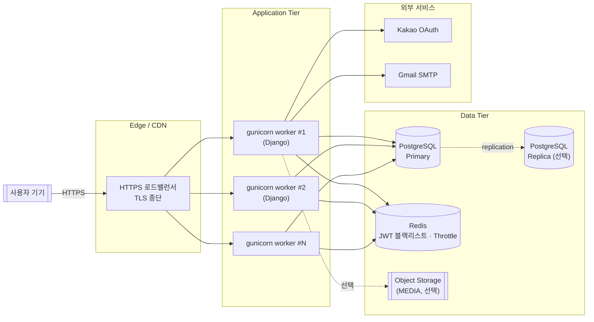

# MJCN 서버 구조 다이어그램 (상세설계보고서용)

> 명지대학교 학생 AI 비서 서비스 API 서버 아키텍처

---

## 1. 전체 시스템 구성도 (System Context)

---

## 2. 계층형 아키텍처 (Layered Architecture)

---

## 3. Django 앱 구성도 (Application Modules)

---

## 4. 요청 처리 흐름 (Request Flow)

---

## 5. 인증·세션 컴포넌트 (JWT + Access Token 블랙리스트)

**보안 포인트**
- `ACCESS_TOKEN_LIFETIME = 30m`, `REFRESH_TOKEN_LIFETIME = 7d`
- Refresh rotation + 회전 즉시 구(舊) refresh 블랙리스트화
- Access token도 `jti` 기반 캐시 블랙리스트로 즉시 무효화 가능
- 운영 배포 시 **Redis 등 공유 캐시 백엔드 필수** (멀티 워커 환경에서 LocMem은 워커별 독립 메모리라 블랙리스트가 공유되지 않음)

---

## 6. 엔드포인트 맵 (URL Routing)

---

## 7. 데이터 계층 개요 (Storage Components)

---

## 8. 배포 토폴로지 (Deployment View, 권장 구성)

---

## 9. 기술 스택 요약

| 계층 | 구성 요소 | 버전 / 비고 |
|---|---|---|
| 언어 / 런타임 | Python | 3.x |
| 웹 프레임워크 | Django | 5.2.12 |
| API 프레임워크 | Django REST Framework | 3.17.1 |
| 인증 | djangorestframework-simplejwt + Custom Blacklist | 5.5.1 / access·refresh 블랙리스트 이중화 |
| API 문서 | drf-spectacular (OpenAPI 3) | 0.29.0 |
| CORS | django-cors-headers | 4.9.0 |
| DB (개발) | SQLite | 내장 |
| DB (운영 권장) | PostgreSQL | — |
| 캐시 (개발) | LocMemCache | 프로세스 로컬 |
| 캐시 (운영 권장) | Redis | 블랙리스트·Throttle 공유 필수 |
| 이메일 | Gmail SMTP (smtp.gmail.com:587, TLS) | Console backend fallback |
| OAuth | Kakao 로그인 | accounts/kakao 엔드포인트 |
| WSGI 서버 (권장) | gunicorn | 멀티 워커 |

---

## 10. 비기능 요구사항 매핑

| 비기능 요구사항 | 구현 위치 | 비고 |
|---|---|---|
| 인증/인가 | `accounts.authentication.BlacklistCheckJWTAuthentication` | JWT + jti 블랙리스트 |
| 속도 제한 | DRF Throttle (`anon 30/m`, `user 60/m`, `verify_email 5/m`, `password_reset 5/m`) | Brute force 방어 |
| 세션 즉시 종료 | `blacklist_current_access_token()` | logout/withdraw 시 access token 무효화 |
| 이메일 인증 | `accounts.services.send_verification_email` | 6자리 코드, 3분 만료, 트랜잭션 원자성 |
| 동시성 제어 | `select_for_update()` + 트랜잭션 | EmailVerification race condition 방지 |
| API 문서 | drf-spectacular `/api/docs/` | OpenAPI 3 |
| 페이지네이션 | `common.pagination.StandardPagination` | page_size=20 |
