# MJCN - 명지대학교 학생 AI 비서 서비스

> 명지대학교 캡스톤디자인 프로젝트
> 최종 수정일: 2026-04-03
> 기능명세서 v1.0 기반

---

## 1. 프로젝트 개요

### 1.1 목적

명지대학교 학생들의 학사 생활을 통합 지원하는 AI 기반 비서 서비스.
공지사항, 수강/졸업 관리, 공모전 정보를 하나의 플랫폼에서 제공하고,
AI 챗봇("띵똥이")을 통해 개인화된 답변과 PUSH 알림을 제공한다.

### 1.2 핵심 가치

- **통합**: 흩어진 학사 정보(공지, 수강, 공모전)를 한 곳에서 조회
- **개인화**: 사용자 프로필(전공, 학년, 관심분야) 기반 맞춤 추천
- **AI 비서**: 자연어 대화를 통한 즉각적 정보 제공

### 1.3 대상 사용자

- 명지대학교 재학생 (학부생 중심)
- 수강신청, 졸업요건, 공모전 등의 정보가 필요한 학생

---

## 2. 기술 스택

| 구분 | 기술 | 비고 |
|------|------|------|
| Language | Python 3.11 | |
| Framework | Django 5.2.12 + DRF | REST API 서버 |
| API | Django REST Framework | JSON API |
| Database | SQLite3 (개발) / PostgreSQL (운영) | |
| AI | OpenAI API | LLM 기반 챗봇 |
| 인증 | DRF Token 또는 JWT (SimpleJWT) | Custom User 모델 |
| PUSH 알림 | FCM (Firebase Cloud Messaging) | 안드로이드 PUSH 전송 |
| 비동기 작업 | Django-Q2 또는 Celery + Redis | 크롤링/알림 스케줄링 |
| 캐시 | Redis (운영) | 선택 |
| 파일 저장 | Django FileField / S3 (운영) | 첨부파일용 |
| 문서화 | drf-spectacular (Swagger/OpenAPI) | API 문서 자동 생성 |
| CORS | django-cors-headers | 프론트엔드 연동용 |

> **NOTE**: 이 프로젝트는 백엔드 REST API만 담당합니다.
> 프론트엔드는 별도 팀원이 개발합니다: **Android (Kotlin)** + **iOS (Swift)**

---

## 3. Django 앱 구조

```
CapstoneDesign/              # 프로젝트 설정 (settings, urls, wsgi)
├── accounts/                # 회원가입, 로그인, 프로필 관리
│   ├── models.py            # User, InterestArea, CourseHistory, CurrentCourse
│   ├── serializers.py       # 회원가입/프로필/설정 Serializer
│   ├── views.py             # API ViewSet
│   └── urls.py
├── chat/                    # AI 비서 채팅 (띵똥이)
│   ├── models.py            # ChatRoom, ChatMessage, ChatAttachment
│   ├── serializers.py
│   ├── views.py
│   ├── services.py          # AI API 호출, 카테고리 분류 로직
│   └── urls.py
├── courses/                 # 수강/졸업 관리, 과목 추천
│   ├── models.py            # Course, CoursePrerequisite, GraduationRequirement
│   ├── serializers.py
│   ├── views.py
│   ├── services.py          # 추천 알고리즘, 이수현황 계산
│   └── urls.py
├── notices/                 # 공지사항 통합 조회
│   ├── models.py            # Notice
│   ├── serializers.py
│   ├── views.py
│   ├── crawlers.py          # 크롤러
│   └── urls.py
├── contests/                # 공모전 통합 조회
│   ├── models.py            # Contest
│   ├── serializers.py
│   ├── views.py
│   ├── crawlers.py          # 크롤러
│   └── urls.py
├── notifications/           # PUSH 알림
│   ├── models.py            # Notification
│   ├── serializers.py
│   ├── views.py
│   ├── services.py          # 알림 생성/스케줄링 로직
│   └── urls.py
├── dashboard/               # 메인화면 데이터 집계 API
│   ├── views.py
│   └── urls.py
├── common/                  # 공통 유틸, 미들웨어, 권한 클래스
│   ├── permissions.py       # 커스텀 DRF 권한
│   ├── pagination.py        # 공통 페이지네이션
│   └── mixins.py
└── media/                   # 업로드 파일
```

### 앱별 책임

| 앱 | 책임 | 기능명세서 항목 |
|-----|------|----------------|
| `accounts` | 회원가입, 인증(JWT), 프로필 CRUD, 설정, 탈퇴 | 1, 5(설정) |
| `chat` | AI 대화 API, 채팅방 보관함, 폴더 분류 | 2.1, 5(보관함) |
| `courses` | 수강과목 추천 API, 커리큘럼, 이수현황 분석 | 3 |
| `notices` | 공지사항 크롤링/저장, 통합 조회 API, 검색 | 4.1 |
| `contests` | 공모전 크롤링/저장, 통합 조회 API | 4.2 |
| `notifications` | 알림 생성, 조회 API, 읽음 처리, 스케줄링 | 2.2, 7 |
| `dashboard` | 메인화면 데이터 집계 API (시간표, 공지, 공모전 등) | 6 |
| `common` | 공통 권한, 페이지네이션, mixin, 유틸 | - |

---

## 4. 데이터 모델

### 전체 ER Diagram

```mermaid
erDiagram
    User {
        int id PK
        string email UK
        string name
        string major
        int grade
        int semester
        int graduation_year
        bool is_email_verified
        bool notification_enabled
    }

    InterestArea {
        int id PK
        int user_id FK
        string category
        text custom_text
    }

    CourseHistory {
        int id PK
        int user_id FK
        string course_name
        string course_code
        int year
        int semester
        string grade_received
        string category
        int credits
    }

    CurrentCourse {
        int id PK
        int user_id FK
        string course_name
        string course_code
        string day_of_week
        time start_time
        time end_time
        string professor
        string room
        string building
    }

    EmailVerification {
        int id PK
        int user_id FK
        uuid token UK
        datetime created_at
        datetime expires_at
        bool is_used
    }

    ChatRoom {
        int id PK
        int user_id FK
        string title
        string category
        string last_message_preview
        datetime created_at
        datetime updated_at
    }

    ChatMessage {
        int id PK
        int room_id FK
        string role
        text content
        datetime created_at
    }

    ChatAttachment {
        int id PK
        int message_id FK
        file file
        string file_type
        string original_name
    }

    Course {
        int id PK
        string course_code UK
        string name
        string college
        string department
        string major
        string category
        int credits
        int year
        int semester
        string professor
    }

    CoursePrerequisite {
        int id PK
        int course_id FK
        int prerequisite_id FK
    }

    CourseSchedule {
        int id PK
        int course_id FK
        string day_of_week
        time start_time
        time end_time
        string building
        string room
    }

    AcademicCalendar {
        int id PK
        int year
        int semester
        date pre_registration_start
        date pre_registration_end
        date registration_start
        date registration_end
        date adjustment_start
        date adjustment_end
        date semester_start
        date semester_end
    }

    GraduationRequirement {
        int id PK
        string department
        int admission_year
        string category
        int required_credits
        int total_required
    }

    Notice {
        int id PK
        string source
        string title
        text content
        url url
        datetime published_at
        date end_date
        datetime created_at
        json tags
    }

    Contest {
        int id PK
        string title
        string organizer
        text description
        url url
        date start_date
        date end_date
        json categories
        bool is_active
        datetime created_at
    }

    Notification {
        int id PK
        int user_id FK
        string title
        text message
        string notification_type
        int related_id
        bool is_read
        bool is_pushed
        datetime created_at
    }

    FCMDevice {
        int id PK
        int user_id FK
        text registration_token
        bool is_active
        datetime created_at
        datetime updated_at
    }

    User ||--o{ InterestArea : "has"
    User ||--o{ CourseHistory : "has"
    User ||--o{ CurrentCourse : "has"
    User ||--o{ EmailVerification : "has"
    User ||--o{ ChatRoom : "owns"
    User ||--o{ Notification : "receives"
    User ||--o{ FCMDevice : "registers"
    ChatRoom ||--o{ ChatMessage : "contains"
    ChatMessage ||--o{ ChatAttachment : "has"
    Course ||--o{ CoursePrerequisite : "is target"
    Course ||--o{ CoursePrerequisite : "is prerequisite"
    Course ||--o{ CourseSchedule : "has"
```



### 4.1 accounts 앱

#### User (AbstractUser 확장)

| 필드 | 타입 | 필수 | 설명 |
|------|------|------|------|
| email | EmailField | O | 로그인 ID (USERNAME_FIELD) |
| name | CharField(50) | O | 실명 |
| major | CharField(100) | O | 전공 |
| grade | IntegerField | O | 학년 (1~4) |
| semester | IntegerField | O | 1: 1학기 / 2: 여름방학 / 3: 2학기 / 4: 겨울방학 |
| graduation_year | IntegerField(null) | | 졸업 희망 연도 |
| is_email_verified | BooleanField | O | 이메일 인증 여부 |
| notification_enabled | BooleanField | O | 알림 수신 여부 (기본 True) |

#### InterestArea (관심분야)

| 필드 | 타입 | 설명 |
|------|------|------|
| user | FK(User) | |
| category | CharField | 직업군 선택형 (choices) |
| custom_text | TextField(blank) | 자유 텍스트 입력 |

#### CourseHistory (수강이력)

| 필드 | 타입 | 설명 |
|------|------|------|
| user | FK(User) | |
| course_name | CharField | 과목명 |
| course_code | CharField | 과목번호 |
| year | IntegerField | 수강 연도 |
| semester | IntegerField | 수강 학기 |
| grade_received | CharField(blank) | 취득 성적 |
| category | CharField | 전공필수/전공선택/교양필수/교양선택/일반선택 |
| credits | IntegerField | 학점 수 |

#### CurrentCourse (현재 수강과목)

| 필드 | 타입 | 설명 |
|------|------|------|
| user | FK(User) | |
| course_name | CharField | 과목명 |
| course_code | CharField | 과목번호 |
| day_of_week | CharField | 요일 |
| start_time | TimeField | 시작 시간 |
| end_time | TimeField | 종료 시간 |
| professor | CharField(blank) | 교수명 |
| room | CharField(blank) | 강의실 |
| building | CharField(blank) | 강의실 위치 |

#### EmailVerification

| 필드 | 타입 | 설명 |
|------|------|------|
| user | FK(User) | |
| token | UUIDField | 인증 토큰 |
| created_at | DateTimeField | 생성 시각 |
| expires_at | DateTimeField | 만료 시각 |
| is_used | BooleanField | 사용 여부 |

### 4.2 chat 앱

#### ChatRoom (채팅방)

| 필드 | 타입 | 설명 |
|------|------|------|
| user | FK(User) | |
| title | CharField | 채팅방 제목 (첫 질문 기반 AI 요약) |
| category | CharField | 자동 분류 (학교생활/수강신청/취업·진로/공모전/교내공지) |
| last_message_preview | CharField(200, blank=True) | 마지막 메시지 미리보기 |
| created_at | DateTimeField | |
| updated_at | DateTimeField | |

#### ChatMessage (채팅 메시지)

| 필드 | 타입 | 설명 |
|------|------|------|
| room | FK(ChatRoom) | |
| role | CharField | "user" 또는 "assistant" |
| content | TextField | 메시지 내용 |
| created_at | DateTimeField | |

#### ChatAttachment (첨부파일)

| 필드 | 타입 | 설명 |
|------|------|------|
| message | FK(ChatMessage) | |
| file | FileField | 업로드 파일 |
| file_type | CharField | image/video/document |
| original_name | CharField | 원본 파일명 |

### 4.3 courses 앱

#### Course (과목 정보 - 학교 데이터)

| 필드 | 타입 | 설명 |
|------|------|------|
| course_code | CharField(unique) | 과목번호 |
| name | CharField | 과목명 |
| college | CharField | 대학(예: 반도체·ICT대학) |
| department | CharField | 학부(예: 컴퓨터정보통신공학부) |
| major | CharField | 전공(예: 컴퓨터공학전공) |
| category | CharField | 전공필수/전공선택/교양필수/교양선택 |
| credits | IntegerField | 학점 |
| year | IntegerField | 개설 연도 |
| semester | IntegerField | 개설 학기 |
| professor | CharField(blank) | 교수명 |

#### 학과 분류 체계 (college → department → major)

Course 모델의 `college`, `department`, `major` 필드는 3뎁스 계층 구조를 따른다.
`department`, `major` 필드는 `null=True, blank=True`로 설정한다.

| 뎁스 | 필드명 | 예시 |
|------|--------|------|
| 1뎁스 | college (대학) | 반도체·ICT대학 |
| 2뎁스 | department (학부/학과) | 컴퓨터정보통신공학부 |
| 3뎁스 | major (전공) | 컴퓨터공학전공 |

**엣지 케이스 (null 처리) — 전체 목록**

| 대학 | department | major | 케이스 유형 | UI 동작 |
|------|------------|-------|------------|---------|
| 반도체·ICT대학 | 반도체공학부 | null | 단일학부 (전공 세분화 없음) | 전공 선택 스텝 스킵 |
| 반도체·ICT대학 | 산업경영공학과 | null | 단일학과 (학부 없이 학과만 존재) | 전공 선택 스텝 스킵 |
| 건축대학 | 공간디자인학과 | null | 단일학과 (학부 없이 학과만 존재) | 전공 선택 스텝 스킵 |
| 아너칼리지 | 자율전공학부 | null | 단일학부 (전공 세분화 없음) | 전공 선택 스텝 스킵 |

- `major`가 null → 프론트에서 전공 선택 3뎁스를 생략하고, department 선택 시 바로 확정

> 전체 분류 목록은 **부록 A. 학과 분류 전체 목록** 참조

#### CoursePrerequisite (선후수 관계)

| 필드 | 타입 | 설명 |
|------|------|------|
| course | FK(Course) | 대상 과목 |
| prerequisite | FK(Course) | 선수 과목 |

#### CourseSchedule (과목 스케쥴 정보)

| 필드 | 타입 | 설명 |
|------|------|------|
| course | FK(Course) | 대상 과목 |
| day_of_week | CharField | 요일(월/화/수/목/금 중 하나) |
| start_time | TimeField | 시작 시간 |
| end_time | TimeField | 종료 시간 |
| building | CharField(blank=True) | 강의실 위치(명진당/창조관/5공학관 등) |
| room | CharField(blank=True) | 강의실 번호 |

#### GraduationRequirement (졸업요건)

| 필드 | 타입 | 설명 |
|------|------|------|
| department | CharField | 학과 |
| admission_year | IntegerField | 입학 연도 |
| category | CharField | 전공필수/전공선택/교양필수/... |
| required_credits | IntegerField | 필요 학점 |
| total_required | IntegerField | 총 졸업 학점 |

#### AcademicCalendar (학사일정)

| 필드 | 타입 | 설명 |
|------|------|------|
| year | IntegerField | 연도 |
| semester | IntegerField | 학기 (1 or 2) |
| pre_registration_start | DateField(null) | 미리담기 시작일 |
| pre_registration_end | DateField(null) | 미리담기 종료일 |
| registration_start | DateField(null) | 수강신청 시작일 |
| registration_end | DateField(null) | 수강신청 종료일 |
| adjustment_start | DateField(null) | 수강신청 정정 시작일 |
| adjustment_end | DateField(null) | 수강신청 정정 종료일 |
| semester_start | DateField(null) | 학기 시작일 |
| semester_end | DateField(null) | 종강일 |

### 4.4 notices 앱

#### Notice (공지사항)

| 필드 | 타입 | 설명 |
|------|------|------|
| source | CharField | 출처 (학사공지/일반공지/행사공지/장학공지/오픈톡) |
| title | CharField | 제목 |
| content | TextField | 내용 |
| url | URLField | 원문 링크 |
| published_at | DateTimeField | 게시일 |
| end_date | DateField(null) | 마감일 (있는 경우) |
| created_at | DateTimeField | 수집 시각 |
| tags | JSONField(default=list) | 자동 태깅 키워드 |

### 4.5 contests 앱

#### Contest (공모전)

| 필드 | 타입 | 설명 |
|------|------|------|
| title | CharField | 제목 |
| organizer | CharField | 주최 |
| description | TextField | 설명 |
| url | URLField | 원문 링크 |
| start_date | DateField(null) | 시작일 (있는 경우) |
| end_date | DateField(null) | 마감일 |
| categories | JSONField(default=list) | 분야 태그 |
| is_active | BooleanField(default=True) | 활성 여부 |
| created_at | DateTimeField | 수집 시각 |

### 4.6 notifications 앱

#### Notification (알림)

| 필드 | 타입 | 설명 |
|------|------|------|
| user | FK(User) | |
| title | CharField | 알림 제목 |
| message | TextField | 알림 내용 |
| notification_type | CharField | 알림 종류 (notice/contest/course/system) |
| related_id | IntegerField(null) | 관련 객체 ID (notification_type에 따라 다른 테이블 ID, 프론트 화면 이동용) |
| is_read | BooleanField(default=False) | 읽음 여부 |
| is_pushed | BooleanField(default=False) | FCM 전송 여부 |
| created_at | DateTimeField | 알림 생성 시각 |

#### FCMDevice (디바이스 토큰)

| 필드 | 타입 | 설명 |
|------|------|------|
| user | FK(User) | 디바이스 소유 사용자 |
| registration_token | TextField | FCM 등록 토큰 |
| is_active | BooleanField | 활성 여부 |
| created_at | DateTimeField | 등록 시각 |
| updated_at | DateTimeField | 마지막 갱신 시각 |

---

## 5. 기능 상세 명세

### 5.1 회원가입 / 인증 (accounts)

#### 5.1.1 이메일 가입

- 이메일 + 비밀번호로 가입
- 가입 후 인증 메일 발송 (UUID 토큰 링크)
- 인증 완료 전까지 로그인 불가

#### 유효성 검사 규칙

**이메일**
- 이메일 형식 준수 (example@domain.com)
- 중복 이메일 가입 불가

**비밀번호**
- 8자 이상 20자 이하
- 영문 + 숫자 + 특수문자 조합 필수
- 이메일과 동일한 비밀번호 불가

#### 5.1.2 프로필 설정 (가입 후 온보딩)

##### 입력 항목 전체

| 구분 | 항목 | 타입 | 사용자 입력 내용 | 스텝 |
|------|------|------|-----------------|------|
| 필수 | 이름 | 텍스트 | 한글 또는 영어, 2~10자 | Step 1 |
| 필수 | 학년 | 선택 | 1~4학년 | Step 1 |
| 필수 | 학기 | 선택 | 1학기 / 여름방학 / 2학기 / 겨울방학 | Step 1 |
| 선택 | 졸업 희망 연도 | 숫자 | 미입력 시 입학 연도 + 4년(8학기) 자동 계산 | Step 1 |
| 필수 | 대학 (college) | 선택 (1뎁스) | 예: 반도체·ICT대학 | Step 2 |
| 필수 | 학부/학과 (department) | 선택 (2뎁스) | 예: 컴퓨터정보통신공학부 | Step 2 |
| 필수 | 전공 (major) | 선택 (3뎁스) | 예: 컴퓨터공학전공. 단일학부/학과인 경우 null (스킵) | Step 2 |
| 필수 | 관심분야 | 칩 다중선택 | 최소 1개, 최대 3개 | Step 3 |
| 선택 | 수강이력 | 과목 다중선택 | 과목명 + 수강연도 + 학기 + 성적 (나머지는 과목 DB에서 자동 매칭) | Step 4 |
| 선택 | 현재 수강과목 | 과목 다중선택 | 과목명만 선택 (시간표·교수·강의실은 과목 DB에서 자동 매칭) | Step 5 |

##### 유효성 검사 규칙

**이름**
- 2자 이상 10자 이하
- 한글 또는 영어만 입력 가능

**관심분야**
- 최소 1개, 최대 3개까지 선택 가능
- 기타 입력 조건 : 2자 이상 100자 이하

**관심분야 선택형 목록** (직업군 위주):
- IT/개발, 디자인, 마케팅/광고, 금융/회계, 교육, 공기업/공공기관,
  의료/바이오, 미디어/콘텐츠, 건축/공간, 스포츠/예술, 연구/R&D, 기타

##### 온보딩 플로우 (5스텝)

상단에 진행률 표시 (Step 1/5 ~ 5/5). Step 4·5는 "건너뛰기" 버튼 제공.

**Step 1 — 기본 정보**
- 이름, 학년, 학기, 졸업 희망 연도(선택) 입력
- 필수 필드(이름, 학년, 학기) 입력 시 "다음" 버튼 활성화

**Step 2 — 전공 선택 (3뎁스 풀스크린 리스트)**
- 대학 → 학부/학과 → 전공 순서로 각 뎁스마다 풀스크린 리스트 화면 전환
- 단일 리스트 컴포넌트를 재사용하여 3뎁스 처리
- 각 항목에 하위 전공 미리보기 서브텍스트 표시 (예: "컴퓨터공학 · 정보통신공학")
- 상단 브레드크럼으로 현재 선택 경로 표시 (예: 반도체·ICT대학 > 학부 선택)
- 뒤로가기로 이전 뎁스 재선택 가능

| 엣지 케이스 | 예시 | UI 동작 |
|-------------|------|---------|
| 단일학부 (전공 없음) | 반도체공학부, 자율전공학부 | "바로 선택 완료" 힌트 표시, 전공 선택 스텝 스킵 |
| 단일학과 (전공 없음) | 산업경영공학과, 공간디자인학과 | "바로 선택 완료" 힌트 표시, 전공 선택 스텝 스킵 |

**Step 3 — 관심분야**
- 칩(Chip) 형태 다중 선택 UI
- 최소 1개 선택 시 "다음" 버튼 활성화

**Step 4 — 수강이력 (선택, 건너뛰기 가능)**
- Step 2에서 선택한 학과의 과목이 기본 리스트로 표시 (가나다순)
- 과목 탭 시 선택 (체크 표시)
- 상단 검색으로 타과/교양 과목 검색 및 추가
- 사용자 입력: 과목 선택 + 수강 연도 + 학기 + 성적
- 이수구분, 학점 수, 교수명 등은 과목 DB(Course 테이블)에서 자동 매칭
- 성적(grade_received)은 선택 입력
- "다음" 또는 "건너뛰기"로 진행

**Step 5 — 현재 수강과목 (선택, 건너뛰기 가능)**
- Step 2에서 선택한 학과의 현재 학기 개설 과목이 기본 리스트로 표시
- 과목 탭 시 선택 (체크 표시)
- 상단 검색으로 타과/교양 과목 검색 및 추가
- 사용자 입력: 과목 선택만
- 요일, 시간, 교수, 강의실 등은 과목 DB(Course + CourseSchedule 테이블)에서 자동 매칭
- "완료"로 온보딩 종료

##### 과목 DB 시딩 요구사항

> **[TODO]** Step 4·5의 과목 리스트 및 자동 매칭은 Course / CourseSchedule 테이블에
> 사전 시딩된 데이터에 의존한다.
>
> - **MVP 범위**: 컴퓨터공학전공 과목 데이터만 우선 구축(시간 남으면 전공 1개 더 추가)
> - **시딩 대상 테이블**: Course, CourseSchedule, CoursePrerequisite, GraduationRequirement
> - **데이터 출처**: 명지대학교 학사 시스템 (수강편람, 교육과정표 등)
> - **시딩 방법**: Django fixture 또는 management command
> - **타 학과 확장**: MVP 이후 순차 확대 예정

#### 5.1.3 로그인 / 로그아웃

- 이메일 + 비밀번호 로그인
- JWT 토큰 발급 (access + refresh)
- access 토큰 만료 시 refresh 토큰으로 갱신

### 5.2 AI 비서 - 띵똥이 (chat)

#### 5.2.1 화면 구성

- **상단 영역**: 새 채팅 시작
  - 빠른 질문 버튼 제공 (예: 최근 7일간 교내 공지 요약, 공모전 키워드 등)
  - 메시지 입력창
- **하단 영역**: 이전 대화 목록
  - 카테고리 필터 탭: 전체/수강신청/학교생활/취업·진로/공모전
  - 각 항목: 채팅방 제목 + 마지막 메시지 미리보기

#### 5.2.2 대화형 인터페이스

- 메시지 전송 시 자동으로 새 채팅방 생성
- 첫 메시지 기반으로 AI가 채팅방 제목 자동 생성
- 기존 채팅방 선택 시 대화 이어서 진행
- AI 컨텍스트: 사용자 프로필 + 대화 히스토리 + 학교 데이터

#### 5.2.3 텍스트 전송

- POST 요청으로 메시지 전송
- 첫 메시지인 경우: 채팅방 자동 생성 + AI에 제목 요약 요청 → ChatRoom.title 업데이트
- AI API 호출 → 응답 저장 → JSON 응답 반환

#### 5.2.4 첨부파일 전송

- 이미지, 동영상, 파일 첨부 가능
- 첨부파일 업로드 후 AI에 함께 전달 (멀티모달 지원 시)
- 지원 형식: jpg/png, mp4, pdf/docx
- 파일 크기 제한: 10MB

#### 5.2.5 정보 추천 (PUSH 알림) - notifications 앱과 연계

- **맞춤형 공지사항 추천**: 새 공지 등록 시 + 마감일 3일 전 + 마감 전날
- **맞춤형 수강과목 추천**: 수강신청 공지 등록 시 + 각 대학별(대학/전공/학부) 수강신청일 전날 + 미리담기 전날
- **맞춤형 공모전 추천**: 새 공모전 등록 시 + 마감일 3일 전 + 마감 전날
- **교내 지원사업 능동 노출**: 사용자 개인정보 기반 교내 지원 사업 등록 시 + 마감일 3일 전 + 마감 전날
- 추천 로직: 사용자 관심분야/전공과 공지·공모전 태그 매칭하여 **관련도 상위 3개 이상 추천**
- **졸업요건 알림**: 졸업까지 남은 학점이 부족할 때

#### 5.2.6 상황별 가이딩 (학사 흐름 기반)

- 수강신청 시기, 학기 종료, 수강신청 미리담기 등 주요 학사 이벤트 시점에 맞춤형 가이드 자동 제공
- 예: 수강신청 2주 전 → 추천 과목 알림, 학기 종료 후 → 다음학기 커리큘럼 제안
- 가이딩 트리거는 학사 일정 데이터 기반 스케줄링

### 5.3 수강/졸업 관리 (courses)

#### 5.3.1 다음학기 수강과목 추천

- **입력**: 사용자 수강이력 + 전공 + 학년/학기
- **고려사항**: 졸업요건 충족, 선후수 과목, 남은 학기 수를 고려하여
  전공필수/전공선택/교양필수/교양선택 균형있게 배분
- **출력**
  - 전공(필수/선택) / 교양(필수/선택) 분리
  - 과목정보 포함 내용: 과목명, 과목번호, 시간, 강의실, 교수명 포함

#### 5.3.2 전체 커리큘럼 추천

- **입력**: 사용자 수강이력 + 전공 + 학년/학기 + 졸업 희망 연도
- **고려사항**: 졸업요건 충족, 선후수 과목, 전공필수/전공선택/교양필수/교양선택 균형있게 배분
- 현재 학기 수강 중인 경우 다음 학기부터 추천 시작
- 계절학기는 기본 추천에서 제외, 사용자 요청 시 포함 가능
- **최소 2안 이상, 최대 5안 이하의 커리큘럼 제시**
- **출력**: 졸업까지 남은 학기별 추천 과목 리스트
  - 전공(필수/선택) / 교양(필수/선택) 분리
  - 과목정보 포함 내용: 과목명, 과목번호, 시간, 강의실, 교수명 포함

#### 5.3.3 이수현황 분석

- 아래 카테고리별 이수학점 / 필요학점 / 잔여학점 표시
  - 전공필수, 전공선택, 교양필수, 교양선택, 일반선택, 총학점
- 졸업까지 남은 총 학점 계산

### 5.4 통합 정보 제공 - 공지사항 (notices)

#### 5.4.1 전체보기

- 학사공지, 일반공지, 행사공지, 장학공지, 오픈톡 통합 리스트
- 형식: `[출처] 제목`
- 검색 기능 (제목, 내용 검색)
- 페이지네이션

#### 5.4.2 맞춤형 보기 (기본값)

- 사용자 프로필(전공, 관심분야) 기반 필터링
- 전체보기 ↔ 맞춤형 보기 토글 전환

#### 5.4.3 공지 유형 자동 분류

- LLM을 통해 공지 유형을 자동 분류 (별도 API 호출)
- **정보형**: 단순 안내 공지 (등록금 안내, 장학금 안내, 프로그램 모집 등)
- **행동형**: 학생이 반드시 조치해야 하는 공지 (이수구분 확인, 수강신청 정정, 폐강과목 등)
- 분류 결과에 따라 카드 구조화 프롬프트가 달라짐

#### 5.4.4 공지 요약 및 카드 구조화

- 크롤링된 공지를 AI가 자동 처리:
  1. 유형 분류 (정보형/행동형)
  2. 100자 이내 한 문장 요약 생성
  3. 카드 형태 JSON 구조화 (행동형 → 상세 버전, 정보형 → 간결 버전)
- 프롬프트 상세 내용은 **9.1절** 참조

### 5.5 통합 정보 제공 - 공모전 (contests)

#### 5.5.1 전체보기

- 전체 공모전 리스트
- `D-NN 제목` 형식으로 마감일 표시

#### 5.5.2 맞춤형 보기 (기본값)

- 관심분야 기반 필터링
- 토글 전환

### 5.6 채팅방 보관함 (chat)

#### 5.6.1 전체 조회

- 사용자의 모든 채팅방 목록 (최신순)
- 각 항목: 제목, 마지막 메시지 미리보기, 날짜

#### 5.6.2 폴더별 조회

- 카테고리 자동 분류: 공지, 공모전, 취업/진로, 취미, 기타
- AI가 대화 내용 기반으로 자동 분류

#### 5.6.3 채팅 삭제

- 개별 채팅방 삭제

#### 5.6.4 채팅 이어가기

- 기존 채팅방 선택 → 대화 이어서 진행

### 5.7 설정 (accounts)

#### 5.7.1 알림 on/off

- 전체 알림 수신 토글

#### 5.7.2 프로필 수정

- 수정 가능: 학년/학기, 수강이력, 현재 수강과목, 관심분야
- 수정 불가: 이름, 전공
- 회원 탈퇴: 버튼 3회 탭으로 확인

### 5.8 메인화면 데이터 (dashboard)

> 단일 API 호출로 메인화면에 필요한 모든 데이터를 집계하여 반환

#### 응답 데이터 구성

- **greeting**: 인사 문구 데이터 (사용자명, 요일, 오늘 수업 수)
- **today_schedule**: 오늘 요일 기준 수업 리스트 (시간순 정렬)
- **notices**: 관심사 기반 최근 공지 N개
- **contests**: 관심사 기반 공모전 N개 (D-day 포함)
- **unread_notification_count**: 읽지 않은 알림 수

### 5.9 알림 (notifications)

#### 5.9.1 전체보기

- 전체 알림 리스트 API (최신순, 페이지네이션)
- 각 알림에 is_read 필드 포함
- related_url 필드로 프론트에서 이동할 경로 제공

---

## 6. REST API 설계

> 모든 API는 `/api/v1/` 접두사를 사용합니다.
> 인증이 필요한 API는 `Authorization: Bearer <access_token>` 헤더를 요구합니다.
> 응답 형식: JSON

### 6.1 인증 (accounts)

| Method | URL | 인증 | 설명 | 요청 body |
|--------|-----|------|------|-----------|
| POST | `/api/v1/accounts/signup/` | X | 회원가입 | `{email, password}` |
| POST | `/api/v1/accounts/verify-email/` | X | 이메일 인증 | `{token}` |
| POST | `/api/v1/accounts/login/` | X | 로그인 (JWT 발급) | `{email, password}` |
| POST | `/api/v1/accounts/token/refresh/` | X | 토큰 갱신 | `{refresh}` |
| POST | `/api/v1/accounts/logout/` | O | 로그아웃 (refresh 무효화) | `{refresh}` |

### 6.2 프로필 / 설정 (accounts)

| Method | URL | 인증 | 설명 |
|--------|-----|------|------|
| GET | `/api/v1/accounts/profile/` | O | 내 프로필 조회 |
| PUT | `/api/v1/accounts/profile/` | O | 프로필 전체 수정 (온보딩) |
| PATCH | `/api/v1/accounts/profile/` | O | 프로필 부분 수정 |
| GET | `/api/v1/accounts/settings/` | O | 설정 조회 (알림 on/off 등) |
| PATCH | `/api/v1/accounts/settings/` | O | 설정 수정 |
| DELETE | `/api/v1/accounts/withdraw/` | O | 회원 탈퇴 |

### 6.3 관심분야 (accounts)

| Method | URL | 인증 | 설명 |
|--------|-----|------|------|
| GET | `/api/v1/accounts/interests/` | O | 관심분야 목록 조회 |
| POST | `/api/v1/accounts/interests/` | O | 관심분야 추가 |
| DELETE | `/api/v1/accounts/interests/<id>/` | O | 관심분야 삭제 |

### 6.4 수강이력 / 현재수강 (accounts)

| Method | URL | 인증 | 설명 |
|--------|-----|------|------|
| GET | `/api/v1/accounts/course-history/` | O | 수강이력 목록 |
| POST | `/api/v1/accounts/course-history/` | O | 수강이력 추가 |
| PUT | `/api/v1/accounts/course-history/<id>/` | O | 수강이력 수정 |
| DELETE | `/api/v1/accounts/course-history/<id>/` | O | 수강이력 삭제 |
| GET | `/api/v1/accounts/current-courses/` | O | 현재 수강과목 목록 |
| POST | `/api/v1/accounts/current-courses/` | O | 현재 수강과목 추가 |
| PUT | `/api/v1/accounts/current-courses/<id>/` | O | 현재 수강과목 수정 |
| DELETE | `/api/v1/accounts/current-courses/<id>/` | O | 현재 수강과목 삭제 |

### 6.5 AI 채팅 (chat)

| Method | URL | 인증 | 설명 |
|--------|-----|------|------|
| GET | `/api/v1/chat/rooms/` | O | 채팅방 목록 (전체) |
| GET | `/api/v1/chat/rooms/?category=<cat>` | O | 채팅방 폴더별 조회 |
| POST | `/api/v1/chat/rooms/` | O | 새 채팅방 생성 |
| GET | `/api/v1/chat/rooms/<id>/` | O | 채팅방 상세 (메시지 히스토리) |
| DELETE | `/api/v1/chat/rooms/<id>/` | O | 채팅방 삭제 |
| POST | `/api/v1/chat/rooms/<id>/messages/` | O | 메시지 전송 + AI 응답 |
| POST | `/api/v1/chat/rooms/<id>/messages/` | O | 첨부파일 전송 (multipart) |

### 6.6 수강/졸업 관리 (courses)

| Method | URL | 인증 | 설명 |
|--------|-----|------|------|
| GET | `/api/v1/courses/recommend/next/` | O | 다음학기 수강과목 추천 |
| GET | `/api/v1/courses/recommend/curriculum/` | O | 전체 커리큘럼 추천 |
| GET | `/api/v1/courses/status/` | O | 이수현황 분석 |
| GET | `/api/v1/courses/` | O | 과목 검색 (쿼리 파라미터) |

### 6.7 공지사항 (notices)

| Method | URL | 인증 | 설명 |
|--------|-----|------|------|
| GET | `/api/v1/notices/` | O | 공지 목록 (맞춤형 기본) |
| GET | `/api/v1/notices/?view=all` | O | 공지 전체보기 |
| GET | `/api/v1/notices/?q=<검색어>` | O | 공지 검색 |
| GET | `/api/v1/notices/<id>/` | O | 공지 상세 |

### 6.8 공모전 (contests)

| Method | URL | 인증 | 설명 |
|--------|-----|------|------|
| GET | `/api/v1/contests/` | O | 공모전 목록 (맞춤형 기본) |
| GET | `/api/v1/contests/?view=all` | O | 공모전 전체보기 |
| GET | `/api/v1/contests/<id>/` | O | 공모전 상세 |

### 6.9 알림 (notifications)

| Method | URL | 인증 | 설명 |
|--------|-----|------|------|
| GET | `/api/v1/notifications/` | O | 알림 전체 목록 (페이지네이션) |
| GET | `/api/v1/notifications/unread-count/` | O | 읽지 않은 알림 수 |
| PATCH | `/api/v1/notifications/<id>/` | O | 읽음 처리 |
| POST | `/api/v1/notifications/read-all/` | O | 전체 읽음 처리 |
| POST | `/api/v1/notifications/devices/` | O | FCM 디바이스 토큰 등록/갱신 |
| DELETE | `/api/v1/notifications/devices/` | O | FCM 디바이스 토큰 삭제 (로그아웃 시) |

### 6.10 대시보드 (dashboard)

| Method | URL | 인증 | 설명 |
|--------|-----|------|------|
| GET | `/api/v1/dashboard/` | O | 메인화면 집계 데이터 |

### 6.11 API 문서

| Method | URL | 설명 |
|--------|-----|------|
| GET | `/api/docs/` | Swagger UI |
| GET | `/api/schema/` | OpenAPI 스키마 (JSON/YAML) |

### 6.12 공통 응답 형식

**성공 (단일)**
```json
{
  "id": 1,
  "field": "value"
}
```

**성공 (목록 + 페이지네이션)**
```json
{
  "count": 100,
  "next": "https://.../api/v1/notices/?page=2",
  "previous": null,
  "results": []
}
```

**에러**
```json
{
  "detail": "에러 메시지"
}
```

**유효성 검사 에러**
```json
{
  "email": ["이미 사용 중인 이메일입니다."],
  "password": ["비밀번호는 8자 이상이어야 합니다."]
}
```

---

## 8. 비기능 요구사항

### 8.1 보안

- JWT 토큰 기반 인증 (access 만료: 30분, refresh 만료: 7일)
- 비밀번호 해싱 (Django 기본 PBKDF2)
- 이메일 인증 필수
- SECRET_KEY 환경변수 분리 (`.env`)
- DEBUG=False (운영 환경)
- CORS 설정 (안드로이드 네이티브는 CORS 제약 없으나, 웹 디버깅/관리자용으로 유지)
- API Throttling 설정 (DRF 기본 제공)

### 8.2 성능 (정량적 기준)

- **일반 API 응답 시간**: 3초 이내
- **AI 채팅 응답 시간**: 8초 이내
- **AI 적절 응답률**: 80% 이상 (사용자 테스트 기준)
- **데이터 갱신 주기**: 주요 학사/공지 데이터 1일 1회 이상
- 공지사항/공모전 크롤링: 주기적 백그라운드 작업
- AI 응답: 스트리밍 응답 고려 (SSE 또는 polling)
- DB 인덱싱: 자주 조회되는 필드 (user, created_at, deadline 등)
- API 페이지네이션: 기본 20개, 최대 100개

### 8.3 확장성

- Custom User 모델 (프로젝트 초기부터 설정 필수)
- 앱 간 느슨한 결합 (FK 관계는 있되, 비즈니스 로직은 각 앱 내)
- Serializer / ViewSet / Service 계층 분리
- API 버전 관리 (`/api/v1/`)

### 8.4 데이터

- 공지사항/공모전: 주기적 크롤링으로 수집
- 과목/졸업요건 데이터: 초기 시딩 (fixture 또는 management command)
- 사용자 업로드 파일: `MEDIA_ROOT` 관리

---

## 9. 외부 연동

### 9.1 AI API (OpenAI)

- OpenAI API 사용
- 시스템 프롬프트에 사용자 프로필 정보 주입
- 대화 히스토리를 컨텍스트로 전달
- 채팅방 제목 요약 + 카테고리 자동 분류용 별도 호출 (첫 메시지 전송 시)
- 사용자 맞춤형 추천을 위한 프롬프트 설계 및 응답 최적화

#### 9.1.1 공지사항 처리 파이프라인

크롤링된 공지 원문을 3단계 LLM 호출로 처리:

```
공지 원문
  → [1차] 유형 분류 (정보형/행동형) — 별도 API 호출
  → [2차] 요약 생성 (100자 이내 한 문장) — 별도 API 호출
  → [3차] 카드 구조화 — 유형별 프롬프트 분기
       - 행동형 → 상세 버전 (이모지 제목, 음슴체, 행동 카드 필수)
       - 정보형 → 간결 버전 (존댓말, 이모지 없음, 정보 중심)
  → DB 저장
```

#### 9.1.2 공지 유형 분류

| 유형 | 설명 | 예시 |
|------|------|------|
| 정보형 | 단순 안내 공지 | 등록금 안내, 장학금 안내, 프로그램 모집 |
| 행동형 | 학생이 반드시 조치해야 하는 공지 | 이수구분 확인, 수강신청 정정, 폐강과목 공지 |

- LLM에 공지 원문을 입력하여 유형을 자동 판단
- 분류 결과(`정보형` 또는 `행동형`)를 후속 프롬프트의 `{type}` 변수로 전달

#### 9.1.3 공지 요약 프롬프트

```text
공지 내용을 공백 포함 최대 100자 이내로 요약해.

다음 조건을 반드시 지켜:
1. 공지가 무엇에 대한 내용인지 한 문장으로 설명
2. 사용자가 해야 할 행동이 있는 경우 반드시 포함
3. 기간/기한이 있다면 반드시 포함
4. 불필요한 설명 없이 핵심만 간결하게 작성
5. 종결은 음슴체(~임, ~필요, ~권장 등)로 작성
6. 톤앤매너는 친절하지만 가볍지 않게, 빠르게 이해되도록
7. 이모지 사용 금지

출력은 한 문장만 반환해.
```

#### 9.1.4 공지 카드 구조화 프롬프트 — 행동형 (상세 버전)

행동형 공지에 사용. 이모지 제목 + 음슴체 스타일.

```text
너는 대학 공지 내용을 사용자에게 보기 쉽게 정리하는 AI야.

입력으로 공지 내용과 공지 유형(type: 정보형 또는 행동형)이 주어진다.

공지 내용을 분석해서 핵심 정보를 카드 형태로 구조화해.

[기본 규칙]
1. 반드시 JSON 형식으로 반환
2. 카드 형태로 정보를 구성
3. 각 카드는 "title"과 "items"를 가진다
4. items는 짧고 간결한 문장으로 작성
5. 불필요한 설명은 제거하고 핵심만 남긴다
6. 중복 내용은 제거한다

[스타일 규칙]
1. title은 "이모지 + 명사형 한글 제목"으로 작성
   - 존댓말(~입니다, ~하세요 등) 사용 금지
   - 문장형 금지, 명사형으로 간결하게 작성
   예:
   "👤 대상 확인"
   "📌 등록 기간"
   "⚠️ 주의사항"
   "🔍 확인 방법"

2. items는 음슴체(~임, ~필요, ~권장 등) 스타일로 작성
   예:
   - MSI 접속 필요
   - 이수구분 확인 필요
   - 오류 시 교학팀 문의 필요

3. 한 줄은 최대 1문장으로 간결하게 작성

[유형별 규칙]
- 행동형:
  → "🚨 지금 해야 할 행동" 카드를 반드시 포함하고 가장 먼저 배치
- 정보형:
  → 행동 카드 없이 정보 중심으로 구성

[문의 카드 규칙]
- 공지 내용에 부서명, 전화번호, 이메일 등 문의 정보가 포함된 경우
  → 반드시 마지막 카드로 "📞 문의" 카드 생성
- 문의 카드에는 연락처만 포함 (불필요한 설명 제외)

[카드 구성 원칙]
공지 내용을 의미 단위로 나누어 카드로 구성해.

각 카드는 하나의 주제만 담아야 하며,
사용자가 빠르게 이해할 수 있도록 제목을 명확하게 작성해.

[카드 제목 생성 기준]
공지 내용에 맞게 자유롭게 생성하되,
다음과 같은 형태를 참고해:

- 대상 확인
- 등록 기간
- 변경 내용
- 신청 방법
- 확인 방법
- 납부 방법
- 주의사항
- 문의

※ 위는 예시이며, 반드시 이 목록에 제한되지 않는다.
※ 공지 내용에 맞는 가장 자연스럽고 적절한 제목을 생성해야 한다.

[출력 형식]
{
  "cards": [
    {
      "title": "이모지 + 제목",
      "items": ["내용1", "내용2"]
    }
  ]
}

공지 유형:
{type}

공지 내용:
{공지 원문}
```

#### 9.1.5 공지 카드 구조화 프롬프트 — 정보형 (간결 버전)

정보형 공지에 사용. 존댓말 + 이모지 없음.

```text
너는 대학 공지 내용을 사용자에게 보기 쉽게 정리하는 AI야.
입력으로 공지 내용과 공지 유형(type: 정보형 또는 행동형)이 주어진다.
공지 내용을 분석해서 핵심 정보를 카드 형태로 구조화해.

[규칙]
1. 반드시 JSON 형식으로 반환
2. 카드 형태로 정보를 구성
3. 각 카드는 "title"과 "items"를 가진다
4. items는 짧고 명확한 문장으로 작성 (존댓말, 간결하게)
5. 불필요한 설명은 제거하고 핵심만 남긴다
6. 중복 내용은 제거한다

[유형별 규칙]

- 행동형:
  → "지금 해야 할 행동" 카드를 반드시 포함하고 가장 먼저 배치
  → 사용자가 해야 할 행동을 명확하게 작성

- 정보형:
  → 행동 카드 없이 정보 중심으로 구성

[카드 구성 가이드]
공지 내용에 따라 아래 중 적절한 것만 선택해서 구성:
- 대상
- 기간
- 변경 내용
- 신청 방법 / 이용 방법
- 확인 방법
- 납부 방법
- 주의사항
- 문의처

[출력 형식]
{
  "cards": [
    {
      "title": "카드 제목",
      "items": ["내용1", "내용2"]
    }
  ]
}

공지 유형:
{type}

공지 내용:
{공지 원문}
```

### 9.2 크롤링 대상

- 명지대학교 공지사항 페이지 (학사, 일반, 장학)
- 카카오톡 오픈톡 (이전 데이터 CSV import, management command로 1회성 시딩 → Notice에 source="오픈톡"으로 저장)
- 공모전 사이트 (링커리어, 씽굿, 위비티 등)

### 9.3 FCM (Firebase Cloud Messaging)

- 안드로이드 앱으로 PUSH 알림 전송
- 백엔드에서 `firebase-admin` SDK 사용
- 앱 로그인 시 FCM 토큰을 서버에 등록, 로그아웃 시 삭제
- 알림 발생 시 해당 사용자의 활성 디바이스로 PUSH 전송

### 9.4 이메일 발송

- Django `send_mail` + SMTP 설정 (Gmail SMTP 또는 운영용 메일 서버)

---

## 10. 개발 단계

> 총 개발 기간: **10주**

### Phase 1 - 프로젝트 기반 + 인증 API (2주)

- [ ] DRF + SimpleJWT + drf-spectacular + django-cors-headers 설치
- [ ] settings 분리 (`base.py`, `dev.py`, `prod.py`) + `.env` 관리
- [ ] Custom User 모델 + accounts 앱 (`AUTH_USER_MODEL` 설정)
- [ ] 회원가입 / 이메일 인증 / 로그인(JWT) / 로그아웃 API
- [ ] 프로필 CRUD API (온보딩 + 수정)
- [ ] 관심분야 / 수강이력 / 현재수강 CRUD API
- [ ] 설정 API (알림 토글, 회원 탈퇴)
- [ ] 공통 권한, 페이지네이션, 에러 핸들링 설정

### Phase 2 - 데이터 수집 (2주)

- [ ] notices 앱: 공지사항 모델 + Serializer + 크롤러 + management command
- [ ] 오픈톡 CSV import management command (1회성 시딩)
- [ ] contests 앱: 공모전 모델 + Serializer + 크롤러
- [ ] courses 앱: 과목/졸업요건 모델 + Serializer + 시드 데이터
- [ ] 크롤링 스케줄러 설정

### Phase 3 - 정보 조회 API (2주)

- [ ] 공지사항 조회 API (전체/맞춤형, 검색, 페이지네이션)
- [ ] 공모전 조회 API (전체/맞춤형, 페이지네이션)
- [ ] 수강과목 추천 + 이수현황 분석 API
- [ ] 대시보드 집계 API

### Phase 4 - AI 비서 API (2주)

- [ ] chat 앱: 채팅방/메시지 모델 + Serializer
- [ ] AI API 연동 (services.py) + 메시지 전송 API
- [ ] 첨부파일 업로드 API (multipart)
- [ ] 채팅방 목록/폴더별 조회/삭제 API
- [ ] 채팅방 제목 자동 생성 로직 (첫 질문 AI 요약)
- [ ] 채팅방 카테고리 자동 분류 로직

### Phase 5 - 알림 + 마무리 (2주)

- [ ] notifications 앱: 알림 모델 + 조회/읽음처리 API
- [ ] 맞춤 추천 알림 스케줄링 (마감일 전날 등)
- [ ] API 통합 테스트 + Swagger 문서 검증
- [ ] 운영 환경 설정 (PostgreSQL, 환경변수 등)
- [ ] 프론트엔드 팀과 API 연동 테스트

---

## 11. 초기 설정 체크리스트

프로젝트 시작 시 반드시 먼저 수행할 항목:

1. **`AUTH_USER_MODEL` 설정** - accounts 앱 생성 후 즉시 설정 (마이그레이션 전)
2. **settings.py 분리** - `base.py`, `dev.py`, `prod.py`
3. **환경변수 관리** - `python-dotenv` 또는 `django-environ` 도입
4. **LANGUAGE_CODE / TIME_ZONE** - `ko-kr`, `Asia/Seoul`로 변경
5. **`.gitignore`** - `.env`, `db.sqlite3`, `media/`, `__pycache__/` 등
6. **requirements.txt 핵심 패키지**:
   - `Django`, `djangorestframework`, `djangorestframework-simplejwt`
   - `drf-spectacular`, `django-cors-headers`
   - `python-dotenv`, `requests` (크롤링), `openai` (AI API)
   - `firebase-admin` (FCM PUSH 알림)
7. **DRF 기본 설정** - `DEFAULT_AUTHENTICATION_CLASSES`, `DEFAULT_PAGINATION_CLASS`, `DEFAULT_THROTTLE_RATES`
8. **CORS 설정** - `CORS_ALLOWED_ORIGINS`에 프론트엔드 도메인 등록
9. **Swagger 설정** - drf-spectacular `SPECTACULAR_SETTINGS` 구성

---

## 부록 A. 학과 분류 전체 목록

> 자연캠퍼스 기준 | Course 모델의 college / department / major 시드 데이터
> `null` 표기는 해당 뎁스가 존재하지 않음을 의미

### A.1 화학·생명과학대학

| college | department | major |
|---------|------------|-------|
| 화학·생명과학대학 | 화학·에너지융합학부 | 화학나노학전공 |
| 화학·생명과학대학 | 화학·에너지융합학부 | 융합에너지학전공 |
| 화학·생명과학대학 | 융합바이오학부 | 식품영양학전공 |
| 화학·생명과학대학 | 융합바이오학부 | 시스템생명과학전공 |

### A.2 스마트시스템공과대학

| college | department | major |
|---------|------------|-------|
| 스마트시스템공과대학 | 기계시스템공학부 | 기계공학전공 |
| 스마트시스템공과대학 | 기계시스템공학부 | 로봇공학전공 |
| 스마트시스템공과대학 | 스마트인프라공학부 | 건설환경공학전공 |
| 스마트시스템공과대학 | 스마트인프라공학부 | 환경시스템공학전공 |
| 스마트시스템공과대학 | 스마트인프라공학부 | 스마트모빌리티공학전공 |
| 스마트시스템공과대학 | 화공신소재공학부 | 화학공학전공 |
| 스마트시스템공과대학 | 화공신소재공학부 | 신소재공학전공 |

### A.3 반도체·ICT대학

| college | department | major |
|---------|------------|-------|
| 반도체·ICT대학 | 반도체공학부 | null |
| 반도체·ICT대학 | 전기전자공학부 | 전기공학전공 |
| 반도체·ICT대학 | 전기전자공학부 | 전자공학전공 |
| 반도체·ICT대학 | 컴퓨터정보통신공학부 | 컴퓨터공학전공 |
| 반도체·ICT대학 | 컴퓨터정보통신공학부 | 정보통신공학전공 |
| 반도체·ICT대학 | 산업경영공학과 | null |

### A.4 스포츠예술대학

| college | department | major |
|---------|------------|-------|
| 스포츠예술대학 | 디자인학부 | 비주얼커뮤니케이션디자인전공 |
| 스포츠예술대학 | 디자인학부 | 인더스트리얼디자인전공 |
| 스포츠예술대학 | 디자인학부 | 영상애니메이션디자인전공 |
| 스포츠예술대학 | 디자인학부 | 패션디자인전공 |
| 스포츠예술대학 | 스포츠학부 | 체육학전공 |
| 스포츠예술대학 | 스포츠학부 | 스포츠산업학전공 |
| 스포츠예술대학 | 아트앤멀티미디어음악학부 | 건반음악전공 |
| 스포츠예술대학 | 아트앤멀티미디어음악학부 | 보컬뮤직전공 |
| 스포츠예술대학 | 아트앤멀티미디어음악학부 | 작곡전공 |
| 스포츠예술대학 | 공연예술학부 | 연극·영화전공 |
| 스포츠예술대학 | 공연예술학부 | 뮤지컬공연전공 |

### A.5 건축대학

| college | department | major |
|---------|------------|-------|
| 건축대학 | 건축학부 | 건축학전공 |
| 건축대학 | 건축학부 | 전통건축학전공 |
| 건축대학 | 공간디자인학과 | null |

### A.6 아너칼리지

| college | department | major |
|---------|------------|-------|
| 아너칼리지 | 자율전공학부 | null |