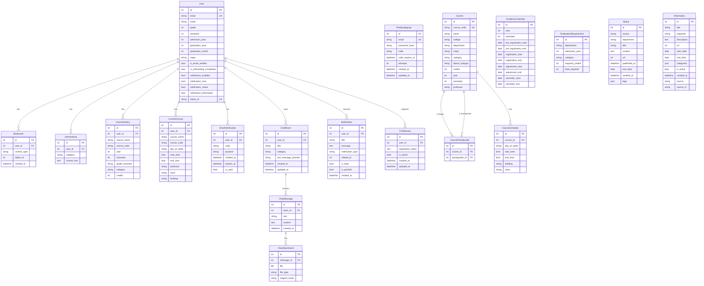

# MJCN - 명지대학교 학생 AI 비서 서비스

> 명지대학교 캡스톤디자인 프로젝트
> 최종 수정일: 2026-04-16
> 기능명세서 v1.0 기반

---

## 1. 프로젝트 개요

### 1.1 목적

명지대학교 학생들의 학사 생활을 통합 지원하는 AI 기반 비서 서비스.
공지사항, 수강/졸업 관리, 정보 정보를 하나의 플랫폼에서 제공하고,
AI 챗봇("띵똥이")을 통해 개인화된 답변과 PUSH 알림을 제공한다.

### 1.2 핵심 가치

- **통합**: 흩어진 학사 정보(공지, 수강, 정보)를 한 곳에서 조회
- **개인화**: 개인화 데이터(사용자 프로필 정보 + AI 카테고리 빈도) 기반 맞춤 추천
- **AI 비서**: 자연어 대화를 통한 즉각적 정보 제공

### 1.3 대상 사용자

- 명지대학교 재학생 (학부생 중심)
- 수강신청, 졸업요건, 정보(공모전, 지원 사업 등) 등의 정보가 필요한 학생

---

## 2. 기술 스택

| 구분 | 기술 | 비고 |
|------|------|------|
| Language | Python 3.11 | |
| Framework | Django 5.2.12 + DRF | REST API 서버 |
| API | Django REST Framework | JSON API |
| Database | SQLite3 (개발) / PostgreSQL (운영) | |
| AI | OpenAI API | LLM 기반 챗봇 |
| 인증 | DRF Token 또는 JWT (SimpleJWT) | Custom User 모델 |
| PUSH 알림 | FCM (Firebase Cloud Messaging) | 안드로이드 PUSH 전송 |
| 비동기 작업 | Django-Q2 또는 Celery + Redis | 크롤링/알림 스케줄링 |
| 캐시 | Redis (운영) | 선택 |
| 파일 저장 | Django FileField / S3 (운영) | 첨부파일용 |
| 문서화 | drf-spectacular (Swagger/OpenAPI) | API 문서 자동 생성 |
| CORS | django-cors-headers | 프론트엔드 연동용 |
| 소셜 로그인 | Kakao SDK + REST API | 카카오 OAuth2 인증 |

> **NOTE**: 이 프로젝트는 백엔드 REST API만 담당합니다.
> 프론트엔드는 별도 팀원이 개발합니다: **Android (Kotlin)** + **iOS (Swift)**

---

## 3. Django 앱 구조

```
CapstoneDesign/              # 프로젝트 설정 (settings, urls, wsgi)
├── accounts/                # 회원가입, 로그인, 프로필 관리
│   ├── models.py            # User, InterestArea, CourseHistory, CurrentCourse
│   ├── serializers.py       # 회원가입/프로필/설정 Serializer
│   ├── views.py             # API ViewSet
│   ├── services.py          # 이메일 인증 코드 발송/검증 로직
│   ├── authentication.py    # Access Token JTI 블랙리스트 (캐시 기반)
│   ├── throttles.py         # 이메일 기준 Rate Limiting
│   └── urls.py
├── themes/                  # 테마 기반 가이드
│   ├── models.py            # Theme, ThemeItem
│   ├── serializers.py
│   ├── views.py
│   └── urls.py
├── chat/                    # AI 비서 채팅 (띵똥이)
│   ├── models.py            # ChatRoom, ChatMessage, ChatAttachment
│   ├── serializers.py
│   ├── views.py
│   ├── services.py          # AI API 호출, 카테고리 분류 로직
│   └── urls.py
├── courses/                 # 수강/졸업 관리, 과목 추천
│   ├── models.py            # Course, CoursePrerequisite, GraduationRequirement
│   ├── serializers.py
│   ├── views.py
│   ├── services.py          # 추천 알고리즘, 이수현황 계산
│   └── urls.py
├── notices/                 # 공지사항 통합 조회
│   ├── models.py            # Notice
│   ├── serializers.py
│   ├── views.py
│   ├── crawlers.py          # 크롤러
│   └── urls.py
├── information/             # 정보(공모전/대외활동/지원사업/교육·강의/부트캠프) 통합 조회
│   ├── models.py            # Information
│   ├── serializers.py
│   ├── views.py
│   ├── crawlers.py          # 크롤러
│   └── urls.py
├── notifications/           # PUSH 알림
│   ├── models.py            # Notification
│   ├── serializers.py
│   ├── views.py
│   ├── services.py          # 알림 생성/스케줄링 로직
│   └── urls.py
├── dashboard/               # 메인화면 데이터 집계 API
│   ├── views.py
│   └── urls.py
├── common/                  # 공통 유틸, 미들웨어, 권한 클래스
│   ├── permissions.py       # 커스텀 DRF 권한
│   ├── pagination.py        # 공통 페이지네이션
│   └── mixins.py
└── media/                   # 업로드 파일
```

### 앱별 책임

| 앱 | 책임 | 기능명세서 항목 |
|-----|------|----------------|
| `accounts` | 회원가입, 인증(JWT), 프로필 CRUD, 설정, 탈퇴, 보안(throttle/블랙리스트) | 1, 5(설정) |
| `chat` | AI 대화 API, 채팅방 보관함, 폴더 분류 | 2.1, 5(보관함) |
| `courses` | 수강과목 추천 API, 커리큘럼, 이수현황 분석 | 3 |
| `notices` | 공지사항 크롤링/저장, 통합 조회 API, 검색 | 4.1 |
| `information` | 정보(공모전 등) 크롤링/저장, 통합 조회 API | 4.2 |
| `notifications` | 알림 생성, 조회 API, 읽음 처리, 스케줄링 | 2.2, 7 |
| `dashboard` | 메인화면 데이터 집계 API (시간표, 공지, 정보 등) | 6 |
| `common` | 공통 권한, 페이지네이션, mixin, 유틸 | - |

---

## 4. 데이터 모델

### 전체 ER Diagram


```mermaid
erDiagram
    User {
        int id PK
        string email UK
        string name
        int grade
        int semester
        int admission_year
        int graduation_year
        int graduation_month
        string major
        bool is_email_verified
        bool is_onboarding_completed
        bool notification_enabled
        bool notification_chat
        bool notification_notice
        bool notification_information
        string kakao_id UK
    }

    InterestArea {
        int id PK
        int user_id FK
        string category
        text custom_text
    }

    CourseHistory {
        int id PK
        int user_id FK
        string course_name
        string course_code
        int year
        int semester
        string grade_received
        string category
        int credits
    }

    CurrentCourse {
        int id PK
        int user_id FK
        string course_name
        string course_code
        string day_of_week
        time start_time
        time end_time
        string professor
        string room
        string building
    }

    EmailVerification {
        int id PK
        int user_id FK
        string code
        string purpose
        datetime created_at
        datetime expires_at
        bool is_used
    }

    PendingSignup {
        int id PK
        string email UK
        string password_hash
        string code
        datetime code_expires_at
        int attempts
        datetime created_at
        datetime updated_at
    }

    ChatRoom {
        int id PK
        int user_id FK
        string title
        string category
        string last_message_preview
        datetime created_at
        datetime updated_at
    }

    ChatMessage {
        int id PK
        int room_id FK
        string role
        text content
        datetime created_at
    }

    ChatAttachment {
        int id PK
        int message_id FK
        file file
        string file_type
        string original_name
    }

    Course {
        int id PK
        string course_code UK
        string name
        string college
        string department
        string major
        string category
        string liberal_subtype
        int credits
        int year
        int semester
        string professor
    }

    CoursePrerequisite {
        int id PK
        int course_id FK
        int prerequisite_id FK
    }

    CourseSchedule {
        int id PK
        int course_id FK
        string day_of_week
        time start_time
        time end_time
        string building
        string room
    }

    AcademicCalendar {
        int id PK
        int year
        int semester
        date pre_registration_start
        date pre_registration_end
        date registration_start
        date registration_end
        date adjustment_start
        date adjustment_end
        date semester_start
        date semester_end
    }

    GraduationRequirement {
        int id PK
        string department
        int admission_year
        string category
        int required_credits
        int total_required
    }

    Notice {
        int id PK
        string source
        string department
        string title
        text content
        url url
        datetime published_at
        date end_date
        datetime created_at
        json tags
    }

    Information {
        int id PK
        string title
        string organizer
        text description
        url url
        date start_date
        date end_date
        json categories
        bool is_active
        datetime created_at
        string source
        string source_id
    }

    Notification {
        int id PK
        int user_id FK
        string title
        text message
        string notification_type
        int related_id
        bool is_read
        bool is_pushed
        datetime created_at
    }

    FCMDevice {
        int id PK
        int user_id FK
        text registration_token
        bool is_active
        datetime created_at
        datetime updated_at
    }
    Bookmark {
    int id PK
    int user_id FK
    string content_type
    int object_id
    datetime created_at
}

User ||--o{ Bookmark : "has"

    User ||--o{ InterestArea : "has"
    User ||--o{ CourseHistory : "has"
    User ||--o{ CurrentCourse : "has"
    User ||--o{ EmailVerification : "has"
    User ||--o{ ChatRoom : "owns"
    User ||--o{ Notification : "receives"
    User ||--o{ FCMDevice : "registers"
    ChatRoom ||--o{ ChatMessage : "contains"
    ChatMessage ||--o{ ChatAttachment : "has"
    Course ||--o{ CoursePrerequisite : "is target"
    Course ||--o{ CoursePrerequisite : "is prerequisite"
    Course ||--o{ CourseSchedule : "has"
```

### 4.1 accounts 앱

#### User (AbstractUser 확장)

| 필드 | 타입 | 필수 | 설명 |
|------|------|------|------|
| email | EmailField | O | 로그인 ID (USERNAME_FIELD) |
| name | CharField(50) | O | 실명 |
| grade | IntegerField | O | 학년 (1~4) |
| semester | IntegerField | O | 1: 1학기 / 2: 여름방학 / 3: 2학기 / 4: 겨울방학 |
| graduation_year | IntegerField(null) | | 졸업 희망 연도 (예: 2028). null 가능 (사용자가 "선택 안 함" 선택 시) |
| graduation_month | IntegerField(null) | | 졸업 희망 월 (2 또는 8). graduation_year와 세트로 관리, null 가능 |
| admission_year | IntegerField(null) | | 입학 연도 (졸업일 자동 추정 + 졸업 진척도 계산에 사용, spec 5.3.4·5.3.5) |
| major | CharField(100, blank) | | 전공명 (예: "컴퓨터공학전공"). 관심사 매칭(spec 5.10)의 키워드 출처 중 하나 |
| chapel_count | IntegerField(default=0) | | 채플 누적 이수 회수 (졸업요건 확인용, graduation_requirements.md §2.1 / 이슈 #47) |
| is_onboarding_completed | BooleanField | O | 온보딩 완료 여부 (기본 False). 온보딩 최종 Step 완료 시 True로 업데이트 |
| is_email_verified | BooleanField | O | 이메일 인증 여부 |
| notification_enabled | BooleanField | O | 전체 알림 수신 여부 (기본 True) |
| notification_chat | BooleanField | O | AI 채팅 알림 수신 여부 (기본 True) |
| notification_notice | BooleanField | O | 공지 알림 수신 여부 (기본 True) |
| notification_information | BooleanField | O | 정보 알림 수신 여부 (기본 True) |
| kakao_id | CharField(null, blank, unique) | | 카카오 고유 사용자 ID (소셜 로그인 연동용) |

#### InterestArea (관심분야)

| 필드 | 타입 | 설명 |
|------|------|------|
| user | FK(User) | |
| category | CharField | 직업군 선택형 (choices) |
| custom_text | TextField(blank) | 자유 텍스트 입력 |

#### CourseHistory (수강이력)

| 필드 | 타입 | 설명 |
|------|------|------|
| user | FK(User) | |
| course_name | CharField | 과목명 |
| course_code | CharField | 과목번호 |
| year | IntegerField | 수강 연도 |
| semester | IntegerField | 수강 학기 |
| grade_received | CharField(blank) | 취득 성적 |
| category | CharField | 전공필수/전공선택/공통교양/핵심교양/학문기초교양/일반교양/자유선택 (학칙 7분류, #47 Phase 3) |
| liberal_subtype | CharField(null, blank) | 교양 4종 — 공통교양/핵심교양/학문기초교양/일반교양. category와 호환 동기화 (#47). 저장 시 course_code로 Course 찾아 자동 채움. 명시값은 안 덮음. bulk_create는 save() 우회하므로 별도 보강 필요. |
| core_area | CharField(null, blank) | 핵심교양 4영역(역사와 철학/사회와 공동체/문화와 예술/과학기술과 정보) + 공통교양 4영역(기독교/사고와 표현/언어/진로와 디지털리터러시). liberal_subtype=='핵심교양'/'공통교양' 행에만 채움 (#47 Phase 2). |
| credits | IntegerField | 학점 수 |

- unique_together: (user, course_code, year, semester) — 동일 학기 같은 과목 중복 등록 방지

#### CurrentCourse (현재 수강과목)

| 필드 | 타입 | 설명 |
|------|------|------|
| user | FK(User) | |
| course_name | CharField | 과목명 |
| course_code | CharField | 과목번호 |
| day_of_week | CharField | 요일 |
| start_time | TimeField | 시작 시간 |
| end_time | TimeField | 종료 시간 |
| professor | CharField(blank) | 교수명 |
| room | CharField(blank) | 강의실 |
| building | CharField(blank) | 강의실 위치 |

- unique_together: (user, day_of_week, start_time) — 동일 시간대 중복 수강 방지

#### EmailVerification (비밀번호 재설정 전용)

비밀번호 재설정 흐름에서만 사용. 회원가입 흐름은 별도 `PendingSignup` 사용 (§5.1.1 참고).

| 필드 | 타입 | 설명 |
|------|------|------|
| user | FK(User) | |
| code | CharField(8) | 인증 코드 |
| purpose | CharField | 용도 ("password_reset") |
| created_at | DateTimeField | 생성 시각 |
| expires_at | DateTimeField | 만료 시각 (생성 후 3분) |
| is_used | BooleanField | 사용 여부 |

#### PendingSignup (이메일 가입 임시 보관)

회원가입 흐름에서 이메일 인증 코드 검증을 통과하기 **전까지만** 사용. 인증 통과 시점에 `User` row를 만들면서 동시에 삭제된다. `User` FK가 없는 자족적 테이블.

| 필드 | 타입 | 설명 |
|------|------|------|
| email | EmailField (unique) | 가입 진행 중인 이메일 (upsert 키) |
| password_hash | CharField(128) | `make_password()` 결과 (raw 평문 절대 저장 안 함) |
| code | CharField(8) | 인증 코드 |
| code_expires_at | DateTimeField | 만료 시각 (생성 후 3분) |
| attempts | PositiveSmallIntegerField (default 0) | 잘못된 코드 입력 횟수 (brute force 보조 방어) |
| created_at | DateTimeField | 최초 생성 시각 |
| updated_at | DateTimeField | 최근 갱신 시각 |

라이프사이클:
- signup 호출 시 `update_or_create(email=...)`로 row upsert
- 같은 이메일 재signup 시 기존 row 덮어쓰기 (password·code·expires 전부 갱신, 이전 코드 자동 무효화)
- verify 성공 시 `User` 생성과 동시에 trigger되는 트랜잭션 안에서 row 삭제
- 만료 후에도 자동 삭제되지 않음 (follow-up cron이 24h 이상 된 row 청소)

#### Bookmark (공지/정보 북마크)

| 필드 | 타입 | 설명 |
|------|------|------|
| user | FK(User) | |
| content_type | CharField | 북마크 대상 ("notice" 또는 "information") |
| object_id | IntegerField | 대상 객체 ID (Notice 또는 Information의 PK) |
| created_at | DateTimeField | 북마크 시각 |

- unique_together: (user, content_type, object_id)

### 4.2 chat 앱

#### ChatRoom (채팅방)

| 필드 | 타입 | 설명 |
|------|------|------|
| user | FK(User) | |
| title | CharField | 채팅방 제목 (첫 질문 기반 AI 요약) |
| category | CharField | 자동 분류(수강·졸업/공지/장학·등록금/공모전/취업·진로/일반질문/기타) |
| last_message_preview | CharField(200, blank=True) | 마지막 메시지 미리보기 |
| created_at | DateTimeField | |
| updated_at | DateTimeField | |

#### ChatRoom 카테고리 정의
```python
CHAT_CATEGORIES = [
    "수강·졸업",    # 수강신청, 수강정정, 졸업요건, 이수학점, 커리큘럼 관련
    "공지",        # 학교 공지 내용 질문, 공지 요약/검색 요청
    "장학·등록금",  # 장학금 신청·조회, 등록금 납부·환불 관련
    "공모전",       # 공모전, 대외활동, 교내외 프로그램 참가 관련
    "취업·진로",    # 취업, 인턴, 대학원, 진로 고민 관련
    "일반질문",     # 학식, 도서관, 시설, 학교생활 등 위 카테고리 외 교내 질문
    "기타",         # 학교와 무관한 질문 또는 분류 불가
]
```

- AI가 첫 메시지 내용을 분석하여 위 카테고리 중 하나로 자동 분류
- 분류는 채팅방 제목 생성과 동일한 API 호출에서 함께 처리

#### ChatMessage (채팅 메시지)

| 필드 | 타입 | 설명 |
|------|------|------|
| room | FK(ChatRoom) | |
| role | CharField | "user" 또는 "assistant" |
| content | TextField | 메시지 내용 |
| created_at | DateTimeField | |

#### ChatAttachment (첨부파일)

| 필드 | 타입 | 설명 |
|------|------|------|
| message | FK(ChatMessage) | |
| file | FileField | 업로드 파일 |
| file_type | CharField | image/video/document |
| original_name | CharField | 원본 파일명 |

### 4.3 courses 앱

#### Course (과목 정보 - 학교 데이터)

| 필드            | 타입 | 설명 |
|---------------|------|------|
| course_code   | CharField(unique) | 과목번호 |
| name          | CharField | 과목명 |
| college       | CharField | 대학(예: 반도체·ICT대학) |
| department    | CharField | 학부(예: 컴퓨터정보통신공학부) |
| major         | CharField | 전공(예: 컴퓨터공학전공) |
| category      | CharField | 전공필수/전공선택/공통교양/핵심교양/학문기초교양/일반교양/자유선택 (학칙 7분류, #47 Phase 3) |
| liberal_subtype | CharField(null, blank) | 교양 4종 분류 — 공통교양/핵심교양/학문기초교양/일반교양. category와 호환 동기화 (#47). 학교 강의시간표 엑셀에는 없는 분류라 import 시점에 학과코드 prefix + 교과목명으로 채움. 전공 등 분류 대상 외 행은 null. |
| core_area     | CharField(null, blank) | 교양 영역 — 핵심교양 4(역사와 철학/사회와 공동체/문화와 예술/과학기술과 정보) + 공통교양 4(기독교/사고와 표현/언어/진로와 디지털리터러시). liberal_subtype='핵심교양'/'공통교양' 행에만 채움 (#47 Phase 2). |
| credits       | IntegerField | 학점 |
| year_open     | IntegerField | 권장 수강 학년 (1~4). **`0` = 전학년 / 학년 무관 sentinel** — 추천 점수 함수에서 학년 비교 분기(==/</>) 모두 skip (#36) |
| semester_open | IntegerField | 권장 수강 학기 (1/2/3/4 — 5.3.2 매핑) |
| professor     | CharField(blank) | 교수명 |
| tags          | JSONField(default=list) | 관심사 매칭용 태그 (예: ["IT/개발", "연구/R&D"]). 빈 배열이면 관심사 가산점 0점 |

#### 학과 분류 체계 (college → department → major)

Course 모델의 `college`, `department`, `major` 필드는 3뎁스 계층 구조를 따른다.
`department`, `major` 필드는 `null=True, blank=True`로 설정한다.

| 뎁스 | 필드명 | 예시 |
|------|--------|------|
| 1뎁스 | college (대학) | 반도체·ICT대학 |
| 2뎁스 | department (학부/학과) | 컴퓨터정보통신공학부 |
| 3뎁스 | major (전공) | 컴퓨터공학전공 |

**엣지 케이스 (null 처리) — 전체 목록**

| 대학 | department | major | 케이스 유형 | UI 동작 |
|------|------------|-------|------------|---------|
| 반도체·ICT대학 | 반도체공학부 | null | 단일학부 (전공 세분화 없음) | 전공 선택 스텝 스킵 |
| 반도체·ICT대학 | 산업경영공학과 | null | 단일학과 (학부 없이 학과만 존재) | 전공 선택 스텝 스킵 |
| 건축대학 | 공간디자인학과 | null | 단일학과 (학부 없이 학과만 존재) | 전공 선택 스텝 스킵 |
| 아너칼리지 | 자율전공학부 | null | 단일학부 (전공 세분화 없음) | 전공 선택 스텝 스킵 |

- `major`가 null → 프론트에서 전공 선택 3뎁스를 생략하고, department 선택 시 바로 확정

> 전체 분류 목록은 **부록 A. 학과 분류 전체 목록** 참조

#### CoursePrerequisite (선후수 관계)

| 필드 | 타입 | 설명 |
|------|------|------|
| course | FK(Course) | 대상 과목 |
| prerequisite | FK(Course) | 선수 과목 |

#### CourseOffering (학기·분반별 개설 정보, #36)

`Course`는 **과목 그 자체** (예: 과목코드 `컴공201` AI프로그래밍 = Course 1개).
`CourseOffering`은 그 과목이 **특정 학기에 열린 분반 한 개**.
**분반 구분 기준은 강좌번호(`section_no`) 단독** — 교수/시간/정원이 같아도
강좌번호가 다르면 별개 Offering.

같은 강좌번호의 여러 엑셀 행은 같은 Offering이며 **요일(스케줄)만** 다른 것.
즉 엑셀 한 행 = `(Course, Offering, Schedule(요일 1개))` 한 조합.

예: `컴공201`이 2026-1학기에 0753반 / 0754반으로 열렸고 각 분반이 월/수에
걸쳐있다면 → 엑셀 4행 / **Course 1 / Offering 2 / Schedule 4**.

`section_no`는 같은 학기 안에서 분반 유일 식별자.

| 필드 | 타입 | 설명 |
|------|------|------|
| course | FK(Course) | 과목 본체 |
| year | IntegerField | 개설 연도 (예: 2026) |
| semester | IntegerField | 1/2/3/4 (정규 1·2학기 / 하계 3 / 동계 4) |
| section_no | CharField | 강좌번호 (학기 안 유일) |
| professor | CharField(blank) | 담당 교수 |
| capacity | IntegerField(null=True, blank=True) | 제한 인원 |
| note | CharField(blank) | 비고 (예: 'IPP 우선수강') |

`unique_together = (year, semester, section_no)`.
시드 출처는 강의시간표 엑셀 (`import_courses_from_xlsx`, spec 5.1).

#### CourseSchedule (과목 스케쥴 정보)

| 필드 | 타입 | 설명 |
|------|------|------|
| course | FK(Course) | 대상 과목 (기존 시드 호환을 위해 NOT NULL 유지) |
| offering | FK(CourseOffering, null=True, blank=True) | 분반 단위 시간 (강의시간표 import 데이터, #36). 기존 더미 시드는 null. |
| day_of_week | CharField | 요일(월/화/수/목/금 중 하나) |
| start_time | TimeField | 시작 시간 |
| end_time | TimeField | 종료 시간 |
| building | CharField(blank=True) | 강의실 위치(명진당/창조관/5공학관 등). 현재 xlsx 원천 데이터에 정보 없어 항상 빈 문자열 — **응답에서는 제외** (#116). 모델 필드는 유지(향후 학교 공식 매핑 제공 시 다시 노출). |
| room | CharField(blank=True) | 강의실 번호 (xlsx 원천 코드 그대로, 예: `Y5407`) |

#### GraduationRequirement (졸업요건)

| 필드 | 타입 | 설명                  |
|------|------|---------------------|
| department | CharField | 학과                  |
| admission_year | IntegerField | 입학 연도               |
| category | CharField | 전공필수/전공선택/공통교양/핵심교양/학문기초교양/일반교양/자유선택 (학칙 7분류, #47 Phase 3) |
| liberal_subtype | CharField(null, blank) | 교양 4종 — 공통교양/핵심교양/학문기초교양/일반교양. category와 호환 동기화. 전공/자유선택 row는 null. |
| core_area | CharField(null, blank) | 교양 영역 — 핵심교양 4영역 / 공통교양 4영역(#47 Phase 2). 영역별 진척도 분해용. 그 외 row는 null. |
| required_credits | IntegerField | 필요 학점               |
| total_required | IntegerField | 총 졸업 학점             |

- **유니크 제약**: `(department, admission_year, category, liberal_subtype, core_area)`. SQLite/PG NULL != NULL 정책상 null 필드끼리는 키 충돌이 별도로 발생하지 않음. 같은 학번 row 묶어 시드 하나에서 박는 식으로 운용.
- 컴공 2024학번 비인증 13 row 예시: 전필 24 / 전선 46 / 공통교양 4영역 분해(6/3/6/2=17) / 핵심교양 4영역 분해(3×4=12) / 학문기초 15 / 일반교양 10 / 자유선택 10 = 134학점.

#### AcademicCalendar (학사일정)

| 필드 | 타입 | 설명 |
|------|------|------|
| year | IntegerField | 연도 |
| semester | IntegerField | 학기 (1 or 2) |
| pre_registration_start | DateField(null) | 미리담기 시작일 |
| pre_registration_end | DateField(null) | 미리담기 종료일 |
| registration_start | DateField(null) | 수강신청 시작일 |
| registration_end | DateField(null) | 수강신청 종료일 |
| adjustment_start | DateField(null) | 수강신청 정정 시작일 |
| adjustment_end | DateField(null) | 수강신청 정정 종료일 |
| semester_start | DateField(null) | 학기 시작일 |
| semester_end | DateField(null) | 종강일 |

### 4.4 notices 앱

#### Notice (공지사항)

| 필드 | 타입 | 설명 |
|------|------|------|
| source | CharField | 출처 (일반/학사/해외/공모전/학생활동/진로·취업·창업/장학·학자금) |
| department | CharField(blank, default='') | 게시 부서명. 제목 앞 `[부서명]` 접두사를 분리 추출. 패턴 없으면 빈 문자열 |
| title | CharField | 제목 (원본 그대로 — `[부서명]` 접두사 포함) |
| content | TextField | 본문 plain text (HTML 태그 제거됨) |
| extracted_content | TextField(blank) | 본문이 이미지로만 구성된 경우 VLM으로 추출한 텍스트 (spec 9.1.5) |
| image_urls | JSONField(default=list) | 본문 영역의 이미지 URL 배열 (VLM 입력용) |
| url | URLField | 원문 링크 |
| published_at | DateTimeField | 게시일 |
| end_date | DateField(null) | 마감일 (있는 경우) |
| created_at | DateTimeField | 수집 시각 |
| tags | JSONField(default=list) | 관심사 매칭용 자동 태깅 키워드 (AI 파이프라인 Stage 4가 채움, spec 9.1.6) |

- unique_together: (source, url) — 동일 출처에서 동일 URL 중복 저장 방지 (크롤링 재실행 시 upsert 기준)
- AI 파이프라인 입력 우선순위: `extracted_content` 있으면 그것 사용, 없으면 `content` 사용

##### `department` 필드 추출 정책

- 제목이 `[xxx] yyy` 패턴이면 `xxx`를 `department`로, 본문 제목은 원본 그대로 보존
- 패턴이 없으면 `department=''` (빈 문자열)
- 추출은 단순 정규식 — 첫 번째 `[...]` 만 분리 (휴리스틱 화이트리스트 없음)
- 모든 source에 동일 적용 (일반·학사·해외·공모전·학생활동·진로·장학)
- 크롤러 저장 시 자동 추출, 별도 cron 불필요

#### NoticeAIResult (AI 처리 결과)

> Notice 1:1로 매칭되는 AI 파이프라인 결과 저장 (spec 9.1.1).
> Notice 모델과 분리해 재처리·실패 추적·모델 버전 관리를 단순화.

| 필드 | 타입 | 설명 |
|------|------|------|
| notice | OneToOneField(Notice, related_name='ai_result') | 대상 공지 |
| notice_type | CharField(blank) | Stage 1 결과 ("정보형" / "행동형") |
| summary | CharField(200, blank) | Stage 2 결과 (100자 이내 한 문장) |
| cards | JSONField(default=list) | Stage 3 결과 (cards 배열, 각 항목은 title+items) |
| status | CharField(choices) | "pending" / "processing" / "success" / "failed" |
| last_stage | CharField(blank) | 어디까지 성공했는지 ("summarize"/"classify"/"build_cards"/"extract_tags") |
| error_message | TextField(blank) | 마지막 실패 메시지 (디버깅용) |
| retry_count | IntegerField(default=0) | 재시도 누적 횟수 |
| content_hash | CharField(64, blank) | Notice.content sha256 — 본문 변경 감지용 |
| model_name | CharField(50, blank) | 처리에 사용한 LLM 모델명 (예: gpt-4o-mini) |
| created_at | DateTimeField | 최초 처리 시각 |
| updated_at | DateTimeField | 최종 업데이트 시각 |

- 부분 실패 복구: Stage 1·2·3까지 성공 후 Stage 4(키워드 추출) 실패 시, NoticeAIResult.status는 `success` 유지하고 `Notice.tags`만 빈 채로 둠 (다음 cron이 재시도). 그 이전 단계 실패는 같은 단계만 재시도.
- 재처리 트리거: `content_hash`가 현재 `Notice.content`와 다르면 처음부터 다시 처리
- cards 형태 예시:
  ```json
  [
    {"title": "🚨 지금 해야 할 행동", "items": ["MSI 접속 필요", "이수구분 확인 필요"]},
    {"title": "📌 등록 기간", "items": ["2026.05.01 ~ 2026.05.10"]},
    {"title": "📞 문의", "items": ["교학팀 02-XXX-XXXX"]}
  ]
  ```

### 4.5 information 앱

#### Information (정보)

| 필드 | 타입 | 설명 |
|------|------|------|
| title | CharField | 제목 |
| organizer | CharField | 주최 |
| description | TextField | 설명 (위비티는 개인정보 보호로 빈 채 저장) |
| url | URLField | 원문 링크 (변동 query 파라미터 포함 가능) |
| start_date | DateField(null) | 시작일 (있는 경우) |
| end_date | DateField(null) | 마감일 |
| categories | JSONField(default=list) | 분야 태그 (공모전/대외활동/지원사업/교육·강의/부트캠프) |
| is_active | BooleanField(default=True) | 활성 여부 |
| created_at | DateTimeField | 수집 시각 |
| source | CharField(max_length=20) | 출처 식별자 (예: 'wevity', 'mju') |
| source_id | CharField(max_length=50) | 출처 내 고유 ID (예: 위비티 ix 값) |

- UniqueConstraint: `(source, source_id)` — 같은 공모전이 여러 카테고리/페이지에 노출돼도 1행만 저장
- 크롤링 재실행 시 upsert 기준도 `(source, source_id)`
- url은 unique 아님 — 카테고리 파라미터(cidx 등) 차이로 같은 공모전이 다른 URL을 가질 수 있음

### 4.6 notifications 앱

#### Notification (알림)

| 필드 | 타입 | 설명 |
|------|------|------|
| user | FK(User) | |
| title | CharField | 알림 제목 |
| message | TextField | 알림 내용 |
| notification_type | CharField | 알림 종류 (notice/information/course/chat/system) — `chat`은 AI 채팅 알림용 (chat 앱 구현 시 활용, spec 5.2.5) |
| related_id | IntegerField(null) | 관련 객체 ID (notification_type에 따라 다른 테이블 ID, 프론트 화면 이동용) |
| is_read | BooleanField(default=False) | 읽음 여부 |
| is_pushed | BooleanField(default=False) | FCM 푸시 송신 완료 여부 (`send_pending_pushes` cron이 마킹, spec 9.3) |
| created_at | DateTimeField | 알림 생성 시각 |

#### FCMDevice (디바이스 토큰)

| 필드 | 타입 | 설명 |
|------|------|------|
| user | FK(User) | 디바이스 소유 사용자 |
| registration_token | TextField | FCM 등록 토큰 |
| is_active | BooleanField | 활성 여부 |
| created_at | DateTimeField | 등록 시각 |
| updated_at | DateTimeField | 마지막 갱신 시각 |

### 4.7 themes 앱

#### Theme (테마)

| 필드 | 타입 | 설명 |
|------|------|------|
| title | CharField | 테마 제목 (예: 수강신청 가이드) |
| category | CharField | 테마 유형 (수강신청/취업진로/교환학생/지원사업/학업관리) |
| description | TextField | 테마 설명 |
| is_active | BooleanField(default=True) | 활성 여부 |
| order | IntegerField(default=0) | 노출 순서 |
| created_at | DateTimeField | 생성 시각 |

#### ThemeItem (테마 상세 항목)

| 필드 | 타입 | 설명 |
|------|------|------|
| theme | FK(Theme) | 소속 테마 |
| title | CharField | 항목 제목 |
| content | TextField(blank) | 항목 내용 |
| external_url | URLField(blank) | 외부 링크 (바로가기) |
| item_type | CharField | 항목 유형 (guide/checklist/link) |
| order | IntegerField(default=0) | 항목 순서 |

---

## 5. 기능 상세 명세

### 5.1 회원가입 / 인증 (accounts)

#### 5.1.1 이메일 가입

- 이메일 + 비밀번호로 가입 — 이 시점에는 `User` row를 만들지 않는다. (email, password_hash, code, code_expires_at)을 신규 `PendingSignup` 임시 테이블에 upsert로 저장
- 가입 후 인증 코드 발송 (이메일로 인증 코드 전송, 유효기간 3분)
- 인증 코드 입력 화면에서 코드 입력하여 인증 완료
- 인증 완료 시점에 비로소 `User` row 생성 (트랜잭션 안에서 PendingSignup → User 변환 + PendingSignup 삭제). JWT access/refresh 토큰 발급 → 프론트가 디바이스에 저장
- 만료 시 "인증 코드 다시 보내기"로 재발송 가능 (PendingSignup row의 code/expires만 갱신, 새 row 생성 안 함)
- 인증 완료 전까지 로그인 불가 — 미인증 단계에서는 User가 존재하지 않으므로 로그인 자체가 불가능

##### 미인증 상태에서 앱 종료 시 동작

이메일/비밀번호 입력 후 인증 코드 화면에서 앱을 종료해도 DB에 `User` row가 남지 않는다 (`PendingSignup`만 존재). 사용자가 같은 이메일로 다시 회원가입을 시도하면 기존 `PendingSignup` row가 `update_or_create`로 덮어써져 새 비밀번호·코드로 갱신된다. 이전 코드는 자동 무효화.

PendingSignup row는 `code_expires_at` 경과 후에도 자동 삭제되지 않는다 (다음 가입 시도 시 upsert로 자연스럽게 교체). 영구히 안 돌아오는 row는 별도 cron(`prune_pending_signups`, follow-up)으로 24h 이상 된 항목 청소.

##### 온보딩 중 앱 종료 후 재접속 시 이어서 진행

- 프론트는 verify-email 응답의 JWT 토큰을 디바이스에 영구 저장 (AsyncStorage/Keychain 등)
- 온보딩 각 스텝 입력 시 `PATCH /api/v1/accounts/profile/`로 **입력 즉시 저장** (모아서 마지막에 보내지 않음)
- 온보딩 최종 Step(Step 5) 완료 시 프론트가 `PATCH /api/v1/accounts/profile/`로 `is_onboarding_completed=true` 설정
- 앱 재접속 시 저장된 refresh 토큰으로 자동 로그인 → `GET /api/v1/accounts/profile/` 호출 → 아래 로직으로 재개 위치 결정

**재개 위치 판단 로직 (필수 필드 기준, 선택 필드는 무시)**

1. `is_onboarding_completed == true` → 온보딩 스킵, 메인화면으로 이동
2. `is_onboarding_completed == false`이면 아래 순서로 판단:
   - Step 1 미완료: `name`, `grade`, `semester`, `admission_year` 중 null이 있음 → Step 1부터
   - Step 2 미완료: Step 1 필수 필드는 있지만 `major`가 null (단, 단일학부/단일학과 케이스는 `department`만 있으면 완료로 간주) → Step 2부터
   - Step 3 미완료: InterestArea가 0개 → Step 3부터
   - Step 4/5는 "건너뛰기" 가능하므로 필수 필드로 판단 불가. Step 3까지 완료됐고 `is_onboarding_completed == false`면 Step 4부터 재개
- **선택 필드는 재개 판단에 영향을 주지 않음**: `graduation_year`, `graduation_month`, CourseHistory, CurrentCourse 등은 null/empty여도 스텝이 완료된 것으로 간주

#### 유효성 검사 규칙

**이메일**
- 이메일 형식 준수 (example@domain.com)
- ASCII 문자만 허용 — 한글·유니코드 local-part는 거부 (#79)
- 대소문자 구분 없이 정규화 저장 (`Abc@mju.ac.kr` → `abc@mju.ac.kr`)
- 중복 이메일 가입 불가 (대소문자 무관)

**비밀번호**
- 8자 이상 20자 이하
- 영문 + 숫자 + 특수문자 조합 필수
- 이메일과 동일한 비밀번호 불가
- Django AUTH_PASSWORD_VALIDATORS 적용 (common password, 숫자 전용, 사용자 정보 유사성 등)

**인증 코드**
- 암호학적으로 안전한 난수 생성 (secrets 모듈 사용)
- 불일치 시 "인증 코드가 일치하지 않습니다." 표시
- 만료 시 "인증 코드가 만료되었습니다. 다시 요청해주세요." 표시
- 새 코드 발송 시 기존 미사용 코드 자동 무효화

#### 5.1.2 프로필 설정 (가입 후 온보딩)

##### 입력 항목 전체

| 구분 | 항목 | 타입 | 사용자 입력 내용 | 스텝 |
|------|------|------|-----------------|------|
| 필수 | 이름 | 텍스트 | 한글 또는 영어, 2~10자 | Step 1 |
| 필수 | 학년 | 선택 | 1~4학년 | Step 1 |
| 필수 | 학기 | 선택 | 1학기 / 여름방학 / 2학기 / 겨울방학 | Step 1 |
| 필수 | 입학 연도 | 선택 | Step 1 |
| 선택 | 졸업 희망 시기 | 연도+월 또는 "선택 안 함" | "선택 안 함" 선택 시 null 저장 (자동 계산 없음). 연도 선택 시 월(2월/8월)도 함께 선택 | Step 1 |
| 필수 | 대학 (college) | 선택 (1뎁스) | 예: 반도체·ICT대학 | Step 2 |
| 필수 | 학부/학과 (department) | 선택 (2뎁스) | 예: 컴퓨터정보통신공학부 | Step 2 |
| 필수 | 전공 (major) | 선택 (3뎁스) | 예: 컴퓨터공학전공. 단일학부/학과인 경우 null (스킵) | Step 2 |
| 필수 | 관심분야 | 칩 다중선택 | 최소 1개, 최대 3개 | Step 3 |
| 선택 | 수강이력 | 과목 다중선택 | 과목명 + 수강연도 + 학기 + 성적 (나머지는 과목 DB에서 자동 매칭) | Step 4 |
| 선택 | 현재 수강과목 | 과목 다중선택 | 과목명만 선택 (시간표·교수·강의실은 과목 DB에서 자동 매칭) | Step 5 |

##### 유효성 검사 규칙

**이름**
- 2자 이상 10자 이하
- 한글 또는 영어만 입력 가능

**입학 연도 / 졸업 희망 연도**
- 1900 이상 2100 이하

**관심분야**
- 최소 1개, 최대 3개까지 선택 가능 (동시 요청 경쟁 조건 방어: DB 행 잠금으로 초과 생성 차단)
- 기타 입력 조건 : 2자 이상 100자 이하

**수강이력**
- 학점(credits): 1 이상 10 이하
- 학기(semester): 1(봄학기) 또는 2(가을학기)
- 연도(year): 1900 이상 2100 이하

**현재 수강과목**
- end_time은 start_time보다 이후여야 함

**관심분야 선택형 목록** (직업군 위주):
- IT/개발, 디자인, 마케팅/광고, 금융/회계, 교육, 공기업/공공기관,
  의료/바이오, 미디어/콘텐츠, 건축/공간, 스포츠/예술, 연구/R&D, 기타

##### 온보딩 플로우 (5스텝)

상단에 진행률 표시 (Step 1/5 ~ 5/5). Step 4·5는 "건너뛰기" 버튼 제공.

**Step 1 — 기본 정보**
- 이름, 학년, 학기, 입학 연도, 졸업 희망 시기(선택) 입력
- 졸업 희망 시기는 "연도+월" 또는 "선택 안 함" 중 선택. "선택 안 함" 선택 시 graduation_year/graduation_month 모두 null로 저장되며, 이후 프로필 수정에서 변경 가능
- 필수 필드(이름, 학년, 학기, 입학 연도) 입력 시 "다음" 버튼 활성화

**Step 2 — 전공 선택 (3뎁스 풀스크린 리스트)**
- 대학 → 학부/학과 → 전공 순서로 각 뎁스마다 풀스크린 리스트 화면 전환
- 단일 리스트 컴포넌트를 재사용하여 3뎁스 처리
- 각 항목에 하위 전공 미리보기 서브텍스트 표시 (예: "컴퓨터공학 · 정보통신공학")
- 상단 브레드크럼으로 현재 선택 경로 표시 (예: 반도체·ICT대학 > 학부 선택)
- 뒤로가기로 이전 뎁스 재선택 가능

| 엣지 케이스 | 예시 | UI 동작 |
|-------------|------|---------|
| 단일학부 (전공 없음) | 반도체공학부, 자율전공학부 | "바로 선택 완료" 힌트 표시, 전공 선택 스텝 스킵 |
| 단일학과 (전공 없음) | 산업경영공학과, 공간디자인학과 | "바로 선택 완료" 힌트 표시, 전공 선택 스텝 스킵 |

**Step 3 — 관심분야**
- 칩(Chip) 형태 다중 선택 UI
- 최소 1개 선택 시 "다음" 버튼 활성화

**Step 4 — 수강이력 (선택, 건너뛰기 가능)**
- Step 2에서 선택한 학과의 과목이 기본 리스트로 표시 (가나다순)
- 과목 탭 시 선택 (체크 표시)
- 상단 검색으로 타과/교양 과목 검색 및 추가
- 사용자 입력: 과목 선택 + 수강 연도 + 학기 + 성적
- 이수구분, 학점 수, 교수명 등은 과목 DB(Course 테이블)에서 자동 매칭
- 성적(grade_received)은 선택 입력
- "다음" 또는 "건너뛰기"로 진행

**Step 5 — 현재 수강과목 (선택, 건너뛰기 가능)**
- Step 2에서 선택한 학과의 현재 학기 개설 과목이 기본 리스트로 표시
- 과목 탭 시 선택 (체크 표시)
- 상단 검색으로 타과/교양 과목 검색 및 추가
- 사용자 입력: 과목 선택만
- 요일, 시간, 교수, 강의실 등은 과목 DB(Course + CourseSchedule 테이블)에서 자동 매칭
- "완료"로 온보딩 종료

##### 과목 DB 시딩 요구사항

> **[TODO]** Step 4·5의 과목 리스트 및 자동 매칭은 Course / CourseSchedule 테이블에
> 사전 시딩된 데이터에 의존한다.
>
> - **MVP 범위**: 컴퓨터공학전공 과목 데이터만 우선 구축(시간 남으면 전공 1개 더 추가)
> - **시딩 대상 테이블**: Course, CourseSchedule, CoursePrerequisite, GraduationRequirement
> - **데이터 출처**: 명지대학교 학사 시스템 MSI의 "강의시간표"
> - **입력 포맷**: 엑셀(.xlsx)
> - **강의시간표 엑셀 컬럼 (입력 스펙, 15개)**:
>   `학년 / 교과목명 / 과목코드 / 학과코드 / 과목번호 / 학점 / 시간 / 담당교수 / 강좌번호 / 제한인원 / 요일 / 시작시간 / 종료시간 / 강의실 / 비고`
> - **시딩 방법**: Django fixture 또는 management command (`import_courses_from_xlsx`)
> - **타 학과 확장**: MVP 이후 순차 확대 예정

#### 5.1.3 로그인 / 로그아웃

**이메일 로그인**
- 이메일 + 비밀번호 로그인
- JWT 토큰 발급 (access + refresh)
- access 토큰 만료 시 refresh 토큰으로 갱신
- 이메일 미인증 사용자 로그인 시도 시 → "이메일 인증을 완료해주세요" 안내 + 인증 메일 재발송 유도

**카카오 로그인**
- 카카오톡 OAuth2 인증을 통한 소셜 로그인 (Authorization Code Grant)
- 프론트에서 카카오 SDK로 인가 코드 획득 → 백엔드에 `authorization_code` 전달
- 백엔드 처리 4단계:
  1. `code` → `access_token` 교환 (`https://kauth.kakao.com/oauth/token`)
  2. `access_token`으로 카카오 사용자 정보 조회 (`https://kapi.kakao.com/v2/user/me`)
  3. `kakao_id` 기준 `User.objects.get_or_create()` 분기
     - **신규**: `User` 생성 + `set_unusable_password()` + `is_email_verified=True` + 닉네임·이메일(있으면) 저장 → 온보딩 플로우(`is_onboarding_completed=False`). 카카오는 OAuth 제공자가 신원을 이미 보장하므로 이메일 가입과 달리 PendingSignup 단계를 거치지 않고 즉시 `User`를 만든다 (정책 차등)
     - **기존**: 그대로 사용 (재로그인)
  4. SimpleJWT 토큰 발급 → `{access, refresh, is_new_user, user}` 응답
- 카카오 계정 이메일과 기존 이메일 가입 계정이 동일한 경우 계정 연동 처리 (`kakao_id`만 추가)
- 이메일 동의 거부 케이스: `kakao_account.email`이 응답에 없으면 `email=''`로 저장 (placeholder), 추후 설정 화면에서 이메일 등록 유도
- 카카오 전용 계정 식별: `kakao_id IS NOT NULL AND password starts with '!'` (Django `set_unusable_password()` sentinel)
- 카카오 토큰(access·refresh)은 저장하지 않음 — 사용자 정보 1회 조회 후 폐기 (우리 서비스 JWT만 발급)
- **환경변수** (`.env`):
  - `KAKAO_REST_API_KEY` (필수)
  - `KAKAO_CLIENT_SECRET` (권장, 콘솔에서 발급 시)
  - `KAKAO_REDIRECT_URI` (콘솔 등록값과 정확히 동일)

**로그아웃**
- refresh 토큰 무효화 (토큰 소유자와 요청자 일치 검증 후 블랙리스트)
- access 토큰도 남은 TTL 동안 JTI 기반 블랙리스트 처리 (캐시 기반)
- FCM 디바이스 토큰 삭제

#### 5.1.4 비밀번호 찾기 / 재설정

- 로그인 화면의 "비밀번호를 잊으셨나요?" 링크를 통해 진입
- 가입 시 사용한 이메일 입력 → 인증 코드 발송 (유효기간 3분)
- 미가입 이메일 입력 시에도 동일한 발송 완료 안내 표시 (계정 존재 여부 노출 방지)
- 인증 코드 입력 → 새 비밀번호 + 비밀번호 확인 입력 → 변경 완료 후 로그인 화면 이동
- 인증 코드 검증은 회원가입 인증과 동일한 로직 재사용 (3분 타이머, 재발송)
- 인증 코드 검증(verify)과 비밀번호 변경(confirm) 2단계 분리: verify 단계에서는 코드를 소모하지 않고 유효성만 확인
- 카카오 로그인 전용 계정(비밀번호 미설정)은 재설정 코드를 발송하지 않되, 미가입 이메일과 동일한 응답 반환 (계정 존재 여부 노출 방지)
- 비밀번호 변경 시 기존에 발급된 모든 refresh 토큰 블랙리스트 처리 (탈취 세션 무효화)

#### 유효성 검사 규칙

**이메일**
- 이메일 형식 준수 (example@domain.com)
- ASCII 문자만 허용 — 한글·유니코드 local-part는 거부 (#79)
- 미가입 이메일 진행 불가

**인증 코드**
- 불일치 시 "인증 코드가 일치하지 않습니다." 표시
- 만료 시 "인증 코드가 만료되었습니다. 다시 요청해주세요." 표시

**새 비밀번호**
- 8자 이상 20자 이하
- 영문 + 숫자 + 특수문자 조합 필수
- 이메일과 동일한 비밀번호 불가
- Django AUTH_PASSWORD_VALIDATORS 적용 (common password, 숫자 전용 등)
- 비밀번호 확인 불일치 시 "비밀번호가 일치하지 않습니다." 표시

### 5.2 AI 비서 - 띵똥이 (chat)

#### 5.2.1 화면 구성

- **상단 영역**: 새 채팅 시작
  - 빠른 질문 버튼 제공 (예: 최근 7일간 교내 공지 요약, 공모전 키워드 등)
  - 메시지 입력창
- **하단 영역**: 이전 대화 목록
  - 카테고리 필터 탭: 대화가 존재하는 카테고리만 동적으로 표시
    - 대화가 없으면 탭 자체를 표시하지 않음
    - 대화가 1개 이상 존재하는 경우, "전체" + 해당 카테고리 탭만 노출
    - 예: 수강·졸업 카테고리 대화만 있을 경우 → "전체", "수강·졸업" 탭만 표시
  - 각 항목: 채팅방 제목 + 마지막 메시지 미리보기

#### 5.2.2 대화형 인터페이스

- 메시지 전송 시 자동으로 새 채팅방 생성
- 첫 메시지 기반으로 AI가 채팅방 제목 자동 생성 및 카테고리 자동 분류
  - 카테고리 : 수강·졸업, 공지, 장학·등록금, 공모전, 취업·진로, 일반질문, 기타
- 기존 채팅방 선택 시 대화 이어서 진행
- AI 컨텍스트: 개인화 데이터 + 대화 히스토리 + 학교 데이터

#### 5.2.3 텍스트 전송

- POST 요청으로 메시지 전송
- 첫 메시지인 경우: 채팅방 자동 생성 + AI에 제목 요약 요청 → ChatRoom.title 업데이트
- AI API 호출 → 응답 저장 → JSON 응답 반환

#### 5.2.4 첨부파일 전송

- 이미지, 동영상, 파일 첨부 가능
- 첨부파일 업로드 후 AI에 함께 전달 (멀티모달 지원 시)
- 지원 형식: jpg/png, mp4, pdf/docx
- 파일 크기 제한: 10MB

#### 5.2.5 정보 추천 (PUSH 알림) - notifications 앱과 연계

- **맞춤 공지 추천**: 새 공지 등록 시 + 마감일 3일 전 + 마감 전날
- **맞춤 수강과목 추천**: 수강신청 공지 등록 시 + 각 대학별(대학/전공/학부) 수강신청일 전날 + 미리담기 전날
- **맞춤 정보 추천**: 새 정보 등록 시 + 마감일 3일 전 + 마감 전날
- **교내 지원사업 능동 노출**: 사용자 개인정보 기반 교내 지원 사업 등록 시 + 마감일 3일 전 + 마감 전날
- 추천 로직: 사용자 관심분야/전공과 공지·정보 태그 매칭하여 **관련도 상위 3개 이상 추천**
- **졸업요건 알림**: 졸업까지 남은 학점이 부족할 때

#### 5.2.6 상황별 가이딩 (학사 흐름 기반)

- 수강신청 시기, 학기 종료, 수강신청 미리담기 등 주요 학사 이벤트 시점에 맞춤형 가이드 자동 제공
- 예: 수강신청 2주 전 → 추천 과목 알림, 학기 종료 후 → 다음학기 커리큘럼 제안
- 가이딩 트리거는 학사 일정 데이터 기반 스케줄링

### 5.3 수강/졸업 관리 (courses)

#### 5.3.1 다음학기 수강과목 추천

- **입력**: 사용자의 기존 수강이력 + 현재 수강중인 과목(해당 시) + 전공 + 학년/학기 + 관심사
  + **추천 대상 학기 (`target_year` / `target_semester`)** — 미지정 시 사용자 학기 기반 자동 결정 (#36)
- **고려사항**: 졸업요건 충족, 선후수 과목, 남은 학기 수를 고려하여
  **학칙 7분류 카테고리(전공필수 / 전공선택 / 공통교양 / 핵심교양 / 학문기초교양 / 일반교양 / 자유선택)**를 균형있게 배분 (#47 Phase 3)
- **개설 학기 필터 (#36)**: `CourseOffering(year, semester)`가 target과 일치하는 분반이
  존재하는 `Course`만 후보. Offering 자체가 없는 Course는 통과 (기존 시드 호환).
- **학년 무관 처리 (#36)**: `Course.year_open == 0` 인 과목은 추천 점수에서 학년 비교 분기
  (==, <, >) 모두 skip — 어떤 학년 학생에게도 중립 노출. 카테고리/관심사/선수 가감산은 정상.
- **출력**
  - 과목 정보: 과목명, 과목번호, 이수구분 카테고리, 학점
  - 분반 정보(offerings 배열): 강좌번호, 교수, 시간/강의실 (분반별 독립 — Course 평탄화 X, #111)
  - target 학기에 매칭되는 분반만 포함. 미래 학기 등 분반 미존재 시 `offerings: []`

#### 추천 시스템 설계 방향

LLM 단독 추천이 아닌 **정형 데이터 기반 규칙 로직(Rule-Based)** 중심으로 설계한다.
졸업요건/선수과목/이수학점처럼 정확성·일관성이 중요한 정보는 서버 로직이 처리하고,
LLM은 추천 설명 생성 및 관심사 해석 보조 역할로만 활용한다.

> **균형 배분 기준**: 학기당 이수구분별 카테고리 비율 고정이 아니라
> 졸업까지 카테고리별 잔여학점 진행률 기반. 부족한 이수구분별 카테고리일수록 가산점이 커진다.

#### 처리 흐름

1. **사용자 데이터 조회** — 수강이력, 이수현황, 관심사, 전공/학년
2. **Hard Filter (무조건 제외)**
   - 이미 이수 완료한 과목
   - 현재 수강 중인 과목
3. **졸업요건 잔여학점 분석** — `(category, liberal_subtype, core_area)` 트리플 키 각각의 부족 학점 계산. 핵심교양 12학점은 4영역(역사·철학/사회·공동체/문화·예술/과학기술·정보)별, 공통교양 17학점은 4영역(기독교/사고와 표현/언어/진로와 디지털리터러시)별 별개 진척도 (#47 Phase 2). 자유선택은 다른 카테고리 초과분 자동 합산 (학칙 §6 정책, #47).
4. **추천 점수 계산** (Soft Constraint)
   - 관심사 매칭 가산점
   - 졸업요건 부족 카테고리 가산점
   - 전공필수 카테고리 가산점(+25) / 학칙 의무 영역(공통/핵심/학문기초) 가산점(+15) (#47 Phase 3 — `BONUS_DESIGNATED_REQUIRED`)
   - 학년/학기 적합성 — 권장 학년 초과 시 감점
   - 권장 학년이 지난 필수/지정 과목(전공필수/공통/핵심/학문기초) 가산점 — 졸업 지연 방지용 우선 노출
   - **선수과목 hard filter** (#47): 동일 학과 학생이 선수 미이수면 후보에서 제외 (5.3.1·5.3.2 정책 일원화). 타과생은 prereq 면제
   - **동일과목 정신** (학칙 §9, #47): 같은 이름 다른 코드 자동 제외 (예: 컴공 학생이 컴정101 C언어 들었으면 기컴101 C언어도 추천 후보 X)
   - **학과별 교양 블랙리스트** (#47): 학생 전공의 전공필수 8과목과 같은 이름의 타과·교양 버전 노출 차단
5. **최종 정렬** — `score DESC → category priority → course_code ASC`
6. **추천 결과 반환**

#### Hard Filter vs Soft Constraint 구분

수강을 **실제로 못하는 조건**만 Hard Filter로 제거하고,
그 외 "권장되지 않을 뿐 가능한" 조건은 Soft Constraint(점수 조정)로 처리한다.
사용자의 선택권을 유지하면서 우선순위만 조정하기 위함이다.

| 조건 | 처리 방식 |
|---|---|
| 이미 이수 완료 | Hard — 제외 |
| 현재 수강 중 | Hard — 제외 |
| 권장 학년/학기보다 낮음 | Soft — 감점 |
| 동일 학과 + 선수과목 미이수 | Soft — 감점 |
| 타과생 + 선수과목 미이수 | 영향 없음 |

#### 선수과목 처리 정책

- **동일 학과 학생**: 선수과목 미이수 시 감점 → 권장 학습 흐름 유도
- **타과생**: 선수과목 제한 미적용(감점 없음)

#### 학년 제한 처리 정책

학년 제한은 실제로는 절대적인 수강 불가 조건이 아니다
(조기졸업·심화 선이수·캡스톤 대비 등 상위 학년 과목 수강 사례 존재).
따라서 학년 초과 과목을 **추천 후보에서 제거하지 않고**, 점수만 감점해 하단에 노출한다.

#### 5.3.2 전체 커리큘럼 추천

- **입력**: 사용자 수강이력 + 전공 + 학년/학기 + 졸업 희망 연도 + 관심사 + 추천 노브(아래)
- **고려사항**: 졸업요건 충족, 선후수 과목, 전공(필수/선택) / 교양(필수/선택) 균형 배분
- 현재 학기 수강 중인 경우 다음 학기부터 추천 시작
- **최소 2안 이상, 최대 5안 이하의 커리큘럼 제시**
  - 데이터 부족으로 1안만 만들어지는 경우, 가짜 복제 없이 1안 + `note='insufficient_data'` 동반
- **출력**: 졸업까지 남은 학기별 추천 과목 리스트
  - 학기마다 학칙 7 카테고리 키 분리 (#47 Phase 3): `major_required` / `major_elective` / `liberal_common` / `liberal_core` / `liberal_foundation` / `liberal_general` / `free_elective`
  - 빈 카테고리도 키 유지 (`[]`)
  - 과목 정보: 과목명, 과목번호, 학점
  - 분반 정보(offerings 배열): 강좌번호, 교수, 시간/강의실 (분반별 독립, #111)
  - 학기별 (year, semester) 매칭 분반만 포함. 미래 학기 등 분반 미존재 시 `offerings: []`

##### 추천 노브 (API body 파라미터, 모두 옵셔널)

LLM이 사용자 답변("21학점 빡세게", "교양 위주" 등)을 받아 아래 노브 값으로 번역해 API에 전달.
무방향 호출 시 합리적 기본값으로 동작.

| 노브 | 타입 | 기본 | 설명 |
|------|------|------|------|
| `max_credits` | int | 18 | 학기당 학점 상한 베이스. 변형 plan은 베이스 ±오프셋 적용 |
| `category_weights` | dict | `{}` | `{카테고리: 배수}`. 학칙 7분류 키(전공필수/전공선택/공통교양/핵심교양/학문기초교양/일반교양/자유선택) 가산점에 추가 배수. 예: `{"핵심교양": 1.5}` (#47 Phase 3) |
| `interest_weight` | float | 1.0 | 관심사 매칭 가산점 배수 |
| `include_summer` | bool | false | 하계 계절학기(semester_open=3) 포함 여부 |
| `include_winter` | bool | false | 동계 계절학기(semester_open=4) 포함 여부 |
| `num_plans` | int | 3 | 변형 plan 개수 (2~5로 clamp) |

##### 학기 슬롯 매핑 (`Course.semester_open`)

| 값 | 의미 |
|----|------|
| `1` | 1학기 (정규) |
| `2` | 2학기 (정규) |
| `3` | 하계 계절학기 |
| `4` | 동계 계절학기 |

학기 진행 순서: `1 → (하계 3) → 2 → (동계 4) → 다음해 1 → ...`
계절학기 슬롯은 `include_summer` / `include_winter` 토글에 따라 끼었다 빠짐.

##### 변형 plan 생성

같은 노브 베이스에서 `max_credits`에 오프셋 `[0, +3, -3, +1, -1]`을 적용해 `num_plans`만큼 변형 생성.
변형 결과가 같으면 학기-과목 시그니처로 dedupe → plan들이 실제로 서로 다름이 보장됨.

##### 선수과목 정책

5.3.1(soft 감점)과 다르게 **hard filter**. 같은 plan 안에서 prereq 학기가 먼저 와야 함.
미래 학기 사전 계획 성격상 prereq 순서 자동 정렬이 자연스러움.
타과생은 5.3.1과 동일하게 prereq 제한 면제.

##### 전공선택 쿼터 (#112)

학기별 채움 시 score-greedy가 전공필수·교양 backlog를 우선 채워서 전공선택이 0건이 되는 갭(결함 J) 방지.
잔여 전공선택 학점이 남아있으면 score 채움 phase 앞에 **학기당 최소 6학점 전공선택 우선 채움**.
잔여가 6학점 미만이면 잔여만큼만 채움 (마지막 과목 overshoot 1회 허용).
전공선택 잔여 0이면 phase skip → 점수 경쟁만 적용 (강제 추가 X).

##### 응답 스키마

```json
{
  "plans": [
    {
      "plan_number": 1,
      "max_credits": 18,
      "semesters": [
        {
          "year": 2027, "semester": 1,
          "major_required":     [{"course_code": "...", "name": "...", "credits": 3, "offerings": [{"id": 1, "section_no": "01", "professor": "...", "schedules": [...]}]}],
          "major_elective":     [],
          "liberal_common":     [],
          "liberal_core":       [],
          "liberal_foundation": [],
          "liberal_general":    [],
          "free_elective":      []
        }
      ]
    }
  ],
  "note": "insufficient_data"   // 옵셔널. fallback 발생 시에만 포함. 머신 코드 (LLM/프론트가 사용자 표현 결정)
}
```

#### 5.3.3 이수현황 계산

- 사용자가 등록한 `수강 이력`, `현재 수강 과목` 데이터를 기준으로 카테고리별 이수현황을 계산한다.

- 카테고리 (학칙 7분류, #47 Phase 3)
  - 전공필수, 전공선택, 공통교양, 핵심교양, 학문기초교양, 일반교양, 자유선택
  - 핵심교양은 GR 4영역 row sum으로 합산, 공통교양은 4영역 row sum으로 합산 (#47 Phase 2)
  - 자유선택은 다른 카테고리 required 초과분 자동 합산 (학칙 §6, #47)

- 각 카테고리별 `이수학점`, `필요학점`, `잔여학점`을 계산하여 제공한다.

- **채플** 별도 키 — 학번별 의무 회수 (1996~98 = 2회 / 1999+ = 4회). `User.chapel_count` 누적 카운트 (#47).

- 남은 총 이수 필요 학점
  - 각 카테고리별 잔여학점을 합산하여 계산한다.
  - 계산식:
    ```python
    sum(max(필요학점 - 이수학점, 0))
    ```

#### 5.3.4 졸업일 추정

- 사용자의 졸업 희망 연도 및 졸업 희망 월을 기준으로 예상 졸업일을 계산한다.

- `graduation_month`는:
  - `2` : 동계졸업
  - `8` : 하계졸업
  값만 허용한다.

- 사용자가 `graduation_year` / `graduation_month`를 직접 입력하지 않거나 잘못된 값(`graduation_month` ∉ {2, 8})이면, 가입 시점의 `학년` / `학기` 정보를 기반으로 자동 추정한다.

  - 잔여 학기:
    ```python
    R = (4 - 학년) * 2 + (2 - 학기)
    ```

  - 가입 시점 시즌
    - 봄학기: 오늘 날짜 3 ~ 8월
    - 가을학기: 오늘 날짜 9 ~ 2월

  - R번 시즌을 교차하여 마지막 학기 시즌을 결정한다.
    - 마지막 학기가 봄 시즌 → 그 해 `8월 20일` 하계졸업
    - 마지막 학기가 가을 시즌 → 다음 해 `2월 10일` 동계졸업

  - 사용자 입력 학기와 실제 시즌이 어긋나는 경우(엇학기) 사용자 입력을 우선 신뢰한다.
  - 추정값은 응답 시점 계산용으로만 사용하며 DB에 저장하지 않는다.

- 졸업 시기별 학사일정 조회 기준
  - 동계졸업(2월)
    ```python
    AcademicCalendar(
        year=graduation_year - 1,
        semester=2
    )
    ```

  - 하계졸업(8월)
    ```python
    AcademicCalendar(
        year=graduation_year,
        semester=1
    )
    ```

- 졸업일 계산 우선순위
  1. 해당 학기의:
     ```python
     AcademicCalendar.semester_end
     ```
     값이 존재하면 해당 일자를 사용
     - `is_estimated = false`

  2. 학사일정 미등록 시 폴백 규칙 적용
     - 동계졸업 → `2월 10일`
     - 하계졸업 → `8월 20일`
     - `is_estimated = true`

- 응답 필드
  - `graduation_date`
    - 추정 졸업일 (`DateField`, nullable)

  - `is_estimated`
    - 폴백 규칙 사용 여부 (`BooleanField`, nullable)

#### 5.3.5 졸업까지 진척도

- 사용자의 입학 시점부터 졸업일까지의 경과 비율을 계산한다.
- 5.3.3 이수현황 계산과 무관하며, 시간 기반 지표이다.

- 시작일: `admission_year-03-01` (1학년 1학기 시작일)
- 졸업일: 5.3.4 졸업일 추정 결과 사용
- 계산식:
  ```python
  (오늘 - 시작일) / (졸업일 - 시작일) * 100
  ```
  (반올림 정수)

- 예외 처리
  - 오늘이 시작일 이전 → `0`
  - 오늘이 졸업일 이후 → `100`
  - 시작일 == 졸업일 (이상 케이스) → `0`

- 응답 필드
  - `graduation_progress_percent` (`IntegerField`, 0 ~ 100)

#### 5.3.6 시간표 조합 추천 (#97)

- **입력**: 사용자 수강이력 + 전공 + 학년/학기 + 관심사 + `target_year` / `target_semester` + 시간표 선호 노브(아래)
- **고려사항**: 5.3.1 추천 점수 재활용 + 시간 충돌 회피 + 사용자 시간표 선호 + 다양성
- **출력**: 시간 충돌 없는 실제 수강 시간표 조합 **top-3** (다양성 dedup 적용)
- **구현 위치**: 별도 `timetables/` 앱 신설. `UserPreference` 모델 신설. `CourseOffering.time_bitmap` cached_property 추가.

##### 처리 흐름 — 7-step 파이프라인

1. **과목 후보 필터** (hard: 이수 완료 / 선수 미충족 / 미개설) — 5.3.1 hard filter 재활용
2. **점수 상위 K=20 과목으로 prune** (5.3.1 `calculate_recommendation_score` 사용)
3. **분반 확장** — `Course` → `CourseOffering` (분반 단위 후보, 같은 과목 다른 분반은 서로 다른 후보)
4. **사용자 prefs hard filter** — `no_morning` / `no_evening` / `banned_days` / `max_credits`
5. **조합 생성** — DFS + bitmap 충돌 검사 + 학점 가지치기 + 같은 과목 분반 OR 선택
6. **조합 단위 점수** — 과목 점수 합 + prefs 가산점 + 부족 카테고리 cover 가산
7. **다양성 dedup + top-3** — Jaccard 유사도 ≥ 0.7이면 중복 취급 제외, 상위 3개 반환

##### 데이터 모델

###### `UserPreference` (timetables 앱 신설, OneToOne with User)

| 필드 | 타입 | 기본값 | 적용 방식 |
|------|------|--------|----------|
| `prefer_off_days` | JSONField (list[str]) | `[]` | Soft — 선호 요일이 실제 공강이면 가산점 |
| `banned_days` | JSONField (list[str]) | `[]` | Hard — 해당 요일에 수업 있는 분반 제외 |
| `no_morning` | Bool | `false` | Hard — `start_time < 10:00` 분반 제외 (1교시 09:00 시작 제외) |
| `no_evening` | Bool | `false` | Hard — `start_time >= 18:00` 분반 제외 |
| `lunch_break` | Bool | `false` | Soft — 12:00~14:00 사이 연속 2 slot(=1시간) 이상 공강이면 가산점 |
| `max_credits` | Int | `18` | Hard 상한 (DFS 가지치기) |
| `min_credits` | Int | `15` | Soft 하한 (미달 조합 점수 패널티) |

미설정 사용자는 추천 요청 시 `get_or_create`로 default 값 row 생성.

###### `CourseOffering.time_bitmap` (courses 앱, cached_property)

- 5요일(월~금) × 26 slot(09:00~22:00, 30분 단위) bitmap
- bit index: `day_idx(0~4) * 32 + slot_idx(0~25)` (day별 32비트 분리, 26+여유 6)
- 점유 정의: "겹치는 모든 30분 slot 점유" (보수적, 75/90분 강의 안전 처리)
- 충돌 검사: `(a.time_bitmap & b.time_bitmap) != 0`

##### API 시그니처

```
POST /timetables/recommend/
```

###### Body 파라미터 (모두 옵셔널, payload field-level merge with UserPreference)

| 노브 | 타입 | UserPreference fallback | 설명 |
|------|------|---|------|
| `year` | int | (없음) | 추천 대상 학년도 |
| `semester` | int | (없음) | 추천 대상 학기 (1/2) |
| `prefer_off_days` | list[str] | DB값 | 공강 선호 요일 |
| `banned_days` | list[str] | DB값 | 수업 금지 요일 |
| `no_morning` | bool | DB값 | 1교시 제외 |
| `no_evening` | bool | DB값 | 18시 이후 제외 |
| `lunch_break` | bool | DB값 | 점심시간 공강 선호 |
| `max_credits` | int | DB값(18) | 학기 학점 상한 |
| `min_credits` | int | DB값(15) | 학기 학점 하한 |

**Payload override 규칙**:
- 키 없음 → UserPreference DB값 유지
- 키 있음 (빈 배열 / false 포함) → 명시적 override

**학기 미지정 시**: 자동 추론하지 않고 응답 최상위 `note: "MISSING_YEAR_SEMESTER"` + HTTP 400. 자연어 되묻기는 AI/chat 레이어 책임.

##### 충돌 검사 (bitmap)

분반 추가 시 누적 bitmap에 OR. 다음 분반 검사 시 누적과 AND — 0이 아니면 충돌. DFS 백트래킹 시 직전 분반 bitmap만 XOR로 제거.

##### 다양성 dedup (Jaccard greedy)

두 시간표의 과목 집합 Jaccard 유사도 ≥ 0.7이면 중복. 6과목 시간표 기준 "1과목만 다른 시간표는 중복 취급, 2과목 이상 다르면 별개". 임계값 0.7은 초안, 시드 돌려보고 튜닝.

##### 조합 단위 점수

```
combination_score = sum(course_score for course in combo)  # 5.3.1 점수 재활용
                  + prefs 가산점 (입력 항목만 활성, if prefs.x: 분기)
                  + 부족 카테고리 cover 가산 (BONUS_BACKLOG_COVER)
                  - min_credits 미달 패널티
```

내부 튜닝 상수(`BONUS_OFF_DAY=15` / `BONUS_LUNCH_BREAK=8` 등)는 코드에 유지, 외부 노출 X (#25 안 B 정책 일관).

##### Fallback / 머신 코드

응답 최상위 `note` (옵셔널):

| code | 발생 조건 | HTTP |
|------|----------|------|
| `MISSING_YEAR_SEMESTER` | year/semester 미지정 | 400 |
| `insufficient_candidates` | K=20 못 채움 (시드 부족) | 200 |
| `low_diversity_pool` | 다양성 통과 plan 3개 미만 (반환 개수만 줄임) | 200 |

각 plan별 `reason_codes` (객체 배열, 자연어 변환 hook):

| code | meta | 의미 |
|------|------|------|
| `covers_required_major` | `{count}` | 부족한 전공필수 모두 포함 |
| `covers_short_categories` | `{categories}` | 부족 카테고리 전부 cover |
| `includes_backlog_required` | `{count}` | 권장학년 지난 필수과목 포함 |
| `off_day_satisfied` | `{days}` | `prefer_off_days` 충족 |
| `no_morning_satisfied` | — | 1교시 없음 |
| `no_evening_satisfied` | — | 18시 이후 없음 |
| `lunch_break_satisfied` | — | 12~14시 연속 1시간 공강 |
| `credits_in_target_range` | `{credits}` | `min/max_credits` 범위 안 |
| `matches_interest_areas` | `{count, areas}` | 관심사 매칭 N개 |
| `credits_below_target` | `{credits, min}` | `min_credits` 미달이지만 후보 유지 |

##### 응답 스키마

```json
{
  "plans": [
    {
      "score": 285,
      "total_credits": 18,
      "credits_by_category": {
        "전공필수": 6, "전공선택": 6, "공통교양": 3, "학문기초교양": 3
      },
      "offerings": [
        {
          "id": 42,
          "course_code": "컴공301",
          "course_name": "운영체제",
          "category": "전공필수",
          "credit": 3,
          "section_no": "01",
          "professor": "...",
          "schedules": [
            {"day": "월", "start_time": "10:00", "end_time": "11:50", "room": "Y5125"},
            {"day": "수", "start_time": "10:00", "end_time": "11:50", "room": "Y5125"}
          ]
        }
      ],
      "reason_codes": [
        {"code": "covers_required_major", "meta": {"count": 2}},
        {"code": "off_day_satisfied", "meta": {"days": ["fri"]}}
      ]
    }
  ],
  "note": null
}
```

- `offerings` 정렬: 요일 ASC → 시작시간 ASC (프론트 grid 렌더 친화)
- `credits_by_category` — 0학점 카테고리는 키 생략 (응답 슬림)
- `note` — fallback 없을 시 `null`

##### LLM 역할 한정

- **서버 (정형 데이터 기반)**: 충돌 검사 / 학점 / 조합 생성 / 필터 / 점수 계산
- **LLM (OpenAI)**: `reason_codes` → 자연어 변환 / 관심사 해석 / 사용자 질의응답 / 학기 미지정 시 되묻기

##### MVP 범위 (#97)

- 위 7-step 파이프라인 / UserPreference 7필드 / 충돌 bitmap / Jaccard dedup / `POST /timetables/recommend/` / `GET·PUT /timetables/preference/`
- **V2 분리**: `SavedTimetable` (저장 기능), branch-and-bound 추가 가지치기, 카테고리별 후보 캡, LLM 자연어 통합

### 5.4 통합 정보 제공 - 공지사항 (notices)

> **크롤링 출처 정책**: 명지대학교 자체 공지 게시판만 수집한다. 외부 사이트(링커리어/씽굿/위비티 등)는 후속 작업으로 보류.

#### 5.4.1 전체보기

- 공지 전체 목록 조회
- 카드 메타 노출 형식: **`[카테고리 태그] 부서명 · 게시 시각`** + 제목
  - 카테고리 태그: 출처 라벨 (`일반` / `학사` / `해외` / `공모전` / `학생활동` / `진로·취업·창업` / `장학·학자금`)
  - 부서명: `Notice.department` (제목 앞 `[부서명]` 접두사에서 자동 추출, 없으면 출처 라벨로 대체)
- 검색 기능 (제목, 내용 검색)
- 페이지네이션

#### 5.4.2 맞춤형 보기 (기본값)

목록 조회 시 사용자 관심사 기반으로 **관련도 점수**를 매겨 정렬한다. 점수 산출 알고리즘은 5.10 매칭 로직 참조.

- **엔드포인트**: `GET /api/v1/notices/?view=personalized` (기본값) / `?view=all` (전체보기 토글)
- **정렬 기준**:
  - 1순위: 관련도 점수 내림차순 (높은 것 위)
  - 2순위: `published_at` 내림차순 (최근 것 위)
- **점수 0인 항목 포함 여부**: 점수 0 (관심사 매칭 없음)인 공지도 응답에 포함하되 최하위 정렬. 이유: 신규 사용자/관심사 미설정 사용자가 빈 화면을 보지 않도록.
- **사용자 데이터 출처**:
  - `User.major` (전공명) → 키워드 추출
  - `InterestArea.category` (선택형 직업군) → 그대로 사용
  - `InterestArea.custom_text` (자유 텍스트) → 콤마/공백 분리 후 사용
- **콘텐츠 매칭 대상**: `Notice.tags` (AI 자동 태깅 키워드)
- **응답에 점수 노출**: `match_score` 필드 추가 (프론트가 디버깅/표시에 활용)

#### 5.4.3 공지 유형 자동 분류

- LLM을 통해 공지 유형을 자동 분류 (별도 API 호출)
- **정보형**: 단순 안내 공지 (등록금 안내, 장학금 안내, 프로그램 모집 등)
- **행동형**: 학생이 반드시 조치해야 하는 공지 (이수구분 확인, 수강신청 정정, 폐강과목 등)
- 분류 결과에 따라 카드 구조화 프롬프트가 달라짐

#### 5.4.4 공지 요약 및 카드 구조화

- 크롤링된 공지를 AI가 자동 처리:
  1. 유형 분류 (정보형/행동형)
  2. 100자 이내 한 문장 요약 생성
  3. 카드 형태 JSON 구조화 (행동형 → 상세 버전, 정보형 → 간결 버전)
- 프롬프트 상세 내용은 **9.1절** 참조

#### 5.4.5 공지 북마크

- 공지 상세 화면에서 북마크 토글
- 설정 > 공지 북마크에서 북마크한 공지 목록 조회

### 5.5 통합 정보 제공 - 정보 (information)

> **크롤링 출처 정책**:
> - 1차 구현 — 명지대학교 자체 공모전 게시판
> - 2차 구현 — 외부 공모전 사이트 **위비티(wevity)** 추가 (운영팀 협조 확인 완료)
> - 그 외 외부 사이트(링커리어/씽굿 등)는 후속 작업으로 보류

#### 위비티 데이터 정책 (2026-05-12 운영팀 회신 반영)

위비티 측 회신에 따라 다음 원칙을 적용한다.

1. **상세 본문 전체 저장 금지**
   - 상세 페이지를 fetch하되 본문 텍스트(`description`)는 **빈 채로** 저장
   - 메타 정보(title, organizer, start_date, end_date, categories, url)만 저장
   - 이유: 상세 페이지에 개인정보가 포함될 수 있어 KISA·정부기관의 수정·삭제 요청 위험
   - 사용자는 항상 위비티 원문 링크로 이동해 본문을 확인하도록 유도

2. **보관 기간 — 1년**
   - `end_date`가 1년 이상 지난 위비티 출처 데이터는 자동 삭제
   - 매일 새벽(06:45 KST) cron으로 정리

3. **API/RSS 없음 → 크롤링 방식만 사용**
   - 위비티는 공식 API/RSS를 제공하지 않음을 확인
   - HTTP GET + HTML 파싱으로만 수집

4. **서비스 런칭 시 위비티 측 통보 필요**
   - 서비스 공개 URL과 담당자 연락처를 위비티 운영팀에 전달
   - KISA·정부기관 통한 정보 수정/삭제 요청이 들어올 경우 응답하기 위함
   - 운영 노트: 배포 직전 수행 작업 체크리스트로 관리 (Phase 5)

#### 5.5.1 전체보기

- 전체 정보 리스트
- `D-NN 제목` 형식으로 마감일 표시

#### 5.5.2 맞춤형 보기 (기본값)

목록 조회 시 사용자 관심사 ↔ `Information.categories` 매칭 점수 기반 정렬. 5.10 매칭 로직 참조.

- **엔드포인트**: `GET /api/v1/information/?view=personalized` (기본값) / `?view=all`
- **정렬 기준**:
  - 1순위: 관련도 점수 내림차순
  - 2순위: `end_date` 빠른 순 (D-day 임박 우선, 기존 정렬과 동일)
- **사용자 데이터 출처**: notices와 동일 (User.major + InterestArea.category + custom_text)
- **콘텐츠 매칭 대상**: `Information.categories`
- **응답에 점수 노출**: `match_score` 필드 추가
- **기존 필터와 조합 가능**: `?view=personalized&category=공모전` 같이 카테고리 필터 + 맞춤 정렬 동시 적용

#### 5.5.3 정보 북마크

- 정보 상세 화면에서 북마크 토글
- 설정 > 정보 북마크에서 북마크한 정보 목록 조회

#### 5.5.4 정보 유형 자동 분류

- 수집된 외부 정보를 카테고리별로 자동 분류
- 분류 기준: 공모전, 대외활동, 지원사업, 교육/강의, 부트캠프
- Information 모델의 `categories` JSONField에 저장

### 5.6 채팅방 보관함 (chat)

#### 5.6.1 전체 조회

- 사용자의 모든 채팅방 목록 (최신순)
- 각 항목: 제목, 마지막 메시지 미리보기, 날짜

#### 5.6.2 폴더별 조회

- 카테고리 자동 분류: 수강·졸업, 공지, 장학·등록금, 공모전, 취업·진로, 일반질문, 기타
- AI가 대화 내용 기반으로 자동 분류

#### 5.6.3 채팅 삭제

- 개별 채팅방 삭제

#### 5.6.4 채팅 이어가기

- 기존 채팅방 선택 → 대화 이어서 진행

### 5.7 설정 (accounts)

#### 5.7.1 프로필 카드

- 설정 화면 상단에 사용자 요약 정보 표시
- 표시 항목: 이름, 학과, 학년, 학기, 졸업 희망 시기

#### 5.7.2 북마크 목록

- 공지 북마크: 북마크한 공지(일반,학사, 해외, 공모전, 학생활동, 진로/취업/창업, 장학/학자금) 목록 조회
- 정보 북마크: 북마크한 정보(공모전, 대외활동, 지원사업, 교육/강의, 부트캠프) 목록 조회

#### 5.7.3 프로필 수정

- 기본 정보 변경: 이름, 학년, 학기, 졸업 희망 시기 ("선택 안 함" 포함)
- 전공 선택 변경: 대학/학부/전공 3뎁스 재선택 (온보딩 Step 2 컴포넌트 재사용)
- 관심 분야 변경: 칩 다중선택 UI (온보딩 Step 3 컴포넌트 재사용)
- 수강 이력 변경: 과목 추가/삭제 (온보딩 Step 4 컴포넌트 재사용)
- 현재 수강 과목 변경: 과목 추가/삭제 (온보딩 Step 5 컴포넌트 재사용)

#### 5.7.4 알림 설정

- 전체 알림: 모든 알림 on/off (off 시 하위 알림 전부 비활성화)
- AI 채팅 알림: AI 띵똥이 관련 알림 on/off
- 공지 알림: 공지사항 관련 알림 on/off
- 정보 알림: 정보 관련 알림 on/off

#### 5.7.5 회원 탈퇴

- 비밀번호 재확인 필수 (탈취된 access token으로 즉시 탈퇴 방지)
- 카카오 전용 계정(비밀번호 미설정)은 비밀번호 없이 탈퇴 허용

### 5.8 메인화면 데이터 (dashboard)

> 단일 API 호출로 메인화면에 필요한 모든 데이터를 집계하여 반환

#### 응답 데이터 구성

- **greeting**: 인사 문구 데이터 (사용자명, 요일, 오늘 수업 수)
- **graduation_progress_percent**: 졸업까지 진척도 (정수 0 ~ 100, 5.3.5 참조)
- **today_schedule**: 오늘 요일 기준 수업 리스트 (시간순 정렬)
- - **notices**: 관심사 기반 최근 공지 N개 (카카오 오픈톡 포함)
- **information**: 관심사 기반 정보 N개 (D-day 포함)
- **unread_notification_count**: 읽지 않은 알림 수


### 5.9 알림 (notifications)

#### 5.9.1 전체보기

- 전체 알림 리스트 API (최신순, 페이지네이션)
- 각 알림에 is_read 필드 포함
- related_url 필드로 프론트에서 이동할 경로 제공

### 5.10 매칭 로직 (공통)

공지·정보의 맞춤형 보기 + 대시보드의 관심사 기반 콘텐츠 노출에 공통으로 사용되는 매칭 알고리즘. 별도 공통 모듈 (`common/matching.py`)로 분리해 중복 구현 방지.

> 참고: 본 절은 `태그매칭추천로직.md` 설계 문서 기반. spec 일치를 위해 핵심 알고리즘만 여기 명시.

#### 5.10.1 사용자 키워드 집합

매 요청마다 사용자의 키워드 집합을 추출.

| 출처 | 처리 |
|------|------|
| `User.major` | 전공명 그대로 1개 키워드로 (예: "컴퓨터공학전공") |
| `InterestArea.category` (FK 1:N) | 모든 카테고리 값 그대로 추가 (예: "IT/개발", "AI") |
| `InterestArea.custom_text` (FK 1:N) | 콤마(`,`) 또는 공백으로 분리해 각각 추가 (예: "머신러닝, 백엔드" → ["머신러닝", "백엔드"]) |

→ 최종 set(str)로 합침. 중복 제거.

#### 5.10.2 콘텐츠 태그 집합

| 콘텐츠 | 출처 |
|--------|------|
| Notice | `Notice.tags` (JSONField, AI 자동 태깅 키워드) |
| Information | `Information.categories` (JSONField, 크롤링 시 수집된 분류) |
| Course | `Course.tags` (현재 spec 4.x에 존재, 추천 로직에서 이미 사용 중) |

→ set(str)로 변환.

#### 5.10.3 점수 산출

```
score = |사용자_키워드 ∩ 콘텐츠_태그|   (단순 교집합 크기)
```

- **완전 일치만 카운트**: 부분 문자열 매칭은 v1에서 적용 안 함 (오탐 방지 + 단순화)
- **카테고리별 가중치 없음** (v1): 모든 출처 동등 가중. 정밀도 부족하면 v2에서 카테고리별 가중치 추가
- **점수 0 케이스**: 관심사 미설정 사용자 또는 매칭 없는 경우 → 0점. 응답에 그대로 포함 (정렬 최하위)

#### 5.10.4 응답 노출 필드

목록 응답의 각 항목에 `match_score: int` 추가. 프론트가 디버깅·표시에 활용 가능 (필수는 아님).

#### 5.10.5 성능 고려

- 사용자 키워드 추출은 요청당 1회 (캐시 없음)
- 콘텐츠 태그 비교는 페이지네이션된 항목(기본 20개) 만 대상 → DB에서 가져온 후 Python에서 점수 계산
- 점수 기반 정렬도 Python 레벨 (`sorted(...)`) — 페이지네이션과 호환을 위해 전체 queryset을 fetch 후 정렬 → 페이지 적용
- 데이터 규모 (Notice ~100건, Information ~30건)에서는 충분히 빠름. 만 단위로 늘어나면 DB 레벨 점수 계산 (raw SQL 또는 PostgreSQL `array` 함수)으로 마이그레이션 검토

#### 5.10.6 사용 위치

| 사용처 | 적용 방식 |
|--------|-----------|
| `GET /api/v1/notices/?view=personalized` | NoticeListView에서 점수 계산 → 정렬 |
| `GET /api/v1/information/?view=personalized` | InformationListView 동일 |
| `GET /api/v1/dashboard/` (5.8) | "관심사 기반 최근 공지·정보 N개" 노출에 사용 |
| `courses/services.py` 기존 코드 | 이미 자체 구현됨 (`BONUS_INTEREST_MATCH`). 추후 공통 모듈로 통합 검토 가능 |

---

## 6. REST API 설계

> 모든 API는 `/api/v1/` 접두사를 사용합니다.
> 인증이 필요한 API는 `Authorization: Bearer <access_token>` 헤더를 요구합니다.
> 응답 형식: JSON

### 6.1 인증 (accounts)

| Method | URL | 인증 | 설명 | 요청 body |
|--------|-----|------|------|-----------|
| POST | `/api/v1/accounts/signup/` | X | 회원가입 — `User` 미생성, `PendingSignup` upsert 후 인증 코드 발송 | `{email, password, password_confirm}` |
| POST | `/api/v1/accounts/verify-email/` | X | 이메일 인증 — 검증 통과 시 `User` 생성 + `PendingSignup` 삭제 + JWT 발급 | `{email, code}` |
| POST | `/api/v1/accounts/verify-email/resend/` | X | 인증 코드 재발송 — `PendingSignup`의 code/expires 갱신 | `{email}` |
| POST | `/api/v1/accounts/login/` | X | 로그인 (JWT 발급) | `{email, password}` |
| POST | `/api/v1/accounts/login/kakao/` | X | 카카오 로그인 (신규/기존 분기) | `{authorization_code}` |
| POST | `/api/v1/accounts/token/refresh/` | X | 토큰 갱신 | `{refresh}` |
| POST | `/api/v1/accounts/logout/` | O | 로그아웃 (refresh + access 무효화) | `{refresh}` |
| POST | `/api/v1/accounts/password/reset/` | X | 비밀번호 재설정 인증 코드 발송 | `{email}` |
| POST | `/api/v1/accounts/password/reset/verify/` | X | 인증 코드 검증 | `{email, code}` |
| POST | `/api/v1/accounts/password/reset/confirm/` | X | 새 비밀번호 설정 | `{email, code, new_password}` |

#### 카카오 로그인 응답 스키마

요청:
```json
{ "authorization_code": "abc123..." }
```

성공 응답 (200 OK) — 신규 가입:
```json
{
  "access": "<JWT access token>",
  "refresh": "<JWT refresh token>",
  "is_new_user": true,
  "user": {
    "id": 42,
    "email": "user@kakao.com",
    "name": "홍길동",
    "is_email_verified": true,
    "is_onboarding_completed": false
  }
}
```

성공 응답 (200 OK) — 기존 사용자 재로그인:
```json
{
  "access": "...",
  "refresh": "...",
  "is_new_user": false,
  "user": { "...": "..." }
}
```

오류 응답:
- `400 Bad Request` — `authorization_code` 누락/형식 오류
- `401 Unauthorized` — 카카오 token 교환 실패 (만료된 code, redirect_uri 불일치 등)
- `502 Bad Gateway` — 카카오 API 호출 자체가 실패 (네트워크/카카오 측 장애)

엣지 케이스:
- 이메일 동의 거부: `user.email = ''` 로 저장, 프론트는 `is_new_user && !email` 조건으로 이메일 등록 화면 노출
- 이메일 중복: 동일 이메일의 기존 일반 가입 계정이 있으면 → 기존 계정에 `kakao_id` 추가 (계정 연동)
- 재로그인: `is_new_user=false` + `is_onboarding_completed`에 따라 메인/온보딩 분기


### 6.2 프로필 / 설정 (accounts)

| Method | URL | 인증 | 설명 | 요청 body |
|--------|-----|------|------|-----------|
| GET | `/api/v1/accounts/profile/` | O | 내 프로필 조회 | |
| PUT | `/api/v1/accounts/profile/` | O | 프로필 전체 수정 (온보딩) | |
| PATCH | `/api/v1/accounts/profile/` | O | 프로필 부분 수정 | |
| GET | `/api/v1/accounts/settings/` | O | 설정 조회 (알림 on/off 등) | |
| PATCH | `/api/v1/accounts/settings/` | O | 설정 수정 | |
| DELETE | `/api/v1/accounts/withdraw/` | O | 회원 탈퇴 (비밀번호 재확인) | `{password}` |

### 6.3 관심분야 (accounts)

| Method | URL | 인증 | 설명 |
|--------|-----|------|------|
| GET | `/api/v1/accounts/interests/` | O | 관심분야 목록 조회 |
| POST | `/api/v1/accounts/interests/` | O | 관심분야 추가 |
| DELETE | `/api/v1/accounts/interests/<id>/` | O | 관심분야 삭제 |

### 6.4 수강이력 / 현재수강 (accounts)

| Method | URL | 인증 | 설명 |
|--------|-----|------|------|
| GET | `/api/v1/accounts/course-history/` | O | 수강이력 목록 |
| POST | `/api/v1/accounts/course-history/` | O | 수강이력 추가 |
| PUT | `/api/v1/accounts/course-history/<id>/` | O | 수강이력 수정 |
| DELETE | `/api/v1/accounts/course-history/<id>/` | O | 수강이력 삭제 |
| GET | `/api/v1/accounts/current-courses/` | O | 현재 수강과목 목록 |
| POST | `/api/v1/accounts/current-courses/` | O | 현재 수강과목 추가 |
| PUT | `/api/v1/accounts/current-courses/<id>/` | O | 현재 수강과목 수정 |
| DELETE | `/api/v1/accounts/current-courses/<id>/` | O | 현재 수강과목 삭제 |

### 6.5 AI 채팅 (chat)

| Method | URL | 인증 | 설명 |
|--------|-----|------|------|
| GET | `/api/v1/chat/rooms/` | O | 채팅방 목록 (전체) |
| GET | `/api/v1/chat/rooms/?category=<cat>` | O | 채팅방 폴더별 조회 |
| POST | `/api/v1/chat/rooms/` | O | 새 채팅방 생성 |
| GET | `/api/v1/chat/rooms/<id>/` | O | 채팅방 상세 (메시지 히스토리) |
| DELETE | `/api/v1/chat/rooms/<id>/` | O | 채팅방 삭제 |
| POST | `/api/v1/chat/rooms/<id>/messages/` | O | 메시지 전송 + AI 응답 |
| POST | `/api/v1/chat/rooms/<id>/messages/` | O | 첨부파일 전송 (multipart) |

### 6.6 수강/졸업 관리 (courses)

| Method | URL | 인증 | 설명 |
|--------|-----|------|------|
| GET | `/api/v1/courses/recommend/next/?year=&semester=` | O | 다음학기 수강과목 추천 (쿼리 미지정 시 사용자 학기 기반 자동, spec 5.3.1, #36). semester ∉ {1,2,3,4} 또는 비숫자 → 400 |
| POST | `/api/v1/courses/recommend/curriculum/` | O | 전체 커리큘럼 추천 (body 노브, spec 5.3.2) |
| GET | `/api/v1/courses/status/` | O | 이수현황 분석 |
| GET | `/api/v1/courses/` | O | 과목 검색 (쿼리 파라미터) |

### 6.7 공지사항 (notices)

| Method | URL | 인증 | 설명 |
|--------|-----|------|------|
| GET | `/api/v1/notices/` | O | 공지 목록 (맞춤형 기본 — `view=personalized` 동작) |
| GET | `/api/v1/notices/?view=all` | O | 공지 전체보기 (최신순) |
| GET | `/api/v1/notices/?view=personalized` | O | 명시적 맞춤형 보기 (5.10 매칭 로직 적용) |
| GET | `/api/v1/notices/?q=<검색어>` | O | 공지 검색 |
| GET | `/api/v1/notices/?source=academic` | O | 출처 필터 |
| GET | `/api/v1/notices/<id>/` | O | 공지 상세 |

응답에 `match_score: int` 필드 포함 (`view=personalized` 시 의미 있음, 그 외는 0).

#### 응답 필드 — 부서명 표시

목록·상세 응답에 다음 두 필드가 포함된다 (spec 4.4 `Notice.department` 정책 반영):

| 필드 | 출처 | 설명 |
|------|------|------|
| `department` | `Notice.department` 그대로 | 부서명. 없으면 빈 문자열 |
| `department_display` | 가공 | `department`가 비어있으면 `source_label`(예: `학사공지`)로 자동 대체. 항상 값 있음 → 프론트는 별도 분기 없이 메타 라인 노출 가능 |

응답 예시:
```json
{
  "id": 85,
  "source": "general",
  "source_label": "일반공지",
  "department": "원격교육센터",
  "department_display": "원격교육센터",
  "title": "[원격교육센터] 명지대학교 \"카피킬러 캠퍼스\" 도입 안내",
  "published_at": "2026-05-12T...",
  ...
}
```

부서명 없는 공지의 경우:
```json
{
  "department": "",
  "department_display": "학사공지",
  "title": "수강신청 안내",
  ...
}
```

### 6.8 정보 (information)

| Method | URL | 인증 | 설명 |
|--------|-----|------|------|
| GET | `/api/v1/information/` | O | 정보 목록 (맞춤형 기본 — `view=personalized` 동작) |
| GET | `/api/v1/information/?view=all` | O | 정보 전체보기 (마감일 빠른 순) |
| GET | `/api/v1/information/?view=personalized` | O | 명시적 맞춤형 보기 (5.10 매칭 로직 적용) |
| GET | `/api/v1/information/?q=<검색어>` | O | 정보 검색 |
| GET | `/api/v1/information/?category=공모전` | O | 카테고리 필터 |
| GET | `/api/v1/information/<id>/` | O | 정보 상세 |

응답에 `match_score: int` 필드 포함 (`view=personalized` 시 의미 있음, 그 외는 0). `?view=personalized&category=공모전` 같이 조합 가능.

### 6.9 알림 (notifications)

| Method | URL | 인증 | 설명 |
|--------|-----|------|------|
| GET | `/api/v1/notifications/` | O | 알림 전체 목록 (페이지네이션) |
| GET | `/api/v1/notifications/unread-count/` | O | 읽지 않은 알림 수 |
| PATCH | `/api/v1/notifications/<id>/` | O | 읽음 처리 |
| POST | `/api/v1/notifications/read-all/` | O | 전체 읽음 처리 |
| POST | `/api/v1/notifications/devices/` | O | FCM 디바이스 토큰 등록/갱신 |
| DELETE | `/api/v1/notifications/devices/` | O | FCM 디바이스 토큰 삭제 (로그아웃 시) |

#### 응답 정책

**본인 알림만 접근 가능**: 다른 사용자의 알림 ID로 PATCH 시도 → **404 Not Found** (존재 자체 노출 방지 — enumeration 방어).

**알림 생성 트리거**: 다른 앱(notices, information, courses 등)에서 이벤트 발생 시 `notifications.services.create_notification(user, ...)` 헬퍼 호출. 사용자의 `notification_enabled` 와 카테고리별 토글(`notification_notice`, `notification_information` 등)을 체크해 INSERT 결정.

**FCM 디바이스 멱등 등록**: 같은 사용자가 같은 토큰 두 번 POST해도 1행만 저장. `is_active=True` 갱신 + `updated_at` 갱신. 다른 사용자가 같은 토큰을 보내면(디바이스 양도 케이스) 기존 사용자 매핑 해제 후 새 사용자에 연결.

**알림 카테고리별 토글**: User 모델의 `notification_enabled`, `notification_notice`, `notification_information`, `notification_chat` 4개 플래그 기준 노출 제어. 전체 OFF면 INSERT 자체 안 함.

#### 공지·정보 자동 fanout 정책

크롤링으로 신규 콘텐츠가 등록될 때 관심사 매칭 사용자에게 인앱 알림을 자동 생성한다. spec 5.10 매칭 로직(`common.matching.score_match`)을 그대로 활용.

**적용 대상 (언제)**:
- `crawl_notices` 실행 중 `Notice`가 **신규 생성된 경우만** (upsert에서 `created=True`). 기존 항목 갱신(`updated=True`)은 알림 미발송 — 사용자 도배 방지.
- `crawl_information` 도 동일 — `Information` 신규 생성 시에만.

**대상 사용자 (누구에게)**:
- `is_active=True` 사용자 중에서
- `extract_user_keywords(user)` 와 콘텐츠의 `tags`(공지) / `categories`(정보) 간 `score_match` ≥ 1
- 사용자의 알림 토글(`notification_enabled` + 카테고리별)이 모두 ON
- 매칭 점수 0인 사용자에게는 알림을 만들지 않는다 — "관심 있는 사용자에게만" 원칙.

**백필 가드**:
- `Notice.published_at` 이 **최근 7일 이내**인 항목만 fanout 대상. 초기 백필이나 `--max-pages` 큰 값으로 과거 공지를 대량 수집할 때 알림 폭주를 방지.
- `Information` 은 `end_date` 가 없거나 `end_date >= today` 인 항목만 (마감 지난 정보로 알림 보내지 않음).

**알림 본문**:
- `title`: 콘텐츠 제목 그대로 (`Notice.title` / `Information.title`)
- `message`: 짧은 안내 문구 ("관심사 기반 새 공지가 등록되었습니다" 등). 본문 요약은 클라이언트가 상세 페이지에서 조회.
- `notification_type`: `notice` 또는 `information`
- `related_id`: `Notice.id` 또는 `Information.id`

**호출 위치**:
- 공지: `BaseNoticeCrawler.save()` 또는 명령 핸들러에서 created 직후 호출. AI 처리(`process_notices_ai`)와는 독립 — AI 실패해도 알림은 발송됨.
- 정보: `BaseInformationCrawler.save()` 동일.
- LLM 호출이나 외부 HTTP는 fanout 안에서 하지 않는다 — 단순 DB INSERT 반복.

**성능**:
- 사용자 N × 신규 콘텐츠 M = N×M INSERT. 현 단계는 단순 루프 (`create_notification` 호출). bulk 최적화는 별 PR.

**FCM 푸시 송신**: 위 fanout은 인앱 알림(`Notification` row)만 생성한다. 실제 디바이스 푸시는 별도 cron 명령 `send_pending_pushes`가 담당한다 (spec 9.3).

- **방식**: 매일 06:35 KST cron — `is_pushed=False`이고 `created_at`이 최근 24시간 이내인 `Notification`을 사용자의 활성 `FCMDevice`로 멀티캐스트 송신. crawl(06:00)+fanout과 분리돼 크롤링이 FCM 장애에 묶이지 않는다.
- **`is_pushed` 상태머신**: 송신 성공 또는 활성 디바이스 없음 → `True` (재시도 안 함). transient 실패(FCM 5xx·네트워크) → `False` 유지(다음 cron 재시도). `created_at` 24시간 초과 → 푸시 없이 `True` (누락된 cron 복구 후 노후 알림 폭주 방지 — 인앱 row는 유지돼 앱에서 조회 가능).
- **죽은 토큰**: FCM이 토큰을 `Unregistered`/`InvalidArgument`로 보고하면 해당 `FCMDevice.is_active=False`로 비활성화.
- **자격증명 미설정 시**: `FIREBASE_CREDENTIALS_PATH`가 비어 있으면 graceful no-op (로컬 개발·테스트는 자격증명 없이 동작 — 이메일 콘솔 폴백과 동일 철학).

#### 응답 스키마 — 목록

```json
{
  "count": 12,
  "next": "...",
  "previous": null,
  "results": [
    {
      "id": 7,
      "title": "수강신청 정정 안내",
      "message": "수강신청 정정 기간이 시작되었습니다",
      "notification_type": "notice",
      "related_id": 42,
      "is_read": false,
      "is_pushed": false,
      "created_at": "2026-05-17T10:00:00Z"
    }
  ]
}
```

#### 응답 스키마 — `unread-count`

```json
{ "unread_count": 5 }
```

#### 응답 스키마 — `devices` POST

요청:
```json
{ "registration_token": "fcm_token_string..." }
```

응답: 201 Created (신규) 또는 200 OK (기존 갱신)
```json
{
  "id": 3,
  "registration_token": "fcm_token_string...",
  "is_active": true,
  "created_at": "2026-05-17T10:00:00Z",
  "updated_at": "2026-05-17T10:00:00Z"
}
```

#### Out of Scope (다음 PR)

- 알림 스케줄링 (spec 7 — 마감일 D-1 자동 발송 등)

### 6.10 대시보드 (dashboard)

| Method | URL | 인증 | 설명 |
|--------|-----|------|------|
| GET | `/api/v1/dashboard/` | O | 메인화면 집계 데이터 |

메인화면에 필요한 데이터를 단일 호출로 집계해 반환한다 (5.8). 새 모델 없이 기존 앱(courses / notices / information / notifications / accounts) 데이터를 읽어 조합하는 읽기 전용 엔드포인트.

#### 응답 스키마

```json
{
  "greeting": {
    "user_name": "홍길동",
    "weekday": "목",
    "today_class_count": 3
  },
  "graduation_progress_percent": 47,
  "today_schedule": [
    {
      "id": 12,
      "course_name": "자료구조",
      "course_code": "CSE2010",
      "day_of_week": "목",
      "start_time": "09:00:00",
      "end_time": "10:30:00",
      "professor": "김교수",
      "room": "5301",
      "building": "공학관"
    }
  ],
  "notices": [ /* 공지 목록 항목 (6.7 NoticeListSerializer) — 최대 3개 */ ],
  "information": [ /* 정보 목록 항목 (6.8) + d_day — 최대 3개 */ ],
  "unread_notification_count": 5
}
```

#### 응답 정책

- **greeting**: `user_name`은 `User.name`(미입력 시 빈 문자열), `weekday`는 오늘 요일(월~일 한글), `today_class_count`는 `today_schedule` 길이.
- **graduation_progress_percent**: 5.3.5 계산 결과(0~100 정수). 별도 단독 엔드포인트는 두지 않고 본 응답으로만 노출한다.
- **today_schedule**: `CurrentCourse` 중 오늘 요일 항목을 `start_time` 오름차순 정렬. 주말 등 수업 없으면 빈 배열.
- **notices**: 관심사 매칭(5.10) 점수 내림차순 → 동점 시 최신순으로 정렬한 상위 3개. **맞춤형(매칭) 공지를 우선 노출하되, 매칭 결과가 3개 미만이면 부족분을 최신 공지로 채운다** (매칭 0개여도 3개 반환). 출처 제한 없음(오픈톡 포함).
- **information**: `is_active=True`이고 미마감(`end_date`가 없거나 오늘 이후)인 항목만 대상. 관심사 매칭 점수 내림차순 → 동점 시 마감 임박(`end_date` 오름차순) 순 상위 3개. notices와 동일하게 부족분은 마감 임박 순으로 채운다. 각 항목에 `d_day`(마감까지 남은 일수, `end_date` 없으면 `null`) 필드를 추가한다.
- **unread_notification_count**: 해당 사용자의 `is_read=False` 알림 수.

### 6.11 북마크 (accounts)

| Method | URL | 인증 | 설명 |
|--------|-----|------|------|
| POST | `/api/v1/bookmarks/` | O | 북마크 추가 (멱등) |
| DELETE | `/api/v1/bookmarks/<id>/` | O | 북마크 삭제 |
| GET | `/api/v1/bookmarks/?type=notice` | O | 북마크한 공지 목록 (전체보기) |
| GET | `/api/v1/bookmarks/?type=notice&source=academic` | O | 공지 북마크 + source 필터 |
| GET | `/api/v1/bookmarks/?type=information` | O | 북마크한 정보 목록 (전체보기) |
| GET | `/api/v1/bookmarks/?type=information&category=공모전` | O | 정보 북마크 + 카테고리 필터 |

#### 응답 정책

**POST 멱등**: 같은 `(user, content_type, object_id)` 조합으로 두 번 POST해도 새 행 생성 안 함. 1차 호출 → 201 Created, 2차 호출 → 200 OK (같은 `id` 반환). `unique_together` 제약으로 DB 1행만 유지.

**없는 `object_id` POST**: Notice/Information에 해당 ID가 없으면 → **404 Not Found**.

**다른 사용자 북마크 DELETE 시도**: 본인 소유 아닌 북마크 ID로 DELETE → **404 Not Found** (존재 자체 노출 방지 — enumeration 방어).

**Dangling bookmark**: 북마크된 Notice/Information이 삭제됐으면 list 응답의 `target` 필드를 `null`로 반환 (행 자체는 유지).

**GET `type` 파라미터 필수**: `?type=notice` 또는 `?type=information` 명시. 누락·잘못된 값 → 400 Bad Request.

#### 응답 스키마 — 목록

```json
{
  "count": 12,
  "next": "...",
  "previous": null,
  "results": [
    {
      "id": 7,
      "content_type": "notice",
      "object_id": 42,
      "created_at": "2026-05-17T10:00:00Z",
      "target": {
        "id": 42,
        "source": "general",
        "source_label": "일반공지",
        "department": "원격교육센터",
        "department_display": "원격교육센터",
        "title": "[원격교육센터] 카피킬러 도입 안내",
        "title_without_dept": "카피킬러 도입 안내",
        "published_at": "2026-05-12T00:00:00Z",
        "end_date": null,
        "url": "https://www.mju.ac.kr/..."
      }
    }
  ]
}
```

- `target`은 `content_type`에 따라 Notice 또는 Information 메타 nest
- 카드 노출에 필요한 최소 필드만 포함 (목록용 Serializer 동일)
- 본인 북마크만 노출 (다른 사용자 것 접근 불가)

#### 응답 스키마 — POST 추가 (성공)

요청:
```json
{ "content_type": "notice", "object_id": 42 }
```

응답:
```json
{
  "id": 7,
  "content_type": "notice",
  "object_id": 42,
  "created_at": "2026-05-17T10:00:00Z"
}
```

- 신규 생성 시 201 Created
- 이미 존재하면 200 OK (같은 id 반환, 멱등)

### 6.12 테마 (themes)

| Method | URL | 인증 | 설명 |
|--------|-----|------|------|
| GET | `/api/v1/themes/` | O | 테마 목록 조회 |
| GET | `/api/v1/themes/<id>/` | O | 테마 상세 (항목 포함) |

### 6.13 API 문서

| Method | URL | 설명 |
|--------|-----|------|
| GET | `/api/docs/` | Swagger UI |
| GET | `/api/schema/` | OpenAPI 스키마 (JSON/YAML) |

### 6.14 공통 응답 형식

**성공 (단일)**
```json
{
  "id": 1,
  "field": "value"
}
```

**성공 (목록 + 페이지네이션)**
```json
{
  "count": 100,
  "next": "https://.../api/v1/notices/?page=2",
  "previous": null,
  "results": []
}
```

**에러**
```json
{
  "detail": "에러 메시지"
}
```

**유효성 검사 에러**
```json
{
  "email": ["이미 사용 중인 이메일입니다."],
  "password": ["비밀번호는 8자 이상이어야 합니다."]
}
```

---

## 8. 비기능 요구사항

### 8.1 보안

- JWT 토큰 기반 인증 (access 만료: 30분, refresh 만료: 7일)
- 비밀번호 해싱 (Django 기본 PBKDF2)
- 이메일 인증 필수
- SECRET_KEY 환경변수 분리 (`.env`)
- DEBUG=False (운영 환경)
- CORS 설정 (안드로이드 네이티브는 CORS 제약 없으나, 웹 디버깅/관리자용으로 유지)
- API Throttling 설정 (DRF 기본 + 이메일 기준 per-email throttle)
  - `verify-email`, `password/reset/verify`, `password/reset/confirm`: 이메일 기준 rate limit (brute force 방어)
- 계정 enumeration 방지: 미가입/카카오 전용/이미 인증 완료 계정 모두 동일 응답 반환
- 로그인 타이밍 공격 방어: 미존재 계정에도 해시 연산 수행
- Access Token JTI 블랙리스트: 로그아웃 시 access token도 남은 TTL 동안 캐시 기반 무효화
- 비밀번호 변경 시 기존 refresh 토큰 전부 블랙리스트 처리
- 인증 코드 생성: `secrets` 모듈 사용 (암호학적 안전한 PRNG)
- 동시성 방어: 인증 코드 검증, 관심분야 생성, 회원가입 시 트랜잭션/행 잠금으로 경쟁 조건 차단
- 회원가입 동시성: `PendingSignup.update_or_create(email=...)`로 같은 이메일의 동시 가입 시도를 row 덮어쓰기로 흡수. verify는 `select_for_update`로 row 잠금 후 `User` 생성 (`User.email` unique constraint가 race 시 IntegrityError로 동일 400 반환)
- SMTP 실패 시: 회원가입은 `PendingSignup` row가 남아 사용자가 재발송으로 복구 가능 (의도된 동작). 코드 재발송은 조용히 실패

### 8.2 성능 (정량적 기준)

- **일반 API 응답 시간**: 3초 이내
- **AI 채팅 응답 시간**: 8초 이내
- **AI 적절 응답률**: 80% 이상 (사용자 테스트 기준)
- **데이터 갱신 주기**: 주요 학사/공지 데이터 1일 1회 이상
- 공지사항/정보 크롤링: 매일 06:00 KST (Asia/Seoul) 정기 실행
  - 1차 구현: 운영 서버 cron + `manage.py crawl_notices` / `crawl_information` 명령
  - 후속 도입: Django-Q2 또는 Celery Beat로 스케줄러 래핑
- 공지 VLM 전처리: 매일 06:15 KST (크롤링 직후, 텍스트 파이프라인 직전)
  - 1차 구현: 운영 서버 cron + `manage.py process_notice_images` 명령
  - 본문이 이미지로만 구성된 공지의 텍스트를 gpt-4o-mini Vision으로 추출 (spec 9.1.5)
- 공지사항 AI 처리: 매일 06:30 KST (크롤링 완료 직후 정기 실행)
  - 1차 구현: 운영 서버 cron + `manage.py process_notices_ai` 명령
  - 미처리(`pending`) + 본문 변경 감지(`content_hash` 불일치)된 공지만 처리 (멱등)
- FCM 푸시 송신: 매일 06:35 KST (crawl+fanout 완료 직후)
  - 1차 구현: 운영 서버 cron + `manage.py send_pending_pushes` 명령
  - `is_pushed=False`이고 최근 24시간 이내인 알림만 송신 (멱등 — 재실행 안전)
- 위비티 데이터 정리: 매일 06:45 KST
  - 1차 구현: 운영 서버 cron + `manage.py prune_information` 명령
  - `end_date`가 365일 지난 wevity 레코드 자동 삭제 (spec 9.2)
- AI 응답: 스트리밍 응답 고려 (SSE 또는 polling)
- DB 인덱싱: 자주 조회되는 필드 (user, created_at, deadline 등)
- API 페이지네이션: 기본 20개, 최대 100개

### 8.3 확장성

- Custom User 모델 (프로젝트 초기부터 설정 필수)
- 앱 간 느슨한 결합 (FK 관계는 있되, 비즈니스 로직은 각 앱 내)
- Serializer / ViewSet / Service 계층 분리
- API 버전 관리 (`/api/v1/`)

### 8.4 데이터

- 공지/정보: 주기적 크롤링으로 수집
- 과목/졸업요건 데이터: 초기 시딩 (fixture 또는 management command)
- 사용자 업로드 파일: `MEDIA_ROOT` 관리

### 8.5 데이터베이스

- **운영**: **PostgreSQL** (`django.db.backends.postgresql`, 어댑터 `psycopg[binary]` 3.x)
  - 사유: 운영은 멀티워커 gunicorn + 새벽 크롤링/AI/푸시 cron이 같은 DB를 동시 갱신 → SQLite는 단일 writer로 `database is locked` 빈발. PG는 MVCC로 동시 쓰기 안정적
  - JSONField (`Notice.tags`, `Information.categories` 등) `__contains` lookup은 PG JSONB 네이티브 지원
- **로컬 개발 / CI**: 환경변수(`DB_ENGINE`) 미설정 시 SQLite 폴백 — 설정·도커 없이 즉시 실행 가능
- **환경변수**: `DB_ENGINE=postgresql` 일 때 `DB_NAME`/`DB_USER`/`DB_PASSWORD`/`DB_HOST`/`DB_PORT` (+ 선택 `DB_CONN_MAX_AGE`)
- JSONField 쿼리는 코드에서 `connection.vendor` 분기 — PG는 native `__contains`, SQLite는 직렬화 문자열 `icontains` 폴백 (`information/views.py`의 카테고리 필터 참조)

#### 8.4.1 크롤링 데이터 흐름 (JSON 단일 포맷)

크롤러 → DB → API → 프론트까지 **JSON 단일 포맷**으로 처리한다.
중간 변환 없이 동일한 구조가 흐르므로 직렬화/역직렬화 비용을 최소화한다.

```
[크롤러] Python dict (JSON 직렬화 가능 구조)
   ↓ Notice.objects.update_or_create(...)
[DB] Notice / Information 레코드 (tags / categories는 JSONField로 보관)
   ↓ DRF Serializer
[API] application/json 응답
   ↓ HTTPS
[프론트] Android / iOS 클라이언트
```

크롤러 반환 dict 표준 스키마 (Notice 기준):

```json
{
  "source": "academic",
  "department": "학사지원팀",
  "title": "[학사지원팀] 2026-1학기 수강신청 안내",
  "content": "본문 plain text",
  "image_urls": ["https://www.mju.ac.kr/.../1.png", "..."],
  "url": "https://www.mju.ac.kr/...",
  "published_at": "2026-05-01T09:00:00+09:00",
  "end_date": null,
  "tags": []
}
```

- `content`는 HTML 태그 제거 후 plain text로 저장 (이후 LLM 입력용)
- `image_urls`는 본문 영역(`div.artclView`)에 포함된 이미지 URL을 절대경로로 정규화해 수집.
  본문이 이미지만으로 구성된 공지(`content`가 비거나 매우 짧음)에 대해 VLM 전처리(spec 9.1.5)에 사용한다.
- `department`는 제목의 첫 `[xxx]` 접두사를 정규식으로 분리 추출. 패턴 없으면 빈 문자열.
  `title`은 원본 그대로 (`[부서명]` 접두사 포함). 분리 표현은 API 응답 단계의 `department_display`에서 처리.
- `tags`는 크롤링 단계에서는 빈 리스트 또는 사이트 카테고리만 채우고, AI 자동 태깅은 후속 파이프라인(spec 9.1)에서 채운다
- 저장은 `(source, url)` (Notice) / `(source, source_id)` (Information) 기준 upsert
- `extracted_content`는 크롤러가 채우지 않음. VLM 전처리 단계(spec 9.1.5)에서만 채워진다.

---

## 9. 외부 연동

### 9.1 AI API (OpenAI)

- OpenAI API 사용
- 시스템 프롬프트에 개인화 데이터 정보 주입
- 대화 히스토리를 컨텍스트로 전달
- 채팅방 제목 요약 + 카테고리 자동 분류용 별도 호출 (첫 메시지 전송 시)
- 사용자 맞춤형 추천을 위한 프롬프트 설계 및 응답 최적화

#### 9.1.1 공지사항 처리 파이프라인

크롤링된 공지 원문을 (선택적 VLM 전처리 +) **4단계 LLM 호출**로 처리. 각 단계는 `notices/ai/pipeline.py`의 순수 함수, 전체 흐름은 `notices/ai/processor.py:process_notice`가 오케스트레이션 (부분 성공 시 `NoticeAIResult.last_stage` 이후만 재실행):

```
[전처리] content가 비거나 매우 짧고 image_urls가 있으면
         → VLM(gpt-4o-mini Vision)으로 이미지 → 텍스트 추출 (spec 9.1.5)
         → Notice.extracted_content에 저장

공지 본문 (extracted_content 우선, 없으면 content)
  → [1차] 요약 생성 (100자 이내 한 문장) — 별도 API 호출 (spec 9.1.2)
  → [2차] 유형 분류 (정보형/행동형) — 별도 API 호출 (spec 9.1.3)
  → [3차] 카드 구조화 — **공통 프롬프트 적용** (type 변수로 내부 분기) (spec 9.1.4)
       - 이모지 제목 + 음슴체 items 통일
       - 행동형: "🚨 지금 해야 할 행동" 카드 최상단 배치
       - 정보형: 행동 카드 없이 정보 중심 구성
  → [4차] 키워드 추출 — **`Notice.tags`** 갱신 (spec 9.1.6, 매칭용)
       - InterestArea 카테고리·전공명·도메인 키워드를 JSON list로
       - 실패 시 `Notice.tags`는 빈 채로 두고 status=success 유지 (graceful)
  → NoticeAIResult 저장 (spec 4.4)
```

##### 운영 / 실행 방식

| 항목 | 결정 |
|------|------|
| 모델 | `gpt-4o-mini` (환경변수 `OPENAI_MODEL`로 교체 가능). VLM 전처리도 동일 모델 사용 (Vision 입력 지원) |
| API 키 | `.env`의 `OPENAI_API_KEY` (settings.py에서 `os.getenv` 로드) |
| 실행 (텍스트 파이프라인) | `manage.py process_notices_ai` — 매일 06:30 KST cron |
| 실행 (VLM 전처리) | `manage.py process_notice_images` — 06:15 KST cron (텍스트 파이프라인 직전) |
| 처리 대상 (텍스트) | `NoticeAIResult.status` 가 `success`/`empty_content`가 아닌 항목 + `content_hash` 변경 감지 |
| 처리 대상 (VLM) | `extracted_content`가 비어있고 `image_urls`가 1개 이상인 Notice |
| 본문 길이 처리 | **truncate** — 본문이 일정 길이 초과 시 앞부분만 잘라 전송 (단순 절단) |
| 재시도 | 단계별 실패 시 같은 단계만 재시도, 지수 백오프 1~3회 |
| 부분 성공 | Stage별로 즉시 DB 저장 → 다음 실행에서 `last_stage` 이후만 이어서 처리 |
| 응답 파싱 | Stage 3 / VLM은 OpenAI JSON mode 사용 (구조화 출력) |

##### Management command 옵션 (예정)

```
manage.py process_notices_ai
    [--source academic general]   # 특정 출처만
    [--limit 50]                  # 처리 건수 제한
    [--ids 12 34 56]              # 특정 Notice ID만
    [--reprocess]                 # success 항목도 강제 재처리

manage.py process_notice_images   # VLM 전처리 (이미지 → 텍스트)
    [--source academic general]
    [--limit 50]
    [--ids 12 34 56]
    [--reprocess]                 # 이미 extracted_content가 있어도 재추출
```

#### 9.1.2 공지 요약 프롬프트

파이프라인 1단계. 공지 본문을 100자 이내 한 문장으로 요약. 음슴체 종결, 이모지 금지.

```text
공지 내용을 공백 포함 최대 100자 이내로 요약해.

다음 조건을 반드시 지켜:
1. 공지가 무엇에 대한 내용인지 한 문장으로 설명
2. 사용자가 해야 할 행동이 있는 경우 반드시 포함
3. 기간/기한이 있다면 반드시 포함
4. 불필요한 설명 없이 핵심만 간결하게 작성
5. 종결은 음슴체(~임, ~필요, ~권장 등)로 작성
6. 톤앤매너는 친절하지만 가볍지 않게, 빠르게 이해되도록
7. 이모지 사용 금지

출력은 한 문장만 반환해.
```

#### 9.1.3 공지 유형 분류 프롬프트

파이프라인 2단계. 공지 본문을 보고 정보형/행동형 중 하나로 분류. 분류 결과(`정보형` 또는 `행동형`)는 후속 카드 구조화 프롬프트의 `{type}` 변수로 전달된다.

| 유형 | 설명 | 예시 |
|------|------|------|
| 정보형 | 단순 안내 또는 참고용 정보 제공 | 등록금 안내, 장학금 안내, 프로그램 모집, 일정 안내 |
| 행동형 | 사용자가 반드시 확인하거나 수행해야 할 행동 포함 | 이수구분 확인, 수강신청 정정, 폐강과목, 서류 제출, 신청/납부/수정 |

```text
공지 내용을 보고 유형을 판단해.

유형 기준:
- 정보형: 단순 안내 또는 참고용 정보 제공 (예: 등록금 안내, 장학금, 프로그램 모집, 일정 안내)
- 행동형: 사용자가 반드시 확인하거나 수행해야 할 행동이 있음 (예: 이수구분 확인, 수강신청 정정, 서류 제출, 신청/납부/수정 등)

판단 기준:
- 사용자가 직접 해야 할 행동(확인, 제출, 신청, 수정, 납부 등)이 포함되면 행동형
- 행동 요구가 없고 단순 정보 전달이면 정보형
- 표현이 명령형이 아니어도, 사실상 사용자의 행동이 필요한 경우 행동형으로 판단

출력 규칙:
- 반드시 "정보형" 또는 "행동형" 중 하나만 반환
- 다른 설명, 문장, 공백 없이 결과만 출력

판단이 애매한 경우에는 사용자의 행동 필요 여부를 기준으로 판단해.
```

#### 9.1.4 공지 카드 구조화 프롬프트 (공통)

행동형/정보형 모두 동일한 프롬프트를 사용한다. `{type}` 변수 값에 따라 프롬프트 내부의 `[유형별 규칙]`이 분기되어 적용된다.
이모지 제목 + 음슴체 items 스타일로 통일하며, 행동형의 경우 "🚨 지금 해야 할 행동" 카드가 가장 먼저 배치된다.

```text
너는 대학 공지 내용을 사용자에게 보기 쉽게 정리하는 AI야.

입력으로 공지 내용과 공지 유형(type: 정보형 또는 행동형)이 주어진다.

공지 내용을 분석해서 핵심 정보를 카드 형태로 구조화해.

[기본 규칙]
1. 반드시 JSON 형식으로 반환
2. 카드 형태로 정보를 구성
3. 각 카드는 "title"과 "items"를 가진다
4. items는 짧고 간결한 문장으로 작성
5. 불필요한 설명은 제거하고 핵심만 남긴다
6. 중복 내용은 제거한다

[스타일 규칙]
1. title은 "이모지 + 명사형 한글 제목"으로 작성
   - 반드시 "이모지 + 명사형 한글 제목" 형식으로 작성
   - 존댓말(~입니다, ~하세요 등) 사용 금지
   - 완전한 문장형 표현 금지
   - 핵심 키워드 중심의 명사형으로 간결하게 작성
   - 이모지는 문맥과 의미에 맞는 것으로 자연스럽게 선택
   - 과도한 감정 표현용 이모지 사용 금지
   - title 길이는 가능한 짧고 직관적으로 작성

   예시
   - 👤 대상 확인
   - 📌 등록 기간
   - ⚠️ 주의사항
   - 🔍 확인 방법
   - 🗂 제출 서류
   - 🕒 일정 안내
   - 💳 결제 정보
   - 🚫 제한 조건

2. items는 음슴체(~임, ~필요, ~권장 등) 스타일로 작성
   예:
   - MSI 접속 필요
   - 이수구분 확인 필요
   - 오류 시 교학팀 문의 필요

3. 한 줄은 최대 1문장으로 간결하게 작성

[유형별 규칙]
- 행동형:
  → "🚨 지금 해야 할 행동" 카드를 반드시 포함하고 가장 먼저 배치
- 정보형:
  → 행동 카드 없이 정보 중심으로 구성

[문의 카드 규칙]
- 공지 내용에 부서명, 전화번호, 이메일 등 문의 정보가 포함된 경우
  → 반드시 마지막 카드로 "📞 문의" 카드 생성
- 문의 카드에는 연락처만 포함 (불필요한 설명 제외)

[카드 구성 원칙]
공지 내용을 의미 단위로 나누어 카드로 구성해.

각 카드는 하나의 주제만 담아야 하며,
사용자가 빠르게 이해할 수 있도록 제목을 명확하게 작성해.

[카드 제목 생성 기준]
공지 내용에 맞게 자유롭게 생성하되,
다음과 같은 형태를 참고해:

- 대상 확인
- 등록 기간
- 변경 내용
- 신청 방법
- 확인 방법
- 납부 방법
- 주의사항
- 문의

※ 위는 예시이며, 반드시 이 목록에 제한되지 않는다.
※ 공지 내용에 맞는 가장 자연스럽고 적절한 제목을 생성해야 한다.

[출력 형식]
{
  "cards": [
    {
      "title": "이모지 + 제목",
      "items": ["내용1", "내용2"]
    }
  ]
}

공지 유형:
{type}

공지 내용:
{공지 원문}
```

#### 9.1.5 VLM 전처리 (이미지 전용 공지 대응)

학교 공지에는 본문이 텍스트 없이 포스터 이미지(`` 태그)만으로 구성된 케이스가 존재한다.
이 경우 텍스트 파이프라인은 빈 본문을 받아 의미 있는 분류·요약·카드를 만들 수 없으므로,
VLM(Vision Language Model)으로 이미지 → 텍스트 추출을 먼저 수행한다.

##### 처리 흐름

```
크롤러: artclView 영역의  URL을 image_urls 배열에 저장
   ↓
process_notice_images 명령 (별도 cron 06:15 KST)
   대상: extracted_content가 비어있고 image_urls가 1개 이상인 Notice
   ↓
VLM 호출 (gpt-4o-mini, vision 입력)
   ↓
Notice.extracted_content에 추출 텍스트 저장
   ↓
다음 텍스트 파이프라인(06:30 KST) 실행 시 자동 재처리됨
   (NoticeAIResult.content_hash 비교에서 hash 변경 감지)
```

##### VLM 추출 프롬프트

```text
다음 이미지는 대학 공지 게시판에 올라온 포스터 또는 안내문이야.
이미지에 포함된 한국어 텍스트를 빠짐없이 옮겨 적어.

[규칙]
1. 이미지에 보이는 모든 한국어 텍스트를 그대로 추출
2. 표·목록·날짜·연락처 등은 원본 구조를 살려 줄바꿈 유지
3. 장식적 텍스트(브랜드 슬로건 등)도 포함
4. 텍스트가 아닌 시각 요소는 묘사하지 말고 텍스트만 옮김
5. 이미지에서 읽을 수 없는 부분은 [읽을 수 없음]으로 표시
6. 출력은 추출한 텍스트만 (메타 설명·서두 금지)

여러 이미지가 주어지면 각 이미지를 순서대로 추출해 빈 줄로 구분.
```

##### 운영 정책

- **모델**: `gpt-4o-mini` (Vision 입력 지원, 비용 저렴)
- **이미지 개수 한도**: 한 공지당 최대 N장(기본 5장)까지만 VLM에 보냄 — 초과분은 무시
- **재시도**: 텍스트 파이프라인과 동일하게 지수 백오프 1~3회
- **실패 처리**: VLM 호출 실패 시 `extracted_content`는 빈 채로 두고 다음 cron 실행에서 재시도
- **재추출 트리거**: `--reprocess` 옵션 또는 `image_urls` 변경 시

#### 9.1.6 키워드 추출 (Stage 4 — Notice.tags 자동 채움)

`Notice.tags`는 사용자 관심사 매칭(spec 5.10)에 사용되는 키워드 배열이다. 이 단계는 Stage 3(카드 구조화) 성공 직후 실행되며 별도 LLM 호출(JSON mode)로 처리한다.

##### 정책

- **실행 시점**: build_cards 성공 직후. 본문은 동일하게 `truncate_content(effective_content)` 적용.
- **저장 위치**: `Notice.tags` (NoticeAIResult 아님 — 매칭에서 자주 조회되는 위치라 Notice 본체에 둠).
- **실패 처리**: graceful degradation — Stage 4 실패해도 `NoticeAIResult.status='success'` 유지하고 `Notice.tags`만 빈 채로 둠. 다음 cron에서 재시도되어 채워질 수 있음.
- **재처리 트리거**: `content_hash` 변경 시 처음부터 다시 (다른 stage와 동일). `--reprocess`도 4단계 모두 재실행.
- **태그 개수**: 3~8개 (프롬프트로 유도, 최대 10개로 강제 절단).

##### 키워드 선정 기준

1. **InterestArea 카테고리 매칭 우선** — `IT/개발`, `디자인`, `마케팅/광고`, `금융/회계`, `교육`, `공기업/공공기관`, `의료/바이오`, `미디어/콘텐츠`, `건축/공간`, `스포츠/예술`, `연구/R&D`, `기타` 중 공지 내용에 적합한 것만.
2. **학과/전공명** — 공지에 학과 또는 전공이 명시되어 있으면 그 이름 그대로 (예: `컴퓨터공학과`, `데이터테크놀로지전공`).
3. **도메인 키워드** — 분야·형태·대상을 나타내는 일반 키워드 (예: `장학금`, `인턴십`, `해커톤`, `공모전`, `세미나`).
4. **제외** — `학생`, `공지`, `안내` 같은 너무 일반적인 단어, 날짜·고유 행사명·인명.

##### 프롬프트 (EXTRACT_TAGS_SYSTEM)

```text
너는 대학 공지를 사용자 관심사와 매칭하기 위한 키워드 태깅 시스템이야.

공지 내용을 보고 핵심 키워드 3~8개를 JSON list로 반환해.

[키워드 선정 규칙]
1. 사용자 관심분야 카테고리 중 매칭되는 것을 우선 포함:
   IT/개발, 디자인, 마케팅/광고, 금융/회계, 교육, 공기업/공공기관,
   의료/바이오, 미디어/콘텐츠, 건축/공간, 스포츠/예술, 연구/R&D, 기타
2. 학과/전공명이 명시되어 있으면 그대로 포함 (예: "컴퓨터공학과")
3. 공지 분야·형태를 나타내는 일반 키워드 (예: "장학금", "인턴십", "해커톤", "공모전")
4. 너무 일반적인 단어("학생", "공지", "안내") 제외
5. 영어/한국어 혼용 가능 (원문 그대로)

[출력 형식]
{"tags": ["키워드1", "키워드2", "키워드3"]}

설명·다른 키 절대 포함 금지.
```

### 9.2 외부 공모전 사이트 크롤링 (위비티)

`information` 앱은 학교 자체 게시판 외에 외부 공모전 사이트 위비티(wevity)도 수집한다. 1년 보관 정책에 따라 만료 데이터는 매일 06:45 KST `prune_information` cron이 정리한다 (spec 8.2).

#### 1차 구현 (완료)

- 명지대학교 공지사항 페이지 (학사 / 일반 / 해외 / 학생활동 / 진로·취업·창업 / 장학·학자금 등 학교 자체 게시판)
- 명지대학교 공모전 관련 게시판 (학교 자체 게시판에 올라오는 공모전·대외활동·지원사업 공지)
- 카카오톡 오픈톡 (이전 데이터 CSV import, management command로 1회성 시딩 → Notice에 source="오픈톡"으로 저장)

#### 2차 구현 (현재 범위 — feature/19)

- **위비티(wevity)** 외부 공모전 사이트 크롤러 추가 (운영팀 회신 반영, 2026-05-12)
  - 대상: Information 모델로 저장 (`source` 식별자 = `wevity`, 로깅·`--source` 옵션용)
  - 1차 대상 카테고리 (URL은 cidx 파라미터로 구분):
    - `cidx=20` — 웹/모바일/IT
    - `cidx=21` — 게임/소프트웨어
  - 카테고리 매핑: 위비티 분류 → Information.categories (공모전/대외활동/지원사업/교육·강의/부트캠프)
  - 페이지네이션: query string `gp=N` (1부터 시작, 빈 페이지면 break)
  - 멱등성: `(source='wevity', source_id=ix)` 기준 upsert — 같은 공모전이 cidx=20/21 양쪽에 노출돼도 1행
  - 실행: 매일 **06:00 KST** `manage.py crawl_information --source wevity` (학교 자체 크롤러와 동일 시각, 동일 명령에 포함)
  - 실패 격리: 위비티 파싱 실패가 다른 크롤러 실행을 막지 않음
  - 정적 HTML이면 `requests` + `BeautifulSoup4`, JS 렌더링 필요 시 `playwright` 보완

##### 개인정보 보호 정책 (위비티 측 요청)

- **상세 페이지를 fetch는 하되 본문(`description`)은 저장하지 않음**
  - 메타 정보만 추출: title, organizer, start_date, end_date, categories, url
  - 본문 텍스트는 파싱 후 즉시 폐기 (`description=''` 저장)
  - 이유: 상세 페이지에 개인정보 포함 가능성 → KISA·정부기관 수정·삭제 요청 위험 회피
- **데이터 보관 1년 정책**: `end_date`가 1년 이상 지난 wevity 레코드는 자동 삭제 (`manage.py prune_information` cron)
- **사용자 노출**: 항상 위비티 원문 링크로 이동해 본문을 확인하도록 UI 설계
- **운영팀 통보 의무**: 서비스 런칭 시 서비스 URL + 담당자 연락처를 위비티 운영팀에 전달 (Phase 5 체크리스트)

#### 후속 작업 (이번 범위 외)

- 그 외 외부 공모전 사이트 (링커리어, 씽굿 등) — 위비티 안정화 이후 별도 브랜치에서 진행

#### 크롤링 방식 / 운영

- HTTP 요청: `requests` + `BeautifulSoup4` (정적 HTML 우선; 필요 시 `playwright` 보완)
- 데이터 포맷: 8.4.1의 JSON 단일 포맷
- 실행: 매일 06:00 KST `manage.py crawl_notices` / `crawl_information` (운영 cron)
- 멱등성: `(source, url)` (Notice) / `(source, source_id)` (Information) 기준 upsert로 중복 방지
- 실패 격리: 한 사이트 파싱 실패가 다른 사이트 크롤링을 중단시키지 않음

### 9.3 FCM (Firebase Cloud Messaging)

- 안드로이드 앱으로 PUSH 알림 전송
- 백엔드에서 `firebase-admin` SDK 사용
- 앱 로그인 시 FCM 토큰을 서버에 등록(`POST /devices/`), 로그아웃 시 삭제
- **송신 방식**: `manage.py send_pending_pushes` 명령을 매일 06:35 KST cron으로 실행. `is_pushed=False`이고 최근 24시간 이내인 `Notification`을 사용자의 활성 `FCMDevice`로 멀티캐스트 송신 후 `is_pushed=True` 마킹 (spec 6.9 상태머신 참고)
- **죽은 토큰 정리**: FCM이 `Unregistered`/`InvalidArgument`로 보고한 토큰은 `FCMDevice.is_active=False`로 비활성화
- **자격증명**: 서비스 계정 JSON 키 경로를 `FIREBASE_CREDENTIALS_PATH` 환경변수로 주입. 미설정 시 송신 명령은 graceful no-op (로컬·테스트는 자격증명 없이 동작)

### 9.4 이메일 발송

- Django `send_mail` + SMTP 설정 (Gmail SMTP 또는 운영용 메일 서버)

---

## 10. 개발 단계

> 총 개발 기간: **10주**

### Phase 1 - 프로젝트 기반 + 인증 API (2주)

- [X] DRF + SimpleJWT + drf-spectacular + django-cors-headers 설치
- [ ] settings 분리 (`base.py`, `dev.py`, `prod.py`) + `.env` 관리 — `.env`는 적용, prod/dev 분리는 미완 (단일 settings.py + env-var 분기로 대체)
- [X] Custom User 모델 + accounts 앱 (`AUTH_USER_MODEL` 설정)
- [X] 회원가입 / 이메일 인증 / 로그인(JWT) / 로그아웃 API
- [X] 프로필 CRUD API (온보딩 + 수정)
- [X] 관심분야 / 수강이력 / 현재수강 CRUD API
- [X] 설정 API (알림 토글, 회원 탈퇴)
- [X] 공통 권한, 페이지네이션, 에러 핸들링 설정

### Phase 2 - 데이터 수집 (2주)

- [X] notices 앱: 공지사항 모델 + 크롤러 + management command (`crawl_notices`) — 학교 자체 공지 게시판
- [X] information 앱: 정보 모델 + 크롤러 + management command (`crawl_information`) — 학교 자체 공모전 게시판
- [X] 크롤러 베이스 클래스 + 사이트별 구현체 분리 (`requests` + `BeautifulSoup4`)
- [X] `(source, url)` / `(url,)` upsert 로직, 실패 격리 처리
- [X] 매일 06:00 KST cron 등록 (운영 환경 — 2026-05-25 AWS EC2 가동)
- [X] 오픈톡 CSV import management command (1회성 시딩)
- [X] courses 앱: 과목/졸업요건 모델 + Serializer + 시드 데이터 (`seed_courses` 명령)
- [X] **공지사항 AI 처리 파이프라인** (spec 9.1.1) — PR #17, PR #65 (Stage 4 추가)
  - [X] `NoticeAIResult` 모델 + 마이그레이션
  - [X] OpenAI 클라이언트 래퍼 (`gpt-4o-mini`, JSON mode, 재시도/타임아웃)
  - [X] 4단계 함수: `summarize` / `classify` / `build_cards` / `extract_tags` (Stage 4는 PR #65)
  - [X] 본문 truncate 유틸 (단계별 길이 한도)
  - [X] 오케스트레이터: `content_hash` 기반 재처리, 단계별 부분 성공 저장
  - [X] Management command: `process_notices_ai` (`--source`, `--limit`, `--ids`, `--reprocess`)
  - [X] 매일 06:30 KST cron 등록
  - [X] 단위 테스트: OpenAI 호출 mock, 부분 실패 복구, 재처리 트리거
- [X] **VLM 전처리 (이미지 전용 공지 대응)** (spec 9.1.5)
  - [X] Notice 모델에 `extracted_content`, `image_urls` 필드 추가 + 마이그레이션 (0003)
  - [X] 크롤러 수정: `div.artclView` 내 `` URL 절대경로로 수집해 `image_urls`에 저장
  - [X] 기존 80건 재크롤링으로 `image_urls` 백필
  - [X] VLM 호출 함수 (`gpt-4o-mini` Vision 입력, 다중 이미지 지원, 이미지 개수 한도)
  - [X] Management command: `process_notice_images` (`--source`, `--limit`, `--ids`, `--reprocess`)
  - [X] 매일 06:15 KST cron 등록 (텍스트 파이프라인 06:30 직전)
  - [X] 텍스트 파이프라인이 `extracted_content` 우선 사용하도록 분기
  - [X] 단위 테스트: 이미지 mock, 추출 실패 시 재시도, image_urls 비어있으면 skip
- [X] **외부 공모전 크롤러 — 위비티(wevity)** (PR #19, 2026-05-13)
  - [X] `information/crawlers/wevity.py`: `WevityCrawler(BaseInformationCrawler)` 구현
  - [X] 1차 대상 카테고리:
        `cidx=20` (웹/모바일/IT) / `cidx=21` (게임/소프트웨어)
  - [X] 페이지네이션 `gp=N` 처리 (빈 페이지면 break, MAX_PAGES 상한)
  - [X] **메타 정보만 추출·저장**: title / organizer / start_date / end_date / categories / url
        (개인정보 보호 정책에 따라 `description`은 저장하지 않음 — 파싱 후 폐기)
  - [X] 카테고리 매핑: 위비티 분류 → Information.categories (공모전/대외활동/지원사업/교육·강의/부트캠프)
  - [X] `start_date` / `end_date` 파싱
  - [X] `is_active` 마감일 기준 자동 판정
  - [X] `crawlers/registry.py`에 등록
  - [X] 매일 **06:00 KST** cron에 포함 (`crawl_information` 명령으로 일괄 실행)
  - [X] 단위 테스트: HTML fixture 기반 list/detail 파싱, upsert 멱등성, 실패 격리, description 빈 채로 저장 확인
- [X] **데이터 보관 정책 cron — `prune_information`** (PR #19)
  - [X] Management command: `manage.py prune_information [--source wevity] [--days 365] [--dry-run]`
  - [X] 기본 동작: `source='wevity' AND end_date < (today - 365)` 삭제
  - [X] 매일 **06:45 KST** cron 등록 (크롤링 06:00 + AI 06:30 다음)
  - [X] 단위 테스트: 보관 기간 내 / 외 / end_date NULL 케이스
- [X] **강의시간표 엑셀 import** (PR #46)
  - [X] `CourseOffering` 모델 + 마이그레이션 (0004)
  - [X] Management command: `manage.py import_courses_from_xlsx` (1회성 시딩)
  - [X] `manage.py import_prerequisites_from_csv` (선수과목 관계)
- [X] **Course.tags 룰 기반 자동 채움** (PR #48 / PR #63, 매칭률 65.6% → 99.6%)
  - [X] `courses/tag_rules.py`: 전공명 + 과목명 키워드 규칙
  - [X] Management command: `manage.py backfill_course_tags [--overwrite] [--dry-run]`
- [ ] (후속) 그 외 외부 공모전 사이트(링커리어, 씽굿 등), Django-Q2/Celery Beat 스케줄러 도입

### Phase 3 - 정보 조회 API (2주)

- [X] 공지사항 조회 API (전체/맞춤형, 검색, 페이지네이션)
- [X] 정보 조회 API (전체/맞춤형, 페이지네이션)
- [X] 수강과목 추천 + 이수현황 분석 API (PR #24, #25, #32, #36)
- [X] 대시보드 집계 API (PR #51)
- [X] 북마크 API (PR #39 — `/api/v1/bookmarks/`)

### Phase 4 - AI 비서 API (2주)

- [ ] chat 앱: 채팅방/메시지 모델 + Serializer
- [ ] AI API 연동 (services.py) + 메시지 전송 API
- [ ] 첨부파일 업로드 API (multipart)
- [ ] 채팅방 목록/폴더별 조회/삭제 API
- [ ] 채팅방 제목 자동 생성 로직 (첫 질문 AI 요약)
- [ ] 채팅방 카테고리 자동 분류 로직

### Phase 5 - 알림 + 마무리 (2주)

- [X] notifications 앱: 알림 모델 + 조회/읽음처리 API (PR #42)
- [X] 공지·정보 자동 fanout 트리거 — 매칭 사용자에게 인앱 알림 생성 (PR #49)
- [X] FCM 푸시 송신: `send_pending_pushes` 명령 + 매일 06:35 KST cron 등록 (PR #53)
- [X] themes 앱: Theme/ThemeItem 모델 + 조회 API (`/api/v1/themes/`) + `seed_themes` 멱등 시드 (#117)
- [ ] 맞춤 추천 알림 스케줄링 (마감일 전날 등) — Out of Scope, 후속 PR
- [ ] API 통합 테스트 + Swagger 문서 검증 — 부분 완료, 통합 테스트 미실시
- [X] 운영 환경 설정 (PostgreSQL, 환경변수 등) — PR #55 (DB 분기) + 2026-05-25 운영 cron 등록
- [ ] 프론트엔드 팀과 API 연동 테스트 — 진행 중
- [ ] **위비티 운영팀 통보** (서비스 런칭 직전)
  - [ ] 서비스 공개 URL 전달
  - [ ] 담당자 연락처 전달 (KISA·정부기관 통한 정보 수정/삭제 요청 응답용)

---

## 11. 초기 설정 체크리스트

프로젝트 시작 시 반드시 먼저 수행할 항목:

1. **`AUTH_USER_MODEL` 설정** - accounts 앱 생성 후 즉시 설정 (마이그레이션 전)
2. **settings.py 분리** - `base.py`, `dev.py`, `prod.py`
3. **환경변수 관리** - `python-dotenv` 또는 `django-environ` 도입
   - 필수 키: `SECRET_KEY`, `DEBUG`, `EMAIL_HOST_USER`, `EMAIL_HOST_PASSWORD`
   - 데이터베이스 (spec 8.5): `DB_ENGINE` 미설정 시 SQLite 폴백. `postgresql` 설정 시 `DB_NAME`/`DB_USER`/`DB_PASSWORD`/`DB_HOST`/`DB_PORT` (선택 `DB_CONN_MAX_AGE`)
   - AI 파이프라인: `OPENAI_API_KEY` (필수), `OPENAI_MODEL` (선택, 기본 `gpt-4o-mini`)
   - FCM 푸시 (spec 9.3): `FIREBASE_CREDENTIALS_PATH` (서비스 계정 JSON 경로, 미설정 시 송신 no-op)
   - 카카오 로그인 (spec 5.1.3):
     - `KAKAO_REST_API_KEY` (필수, 카카오 콘솔 "앱 키" 화면의 REST API 키)
     - `KAKAO_CLIENT_SECRET` (권장, 콘솔 "보안" 또는 "고급" 메뉴에서 발급)
     - `KAKAO_REDIRECT_URI` (필수, 콘솔 등록값과 정확히 일치 — trailing slash·http/https 포함)
4. **LANGUAGE_CODE / TIME_ZONE** - `ko-kr`, `Asia/Seoul`로 변경
5. **`.gitignore`** - `.env`, `db.sqlite3`, `media/`, `__pycache__/` 등
6. **requirements.txt 핵심 패키지**:
   - `Django`, `djangorestframework`, `djangorestframework-simplejwt`
   - `drf-spectacular`, `django-cors-headers`
   - `python-dotenv`, `requests` + `beautifulsoup4` + `lxml` (크롤링), `openai` (AI 파이프라인)
   - `firebase-admin` (FCM PUSH 알림)
   - `psycopg[binary]` (운영 PostgreSQL 어댑터 — spec 8.5)
   - `openpyxl` (강의시간표 엑셀 import용 — `manage.py import_courses_from_xlsx`)
7. **DRF 기본 설정** - `DEFAULT_AUTHENTICATION_CLASSES`, `DEFAULT_PAGINATION_CLASS`, `DEFAULT_THROTTLE_RATES`
8. **CORS 설정** - `CORS_ALLOWED_ORIGINS`에 프론트엔드 도메인 등록
9. **Swagger 설정** - drf-spectacular `SPECTACULAR_SETTINGS` 구성

---

## 부록 A. 학과 분류 전체 목록

> 자연캠퍼스 기준 | Course 모델의 college / department / major 시드 데이터
> `null` 표기는 해당 뎁스가 존재하지 않음을 의미

### A.1 화학·생명과학대학

| college | department | major |
|---------|------------|-------|
| 화학·생명과학대학 | 화학·에너지융합학부 | 화학나노학전공 |
| 화학·생명과학대학 | 화학·에너지융합학부 | 융합에너지학전공 |
| 화학·생명과학대학 | 융합바이오학부 | 식품영양학전공 |
| 화학·생명과학대학 | 융합바이오학부 | 시스템생명과학전공 |

### A.2 스마트시스템공과대학

| college | department | major |
|---------|------------|-------|
| 스마트시스템공과대학 | 기계시스템공학부 | 기계공학전공 |
| 스마트시스템공과대학 | 기계시스템공학부 | 로봇공학전공 |
| 스마트시스템공과대학 | 스마트인프라공학부 | 건설환경공학전공 |
| 스마트시스템공과대학 | 스마트인프라공학부 | 환경시스템공학전공 |
| 스마트시스템공과대학 | 스마트인프라공학부 | 스마트모빌리티공학전공 |
| 스마트시스템공과대학 | 화공신소재공학부 | 화학공학전공 |
| 스마트시스템공과대학 | 화공신소재공학부 | 신소재공학전공 |

### A.3 반도체·ICT대학

| college | department | major |
|---------|------------|-------|
| 반도체·ICT대학 | 반도체공학부 | null |
| 반도체·ICT대학 | 전기전자공학부 | 전기공학전공 |
| 반도체·ICT대학 | 전기전자공학부 | 전자공학전공 |
| 반도체·ICT대학 | 컴퓨터정보통신공학부 | 컴퓨터공학전공 |
| 반도체·ICT대학 | 컴퓨터정보통신공학부 | 정보통신공학전공 |
| 반도체·ICT대학 | 산업경영공학과 | null |

### A.4 스포츠예술대학

| college | department | major |
|---------|------------|-------|
| 스포츠예술대학 | 디자인학부 | 비주얼커뮤니케이션디자인전공 |
| 스포츠예술대학 | 디자인학부 | 인더스트리얼디자인전공 |
| 스포츠예술대학 | 디자인학부 | 영상애니메이션디자인전공 |
| 스포츠예술대학 | 디자인학부 | 패션디자인전공 |
| 스포츠예술대학 | 스포츠학부 | 체육학전공 |
| 스포츠예술대학 | 스포츠학부 | 스포츠산업학전공 |
| 스포츠예술대학 | 아트앤멀티미디어음악학부 | 건반음악전공 |
| 스포츠예술대학 | 아트앤멀티미디어음악학부 | 보컬뮤직전공 |
| 스포츠예술대학 | 아트앤멀티미디어음악학부 | 작곡전공 |
| 스포츠예술대학 | 공연예술학부 | 연극·영화전공 |
| 스포츠예술대학 | 공연예술학부 | 뮤지컬공연전공 |

### A.5 건축대학

| college | department | major |
|---------|------------|-------|
| 건축대학 | 건축학부 | 건축학전공 |
| 건축대학 | 건축학부 | 전통건축학전공 |
| 건축대학 | 공간디자인학과 | null |

### A.6 아너칼리지

| college | department | major |
|---------|------------|-------|
| 아너칼리지 | 자율전공학부 | null |